# Android Performance Studio 商业化 UI 详细实现方案

> 状态：Implementation Design / 可执行设计稿  
> 目标项目：`yuchuangu85/AndroidPerformanceStudio`  
> 技术栈：Kotlin/JVM + Compose Multiplatform Desktop  
> 输出目标：在**不破坏现有 Profiler 强类型模块和证据边界**的前提下，将当前工具型界面升级为可正式商业化交付的统一桌面工作站。  
> 本文面向：项目开发者、Codex/Agent 执行器、代码 Review 与阶段验收。

---

## 0. 文档使用方式

本文不是纯 UI 视觉稿，而是 **UI + 架构 + 数据边界 + Codex 执行规范 + 验收条件** 的统一实施文档。

使用本文实施时应遵循以下优先级：

1. **源码和已有 ADR / Design 文档优先于设计图。**
2. **真实 Evidence / Capability 优先于“视觉上应该有”。**
3. 设计图用于确定信息层级、密度、布局、交互方向和视觉语言，**不得据此虚构底层数据**。
4. 每个 Profiler 保持现有强类型 Model / Analyzer / Controller / Storage；商业化工作首先改造 Presentation 和 Shell。
5. 跨模块聚合采用 Projection / Summary，不提前建立通用业务 Record 树或统一时间线。
6. 每个阶段独立可运行、可测试、可回滚，禁止一次性重写全部页面。

### 0.1 当前代码基线

本方案编写时 GitHub 接口返回 `main` HEAD：

```text
commit: a59f7738f332d27cd2b91c69f5178256c18f68db
message: docs(memory): add HPROF viewer design
```

**执行前 Codex 必须重新执行：**

```bash
git status --short
git branch --show-current
git rev-parse HEAD
```

并将真实执行基线写入本次任务记录。若 HEAD 已发生变化，以本地实际源码为准，不允许为了匹配本文而回退新代码。

---

# 1. 商业化改造目标

当前工程已经具备完整的模块化性能工作站基础，商业化改造不应重做 Analyzer，而应解决四个问题：

1. **统一产品外壳**：所有工具看起来和使用起来属于同一个产品，而不是多个功能拼接。
2. **统一信息架构**：设备、工作区、会话、证据、状态、导出、设置有一致位置和操作习惯。
3. **统一设计系统**：颜色、Typography、间距、Panel、表格、Toolbar、状态、图表统一。
4. **保持证据可信性**：所有指标、图表、AI Insight 都必须能够回溯到真实 Artifact / Analyzer / Query。

目标产品形态：

```text
Android Performance Studio
├── Home Dashboard
├── Layout Inspector
├── CPU Profiler
├── Trace Analyzer
├── Memory Profiler
├── Frame Profiler
├── Startup Profiler
├── Battery & Network
├── GPU Analysis Hub
├── Benchmark Regression
├── Reports
├── Source Workspaces（上下文入口）
└── Settings
```

其中：

- `Battery` 与 `Network` 可以在 UI 上组合，但底层保持两个独立模块。
- `GPU Inspector` 当前实现应定位为 **GPU Analysis Hub / AGI Integration**，不能伪装成本地完整 GPU Analyzer。
- `Reports` 是新的产品级聚合页，但不改变每个 feature 自身的导出能力。
- `Source Workspaces` 保持上下文工作区，不建议占用一级常驻导航位，可由 Layout / CPU / AI Insight 等入口跳转。
- `Method Recording` 保持高级工具，可放在 CPU 页面二级入口或 Tools 菜单中，而不是首页一级模块。

---

# 2. 设计图是否需要提供给 Codex

## 2.1 结论

**需要，而且建议必须提供。**

但 Codex 获得的资料必须包含两部分：

```text
A. Visual Reference
   设计图：布局、密度、视觉层级、控件位置、整体风格

B. Functional Source of Truth
   当前源码 + 本文 + ADR / Design：真实数据、交互、边界、行为
```

若只给设计图，Codex 极易：

- 为了填 KPI 创建假数据；
- 将多个独立 session 强行统一；
- 在 Memory 页创造 HPROF 不存在的实时 GC Timeline；
- 在 GPU 页实现没有解析源的数据面板；
- 把 Perfetto 官方 Timeline 用低质量 Compose 仿制；
- 创建重复的 Theme / Component / State abstraction。

## 2.2 设计图清单

### 01 首页 / Home Dashboard

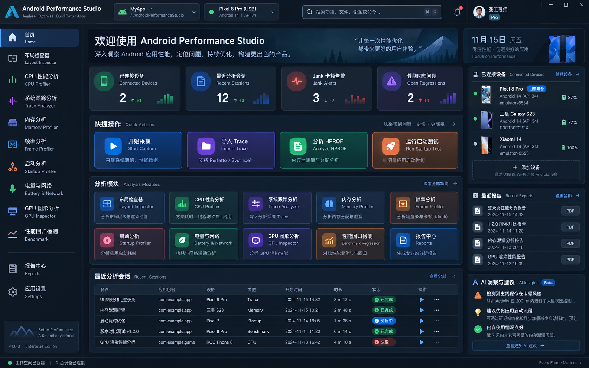

### 02 布局检查器 / Layout Inspector

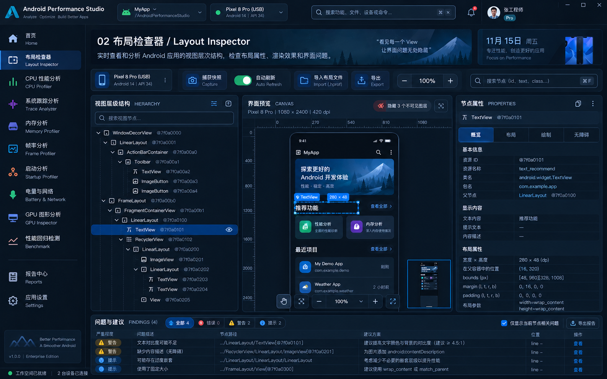

### 03 CPU 性能分析 / CPU Profiler

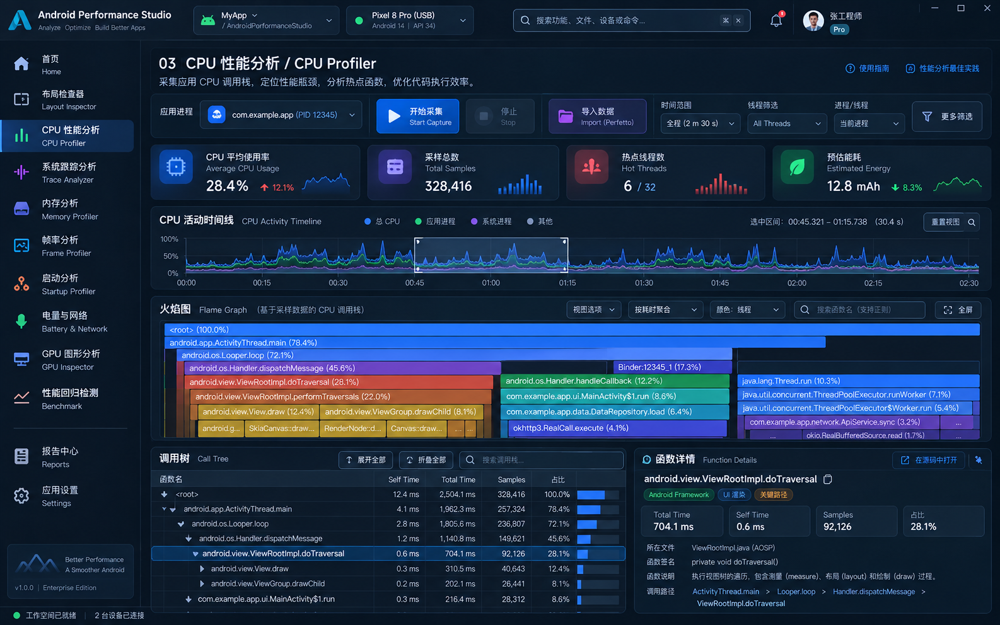

### 04 系统跟踪分析 / Trace Analyzer

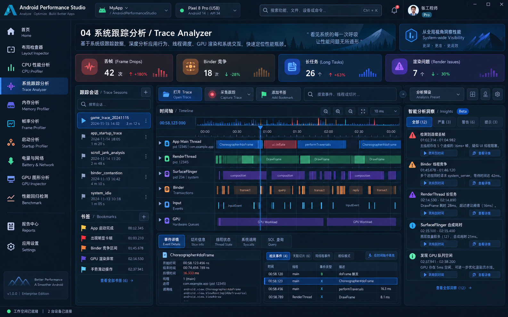

### 05 内存分析 / Memory Profiler

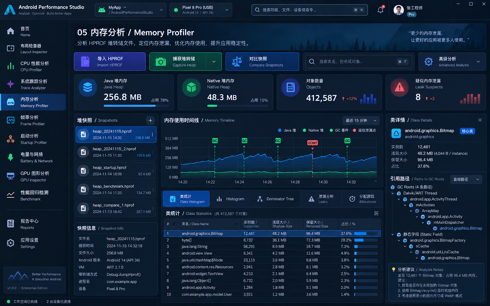

### 06 帧率分析 / Frame Profiler

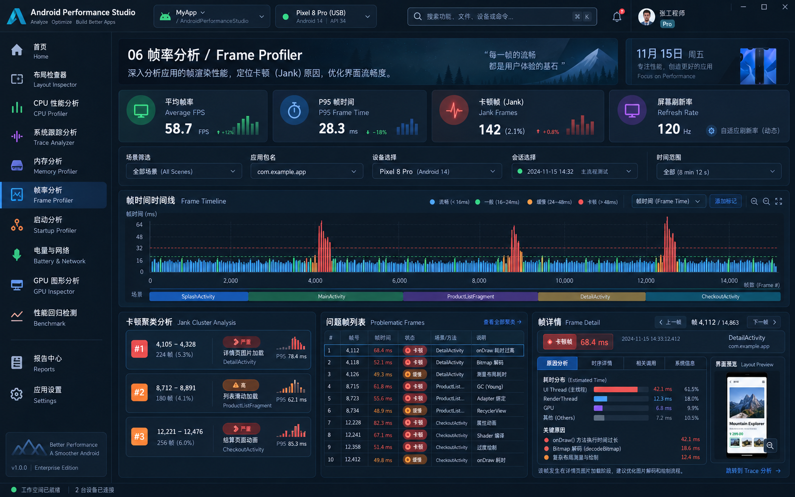

### 07 启动分析 / Startup Profiler

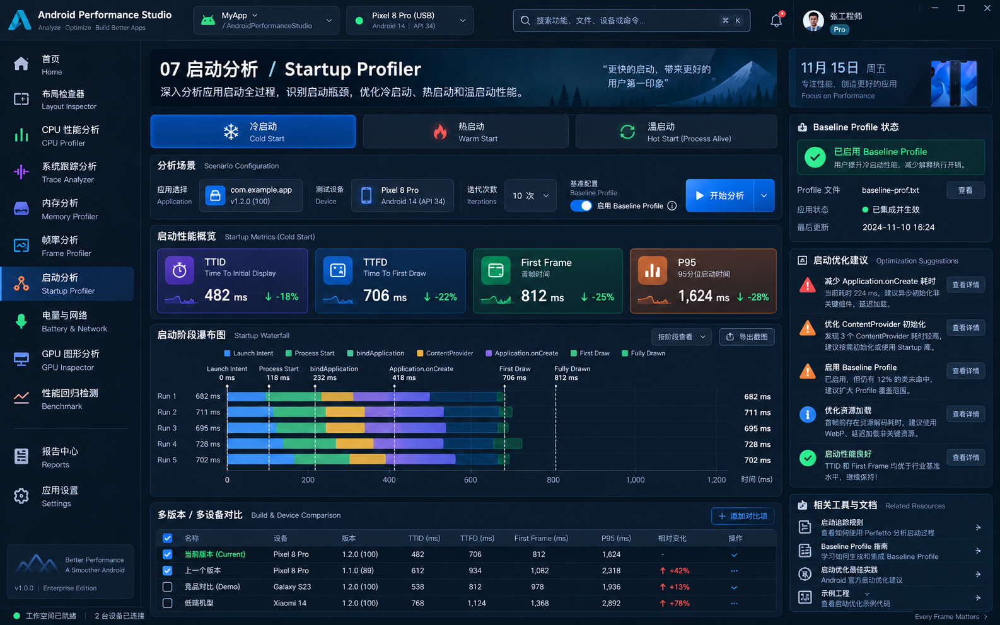

### 08 电量与网络 / Battery & Network

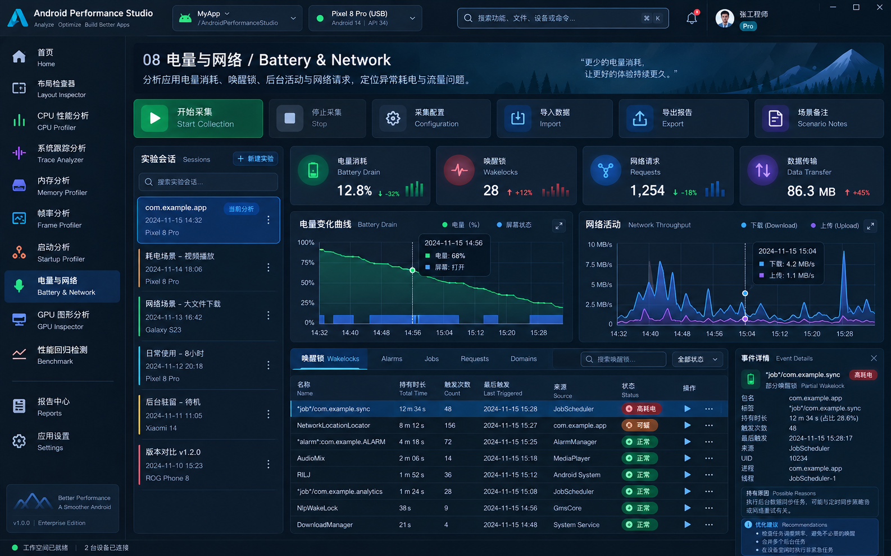

### 09 GPU 图形分析 / GPU Analysis Hub

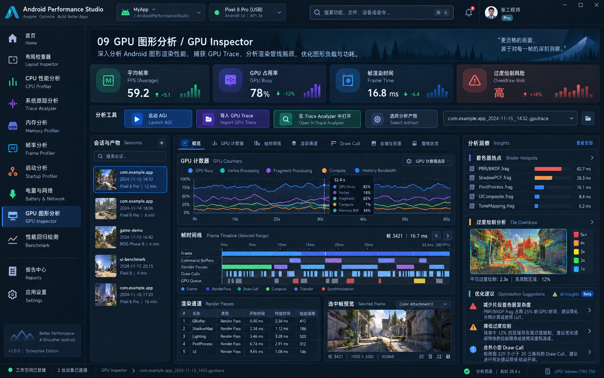

### 10 性能回归 / Benchmark & Reports

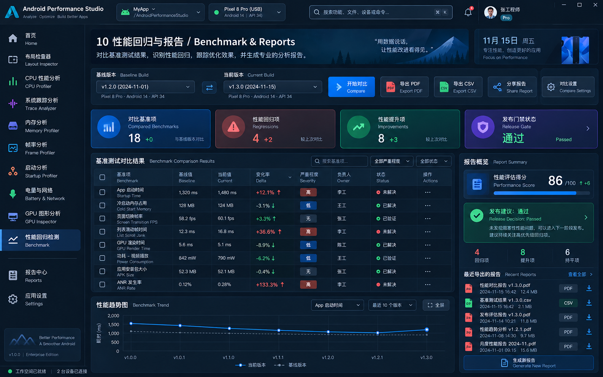

## 2.3 设计图必须做的能力修正

| 页面 | 设计图内容 | 实施规则 |
|---|---|---|
| CPU | Average CPU / Energy | 若当前 Simpleperf 证据不能证明，则改为 Samples / Threads / Duration / Effective Sample Rate 等真实指标 |
| Trace | 全 Compose 系统 Track | 主 Trace 继续复用 Perfetto UI；APS 自己负责 Session、Finding、Diagnostics、Context |
| Memory | 实时 Heap / GC Timeline | HPROF 模式禁止；改为 Snapshot / Heap Distribution / Diff / Dominator 等静态证据 |
| Battery & Network | 同时间线完全关联 | 只有 clock domain / capture window 可证明关联时才共轴显示；否则明确为 Independent Evidence |
| GPU | GPU Busy、Shader、Draw Call、Render Pass | 当前仅做 AGI Integration Hub；内部指标只有在有稳定 parser/data source 后开放 |
| Benchmark | 86/100 Score | 第一阶段不创建任意打分；优先 PASS / FAIL / INCONCLUSIVE 的版本化 Gate Policy |

---

# 3. 总体架构

## 3.1 必须保留的现有模块边界

```text
Desktop App Shell
        │
        ├── Layout Inspector
        ├── Simpleperf / CPU
        ├── Perfetto
        ├── Memory
        ├── Frame
        ├── Startup
        ├── Battery
        ├── Network
        ├── GPU Integration
        └── Benchmark Regression
```

禁止为了 UI 统一创建：

```text
UniversalPerformanceRecord
UniversalProfilerModel
UniversalTimelineEvent
OneHugeProfilerController
```

现有 `CaptureArtifact` 继续作为中立 Evidence 契约；跨 artifact 的完整 `Profiler Session` 继续后置，除非后续有明确需求和 ADR。

## 3.2 推荐目标架构

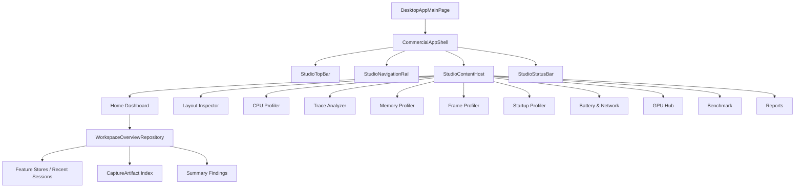

## 3.3 推荐新增目录

> 以下是推荐的新路径，不代表当前仓库已经存在。

```text
desktop-viewer/
  desktop-app/
    src/main/kotlin/com/androidperformancestudio/desktop/
      shell/
        CommercialAppShell.kt
        StudioTopBar.kt
        StudioNavigationRail.kt
        StudioStatusBar.kt
        StudioContentHost.kt
        WorkspaceContext.kt
        StudioCommandPalette.kt
      dashboard/
        StudioDashboard.kt
        WorkspaceOverviewRepository.kt
        WorkspaceOverviewModels.kt
        RecentWorkspaceAdapter.kt
      reports/
        StudioReportsPage.kt
        ReportIndex.kt

  ui-components/
    src/main/kotlin/com/androidperformancestudio/ui/
      design/
        StudioTokens.kt
        StudioDimensions.kt
        StudioElevation.kt
      navigation/
        StudioNavItem.kt
      panel/
        StudioPanel.kt
        StudioSection.kt
        StudioSplitPane.kt
      metric/
        StudioMetricCard.kt
      table/
        StudioDataTable.kt
        StudioTableHeader.kt
      chart/
        StudioChartSurface.kt
        StudioLegend.kt
        StudioTimeline.kt
      feedback/
        StudioStatusChip.kt
        StudioEvidenceBadge.kt
        StudioEmptyState.kt
        StudioErrorState.kt
        StudioProgressState.kt
```

## 3.4 Shell 与 Feature 的职责边界

### Shell 负责

- 一级导航；
- 顶部全局区域；
- 当前 Workspace Context 的只读显示；
- Home Dashboard；
- 全局任务/状态投影；
- Reports；
- Command Palette；
- 应用级设置；
- 窗口尺寸、主题、语言、Display Scale；
- Feature route / retained composition。

### Feature 继续负责

- 设备与目标业务选择；
- Capture；
- Import；
- Analyzer；
- 数据 model；
- session/artifact storage；
- feature 内部 filter/search/selection；
- feature-specific export；
- 真实分析状态。

Shell **不能成为业务 Controller**。

---

# 4. 商业化 Design System

## 4.1 目标

现有 `ViewerTheme` 不删除，继续作为统一 Theme 根。商业化改造应向它增加语义组件，而不是建立平行 Theme。

现有能力可继续复用：

- dark / light；
- accent color；
- display scale；
- typography；
- shapes；
- `ViewerColors`；
- `ViewerVisualizationColors`；
- `ProfilerMetricCard`；
- `HeaderToolbar` 等现有控件。

## 4.2 推荐视觉 Token

### 尺寸

```text
Top Bar                  56 dp
Navigation Expanded     216 dp
Navigation Collapsed     64 dp
Feature Local Toolbar    42 dp
Global Status Bar        28 dp
Panel Header              36 dp
Default content padding   16 dp
Compact content padding    8 dp
Panel gap                  8 dp
Section gap               12 dp
```

### Corner Radius

```text
small control   4 dp
panel           6 dp
card            8 dp
hero card      10 dp
```

不要大量使用 16–24dp Web/SaaS 风格大圆角；这是高密度工程工具。

### Border

```text
Normal panel 1 dp
Selected     1 dp accent alpha
Focus        1-2 dp accent
Splitter     1 dp + 6~8 dp hit target
```

### Window

```text
Recommended: 1440 x 900 以上
Minimum:     1280 x 720
```

低于最小宽度时：

- Navigation 自动 collapse；
- 右 Inspector 可折叠；
- KPI 从 4 列变 2 列；
- 禁止通过缩小字体到不可读程度来硬塞内容。

## 4.3 统一组件清单

必须优先实现并复用：

```text
StudioPanel
StudioPanelHeader
StudioMetricCard
StudioToolbarButton
StudioPrimaryAction
StudioStatusChip
StudioEvidenceBadge
StudioCapabilityBadge
StudioDataTable
StudioTableColumn
StudioSearchField
StudioFilterChip
StudioSplitPane
StudioInspectorPane
StudioTimelineSurface
StudioChartSurface
StudioEmptyState
StudioLoadingState
StudioErrorState
StudioWarningBanner
StudioBreadcrumb
StudioContextMenu
```

禁止每个 feature 自己重新实现新的 Card/Button/Search/Table 视觉版本。

---

# 5. 全局 App Shell 实现

## 5.1 页面结构

```text
┌────────────────────────────────────────────────────────────────────┐
│ Product / Workspace | Context | Search | Capture | Import | User    │ 56
├───────────────┬────────────────────────────────────────────────────┤
│               │                                                    │
│ Navigation    │                  Feature Content                   │
│               │                                                    │
│               │                                                    │
├───────────────┴────────────────────────────────────────────────────┤
│ Device / Artifact / Task / Warning / Operation Status              │ 28
└────────────────────────────────────────────────────────────────────┘
```

## 5.2 一级导航

建议正式版顺序：

```text
Home
────────
Layout Inspector
CPU Profiler
Trace Analyzer
Memory Profiler
Frame Profiler
Startup Profiler
Battery & Network
GPU Analysis
Benchmark
────────
Reports
────────
Settings
```

### Source Workspaces

不占一级导航主位，入口来源：

- Layout Inspector → Open Source；
- CPU AI Analysis → Source Candidate；
- Insight → Open Source；
- Command Palette → Source Workspaces。

### Method Recording

建议：

```text
CPU Profiler > More Tools > Method Recording
```

或者 Command Palette 中提供入口。

## 5.3 Top Bar

第一阶段功能：

- Product logo + name；
- 当前 feature / workspace breadcrumb；
- 当前 context 的**只读设备/应用投影**；
- Command/Search (`Cmd/Ctrl+K`)；
- 当前页面可用时显示 `Capture` / `Import` 快捷动作；
- Tasks/Notifications；
- Settings。

### 注意：Global Device 暂不直接改 Feature State

第一阶段：

```kotlin
WorkspaceContext(
    deviceLabel,
    packageName,
    processName,
    artifactLabel,
)
```

由当前 Feature 提供只读 context。

第二阶段若多个 feature 的设备模型足够统一，再考虑 global selection synchronization。

## 5.4 Status Bar

统一显示：

- workspace readiness；
- device count / 当前设备；
- active artifact；
- active long-running task；
- warnings count；
- feature-specific right slot。

Feature 原本的 status bar 可逐步迁移为：

```text
Feature status -> Shell status contribution
```

但第一阶段允许保留 feature local status，避免一次性破坏行为。

## 5.5 AppNavigator

保留现有 retained destination 思想。

新增 route：

```kotlin
REPORTS
SETTINGS // 若 Settings 继续 dialog 可不成为 route
BATTERY_NETWORK // UI 聚合入口，可内部切 Battery / Network
```

现有 `BATTERY_PROFILER` / `NETWORK_PROFILER` 可继续作为内部 route 或 child destination。

---

# 6. 页面 01：Home Dashboard

## 6.1 页面目标

从“功能入口卡片页”升级为：

> 当前性能工作、最近证据、异常、回归和快捷操作的总览入口。

不是把所有 profiler 数据实时聚合进内存，而是做**只读 Projection**。

## 6.2 页面区域

```text
Header
├── Workspace title
├── environment summary
└── Quick Capture / Import

KPI Row
├── Connected Devices
├── Recent Sessions
├── Open Findings
└── Regressions

Quick Actions
├── Start CPU Capture
├── Capture Layout
├── Open Trace
├── Analyze HPROF
└── Run Startup Test

Modules
└── feature cards

Recent Workspaces / Sessions
└── unified summary table

Right Rail
├── Devices
├── Recent Reports
└── Evidence-backed Insights
```

## 6.3 数据模型

新增**只读 summary model**：

```kotlin
enum class StudioFeature {
    LAYOUT, CPU, TRACE, MEMORY, FRAME, STARTUP,
    BATTERY, NETWORK, GPU, BENCHMARK
}

data class StudioRecentItem(
    val id: String,
    val feature: StudioFeature,
    val title: String,
    val subtitle: String?,
    val capturedAt: Instant?,
    val deviceLabel: String?,
    val packageName: String?,
    val status: StudioRecentStatus,
    val artifactId: String?,
    val openAction: StudioOpenAction,
)

data class StudioFindingSummary(
    val feature: StudioFeature,
    val severity: StudioSeverity,
    val title: String,
    val evidenceLabel: String,
    val openAction: StudioOpenAction,
)
```

不要复制完整 `FrameSample` / `HttpCall` / `BenchmarkMetric` 到 Dashboard。

## 6.4 WorkspaceOverviewRepository

建议 Adapter 模式：

```text
Layout recent adapter ──┐
CPU recent adapter ─────┤
Perfetto recent adapter ┤
Memory recent adapter ──┤
Frame recent adapter ───┤
Startup recent adapter ─┼─> WorkspaceOverviewRepository
Battery recent adapter ─┤
Network recent adapter ─┤
GPU artifact adapter ───┤
Benchmark adapter ──────┘
```

接口：

```kotlin
interface StudioOverviewSource {
    suspend fun recentItems(limit: Int): List<StudioRecentItem>
    suspend fun findings(limit: Int): List<StudioFindingSummary>
}
```

## 6.5 当前代码改造

主要影响：

```text
desktop-app/AppHomePage.kt
DesktopAppMainPage.kt
AppDestination.kt
```

推荐新增：

```text
desktop-app/dashboard/*
```

## 6.6 功能验收

- 无设备时首页可以正常打开；
- 首页不得初始化所有 profiler controller；
- 最近会话读取失败不阻塞首页；
- 点击 Recent Item 能跳转正确 feature；
- KPI 必须来自真实 store/projection；
- 没有数据时显示 `—` / EmptyState，不显示模拟数字；
- 首页首屏 1440x900 下无整体纵向滚动或仅主内容区滚动。

---

# 7. 页面 02：Layout Inspector

## 7.1 当前支撑度

当前实现与目标页面高度一致，主要是视觉重排和统一组件迁移。

现有关键能力：

- Device selector；
- capture target；
- window selector；
- manual/auto scan；
- hierarchy tree；
- hierarchy search；
- isolation；
- hidden layer；
- screenshot/layout canvas；
- zoom/pan/scroll；
- properties；
- findings；
- archive import/export；
- source correlation；
- AI analysis；
- Memory / Frame 等跨工具关联入口。

## 7.2 目标布局

```text
Feature Toolbar
Device | Target | Window | Capture | Auto | Import | Export | Search

┌────────────────┬──────────────────────────────┬───────────────────────┐
│ Hierarchy      │ Canvas                       │ Properties            │
│ Search         │ Screenshot                   │ Overview / Layout      │
│ Tree           │ Bounds Overlay               │ Draw / Accessibility   │
│                │ Zoom/Pan                     │ Compose properties     │
├────────────────┴──────────────────────────────┴───────────────────────┤
│ Findings / Timeline / Diff                                             │
└────────────────────────────────────────────────────────────────────────┘
```

## 7.3 UI 改造原则

### 左侧 Hierarchy

- 宽度：280–360dp，可拖拽；
- Search 固定顶部；
- 选中行、hover、hidden、search match 使用 Design System token；
- Disclosure / layer visibility / ID 等行为全部保留；
- 大列表继续虚拟化，不改为普通 Column。

### 中央 Canvas

- Canvas 为最大空间；
- Canvas toolbar 只保留与画布相关操作：Fit、Zoom、Mode、Layers；
- Hidden layer summary 使用 chip/banner，不占大块内容；
- Screenshot / Layout-only / Waiting 状态视觉统一。

### 右侧 Properties

将当前详情内容按 tab/section 组织：

```text
Overview
Layout
Drawing
Accessibility
Compose（有证据时）
Evidence
```

但底层字段仍来自当前 node/detail 模型。

### Bottom Findings

- 默认 220–280dp；
- 可折叠；
- severity + rule + evidence；
- 点击 Finding 同步 selected node；
- AI 建议必须区分 AI conclusion 与 rule evidence。

## 7.4 需要改动的源码

现有：

```text
layout-inspector/presentation/.../LayoutInspectorMainPage.kt
HierarchySearchState.kt
HiddenLayerState.kt
FindingSelectionState.kt
...
```

建议把大文件逐步抽出 UI 子组件，但**不要同时改业务逻辑**：

```text
presentation/workspace/
  LayoutInspectorWorkspace.kt
  HierarchyPanel.kt
  InspectorCanvasPanel.kt
  PropertiesPanel.kt
  FindingsPanel.kt
```

## 7.5 验收

- 所有现有 Layout Inspector 测试继续通过；
- 树/Canvas/Properties/Findings selection 同步行为不变；
- Hidden layer/Isolation/Search 快捷键不退化；
- archive import/export 行为不变；
- resize 后 pane state 稳定；
- 10k node 场景不因 UI 包装出现明显性能回退。

---

# 8. 页面 03：CPU Profiler

## 8.1 当前支撑能力

现有 CPU/Simpleperf 已具备：

```text
Device/target selection
Capture
Offline import
SQLite projection
Overview
Top Functions
Call Tree
Flame Graph
Stack Chart
Marker Chart
Marker Table
Diagnostics
Firefox Profiler integration
Export
AI Analysis
Source correlation
```

商业化重点是重新组织 workspace，而不是重做 FlameGraph。

## 8.2 目标布局

```text
Toolbar
Device | App | Process | Thread | Capture | Import | Search | Filter

KPI
Samples | Threads | Capture Duration | Effective Sample Rate

Activity Timeline / Sampling Overview

Main Tabs
Overview | Flame Graph | Call Tree | Top Functions | Stack | Markers

Main Analysis                                 Detail Inspector
Flame / CallTree / Table                     Selected symbol / stack
```

## 8.3 KPI 规则

允许：

- Samples；
- Thread count；
- Capture duration；
- sample/event frequency；
- lost/invalid samples（若现有 evidence 存在）；
- top function share。

禁止无数据来源时显示：

- Average CPU Usage；
- Energy Cost；
- CPU temperature。

## 8.4 Flame Graph

必须复用：

```text
FlameGraphCanvas
FlameGraphLayout
FlameGraphNavigator
FlameGraphTooltip
FlameGraphDetailsPanel
```

商业化改造只处理：

- 周边 Chrome；
- toolbar；
- breadcrumb；
- search/filter；
- details pane；
- export entry；
- theme token。

禁止重写 flame layout algorithm。

## 8.5 Call Tree / Top Functions

升级成统一 `StudioDataTable` 风格：

```text
Function
Library / Path
Total %
Inclusive
Self
Samples
Threads
```

保留：

- selection；
- sort；
- keyboard navigation；
- focus flame；
- focus call tree。

## 8.6 AI Insights

推荐由 Dialog 改为可停靠 `Insight Drawer`：

```text
Evidence Scope
Findings
Confidence
Explanation
Recommendation
Open Source
```

但 AI 结果必须继续明确模型和 evidence scope。

## 8.7 源码修改范围

```text
simpleperf-viewer/presentation/DeviceTargetPage.kt
simpleperf-viewer/presentation/ReportPage.kt
simpleperf-viewer/presentation/HomeScreen.kt
simpleperf-viewer/app-desktop/SimpleperfMainPage.kt
```

Controller / Storage / Analysis 不应因视觉改造被重写。

## 8.8 验收

- Flame Graph golden/UI tests 继续通过或有明确 golden 更新；
- Capture 不受页面切换影响；
- Report tab selection 保留；
- 大 call tree 滚动性能不退化；
- AI 分析仍能跳 Source Workspace；
- “CPU Usage” 等指标无真实证据时不出现。

---

# 9. 页面 04：Trace Analyzer

## 9.1 实施原则

**APS 不自己重新实现完整 Perfetto Timeline。**

当前 `PerfettoUiServer` + Trace Processor 是高价值资产，应继续作为主 Trace Viewer。

## 9.2 目标架构

```text
APS Shell
┌─────────────────────────────────────────────────────────────────┐
│ Session / Capture / Open / Export / Search / Diagnostic Preset  │
├─────────────────────────────────────────────────────────────────┤
│                                                                 │
│                   Embedded / Launched Perfetto UI                │
│                                                                 │
├──────────────────────────────┬──────────────────────────────────┤
│ Diagnostic Result            │ APS Insights / Correlations       │
└──────────────────────────────┴──────────────────────────────────┘
```

如果当前技术上 Perfetto UI 仍通过本地 server + browser 打开，第一阶段可以保持外部/本地 Web View 行为；不要为了“必须内嵌”阻塞商业化 Shell。

## 9.3 APS 自有功能

### Capture

- Device；
- Trace template；
- Duration；
- buffer；
- capability；
- start / stop；
- recent session。

### Diagnostics

现有 SQL 诊断可商业化为卡片/查询列表：

```text
CPU Scheduling Hotspots
CPU Frequency Distribution
Binder Transaction Latency
Frame Jank Detection
Memory Usage Timeline
Input Event Latency
Thread State Breakdown
Thread Wakeup Latency
```

### Insight

Insight 必须携带：

```text
Query ID
Trace Artifact ID
Result rows / aggregate
Limitations
Open in timeline action（若可定位）
```

## 9.4 不做

第一阶段不做：

- 完整自研 Track rendering；
- 自研 SQL editor IDE；
- 自研 trace processor；
- 假设所有设备都支持同一 Perfetto schema。

## 9.5 验收

- Capture → artifact → open → diagnostic 闭环；
- existing recent session 不丢失；
- diagnostics failure 不影响 trace 打开；
- 各 SQL Query 使用真实 schema compatibility；
- Frame / Startup 跳转到 Perfetto 的关联动作继续工作。

---

# 10. 页面 05：Memory Profiler

## 10.1 产品定位

第一阶段明确定位为：

> Android compatible HPROF investigation workspace + Native/Bitmap 辅助证据。

不是“实时 Memory Profiler 全功能复制品”。

## 10.2 目标布局

```text
Toolbar
Import HPROF | Dump Heap | Mapping | Compare | Export | Search

Snapshot Tabs
[Snapshot A] [Snapshot B] [+]

Summary
Heap Size | Objects | Classes | Leak Suspects

┌───────────────┬──────────────────────────────────┬─────────────────────────┐
│ Filters       │ Classes / Dominators / Diff      │ Object Inspector        │
│ Heap          │ Main virtualized table           │ Object ID / Size         │
│ Scope         │                                  │ Fields                   │
│ Leak          │                                  │ Inbound references       │
│ Search        │                                  │ GC Root path             │
├───────────────┴──────────────────────────────────┴─────────────────────────┤
│ Status / Parse warnings / Evidence capabilities                           │
└────────────────────────────────────────────────────────────────────────────┘
```

## 10.3 必须支持的主视图

```text
Classes
Dominators
Diff
Leaks & Bitmaps
Native Heap（有对应 artifact 时）
```

## 10.4 Classes

字段至少：

```text
Class
Instances
Shallow Size
Retained Size
Native Size（可用时）
Heap
```

支持：

- Class / Package grouping；
- heap filter；
- project/system scope；
- leak filter；
- regex/case；
- sort；
- instance drill down。

## 10.5 Object Inspector

显示：

```text
Object ID
Class
Reachability
Depth
Shallow
Retained
Native size（有证据时）
Fields
References
Inbound references
Paths to GC Root
```

必须支持：

- open target object；
- back/forward；
- copy object id；
- pin；
- large array pagination。

## 10.6 Diff

**只能做类级可信比较。**

不得把两个 dump 中相同 object id 视为同一个对象。

表格：

```text
Class | A Count | B Count | Δ Count | A Retained | B Retained | Δ Retained
```

## 10.7 设计图中需要删除/改造的内容

删除：

```text
Realtime Heap Timeline
GC marker timeline
live allocation/deallocation timeline
```

除非未来独立开发 `Live Memory Recording`。

替代为：

```text
Snapshot comparison
Heap distribution
Retained size composition
Top growth classes
```

## 10.8 代码范围

现有重点：

```text
memory-profiler/presentation/MemoryProfilerScreen.kt
MemoryProfilerState.kt
MemoryProfilerController.kt
HprofParser
DominatorTreeAnalyzer
InstanceReferenceQuery
MemoryHistogramAnalyzer
```

已有 Memory HPROF design 应作为 Codex 强制输入资料。

## 10.9 验收

- 大 HPROF 解析不阻塞 Compose UI；
- cancellation 有效；
- class → instance → reference chain 闭环；
- Dominator / retained size 可复核；
- Diff 不伪造跨 dump identity；
- 无 allocation evidence 时对应字段明确 unavailable/not applicable；
- Export 包含 source hash / mapping / algorithm version / limitation。

---

# 11. 页面 06：Frame Profiler

## 11.1 当前基础

现有模型已经包含：

```text
intended/actual vsync
frame complete / present
expected duration
refresh rate
FrameTimeline VSync ID
Input / Animation / Layout / Draw / Sync / Command / Swap / GPU
platform jank
jank types
missed vsync count
cluster
```

这是最适合商业化图形化的模块之一。

## 11.2 目标布局

```text
Toolbar
Device | Process | Capture | Import | Source | Filter

KPI
Frames | Deadline Miss | P50 | P95 | Worst

Frame Timeline
||||||||||||██||||||||████||||||||||

┌───────────────────────────────────────┬──────────────────────────┐
│ Jank Clusters / Problem Frames        │ Selected Frame           │
│ Table                                 │ Duration / Budget         │
│                                       │ Stages                    │
│                                       │ Jank reason               │
│                                       │ Open Layout / Open Trace  │
└───────────────────────────────────────┴──────────────────────────┘
```

## 11.3 Frame Timeline

继续使用 Canvas/高效绘制，不要用成百上千 Composable Box 渲染 frame bar。

支持：

- zoom / range；
- hover；
- select；
- jank color；
- cluster marker；
- refresh-rate-aware threshold；
- selected frame auto scroll。

## 11.4 Selected Frame

必须显示证据来源：

```text
Source
Frame ID
FrameTimeline VSync ID
Duration
Expected budget
Budget source
Missed VSync
Platform Jank
Jank Types
Largest Stage
Stage breakdown
State labels
```

操作：

```text
Inspect Layout
Open in Trace Analyzer
Copy Evidence
```

## 11.5 验收

- Frame capture/import 继续工作；
- timeline 对 10k+ frame 不出现大量 recomposition；
- cluster 和 selected frame 关联正确；
- Open Layout / Open Trace 不改变证据含义；
- `ExpectedDurationSource.UNKNOWN` 时 UI 不显示伪预算。

---

# 12. 页面 07：Startup Profiler

## 12.1 目标布局

```text
Cold | Warm | Hot

Toolbar
Device | App | Component | Runs | Compilation | Profile | Start

KPI
TTID | TTFD | First Frame | Stability/P95

Startup Waterfall
Process Start
Initializer
Activity Create
Activity Resume
First Frame
Fully Drawn

Runs Table                                  Run Detail
Iteration / Observed / Total / ...          Evidence
                                             Compiler/Profile
                                             Environment
                                             Trace correlation

Baseline Comparison / Recommendations
```

## 12.2 Startup Type

直接复用：

```text
COLD
WARM
HOT
```

不要将 requested type 与 observed type 混在一个标签。

## 12.3 KPI

基于现有真实统计：

- Median total time；
- First frame；
- Fully drawn；
- P90/P95；
- MAD/stability。

TTID/TTFD 必须展示 evidence confidence：

```text
EXACT
ESTIMATED
INFERRED
UNAVAILABLE
```

## 12.4 Waterfall

数据来自：

```text
StartupMilestone
StartupPhase
PlatformLaunchMetrics
```

不能为了图形连续性凭空补 phase duration。

## 12.5 Baseline Profile / Compilation

页面必须展示：

```text
requested compilation mode
compiler filter before/after
verified
profile source
profile source declared
failure reason
```

商业化价值很高，应放在 Run Detail 或 Optimization panel。

## 12.6 Perfetto Correlation

若 `traceEvidence.rootCause` 存在：

```text
Scheduling slices
Binder slices
Main thread slices
Frame slices
Correlation error bound
Limitations
```

提供：

```text
Open Trace
```

## 12.7 验收

- 运行中 progress 正确；
- cold/warm/hot 不混淆；
- baseline comparison 不隐去 confidence；
- trace correlation error/limitation 可见；
- Speed Profile 的配置状态可复核。

---

# 13. 页面 08：Battery & Network

## 13.1 UI 合并，模型不合并

推荐页面结构：

```text
Battery & Network
[Battery] [Network] [Correlation]
```

实现上仍然是：

```text
BatteryProfilerController
NetworkProfilerController
```

不能建立一个丢失业务语义的通用 event model。

## 13.2 Battery Tab

### KPI

```text
Wakelock Duration
Wakeup Alarms
Network Bytes
Modeled Energy（只有 evidence 存在时）
```

### 主要区域

```text
Experiment summary
Runs
Battery snapshots / history
Wakelocks
Alarms
Jobs
Sensors
Energy
Network counters
Warnings
```

### History

按真实 `BatteryHistoryEventKind`：

```text
WAKELOCK
ALARM
JOB
SENSOR
NETWORK
APP_STATE
SCREEN
CHARGING
THERMAL
```

## 13.3 Network Tab

### Summary

```text
Requests
Failures
Transferred bytes
Median/slow request（从真实 call duration 聚合）
Evidence completeness
```

### Request List

字段：

```text
Method
Redacted URL
Status
Duration
Bytes
Protocol
Outcome
Source
```

### Request Detail

```text
Dispatcher Queue
DNS
Connect
TLS
Request Headers/Body
Server Wait
Response Headers/Body
Connection Held
```

必须显示 `NetworkConfidence`，尤其 HAR import 的 inferred/approximated phase。

## 13.4 Correlation Tab

第一阶段只在有可靠 mapping 时开放：

```text
Battery event + Network call
```

需要：

- 可比较的 time domain；
- capture window；
- clock mapping error bound；
- artifact provenance。

若不满足，显示：

```text
These artifacts are independent evidence and cannot be aligned on one clock.
```

而不是强行画在同一 X 轴。

## 13.5 验收

- Battery / Network 可以独立使用；
- 一方失败不影响另一方；
- HAR inferred phase 有视觉区分；
- sensitive URL/headers 继续遵守 redaction；
- correlation 无 clock evidence 时明确不可用。

---

# 14. 页面 09：GPU Analysis Hub

## 14.1 第一阶段产品定位

当前模块应命名/解释为：

> GPU Analysis Hub — Android GPU Inspector / Perfetto / GPU artifact integration center.

不是本地完整 AGI 替代品。

## 14.2 页面布局

```text
GPU Analysis

Device / Graphics Context
GPU Renderer | Driver | API | Graphics Implementation

AGI Capability
Version | Launch Mode | Executable | Warnings

Actions
Launch AGI | Import Artifact | Open Trace Analyzer

Artifacts
Kind | File | Device | Package | API | Captured | Status | Action

Related Evidence
Frame trace / Perfetto / Screenshot / External report
```

## 14.3 可真实实现的功能

当前模型已经可支撑：

- AGI executable discovery；
- version；
- launch mode；
- launch supported；
- artifact open supported；
- device graphics context；
- graphics API；
- GPU artifact kind；
- path/hash/size；
- artifact location verification；
- open/reveal/relocate；
- Open in Perfetto / AGI。

## 14.4 第一阶段禁止实现的面板

没有稳定 parser/data source 前不得实现：

```text
GPU Busy chart
Vertex / Fragment Processing
Shader Hotspots
Render Pass table
Draw Call table
Tile Overdraw
Frame Attachment preview derived from AGI frame profile
```

设计图这些区域改为：

```text
Artifact Preview / Metadata
Related Analysis
External Tool Capability
Open with AGI
```

## 14.5 后续 In-App GPU Analyzer 的独立前置条件

必须先回答：

1. AGI artifact 格式是否公开、稳定、可合法读取？
2. 是否有官方 CLI / export API？
3. Perfetto 是否已经覆盖目标 counter？
4. 是否需要 device-side agent？
5. shader/render-pass/draw-call 的来源、版本与兼容矩阵？

上述未完成前不立项内嵌 GPU Analyzer UI。

---

# 15. 页面 10：Benchmark Regression

## 15.1 目标

从当前 comparison card 列表升级为：

> Release-oriented performance regression investigation workspace.

## 15.2 布局

```text
Toolbar
Baseline | Current | Policy | Compare | Import | Export

Summary
Compared Metrics | Regressions | Improvements | Gate Status

Regression Table
Case | Metric | Baseline | Current | Delta | % | Confidence | Classification

Trend / Historical Runs

Right Inspector
Compatibility
Reasons
Samples
Trace artifacts
Policy
```

## 15.3 当前已有真实能力

- device compatibility；
- API/ABI/fingerprint；
- build variant；
- metric direction；
- absolute/relative delta；
- minimum sample count；
- MAD noise band；
- regression/improved/stable/inconclusive/incompatible。

## 15.4 新增 Release Gate Policy

不要第一阶段设计任意 Performance Score。

推荐：

```kotlin
enum class GateDecision {
    PASS,
    FAIL,
    INCONCLUSIVE,
}

data class ReleaseGatePolicy(
    val blockingMetricPatterns: List<String>,
    val failOnRegression: Boolean,
    val maxAllowedRegressions: Int,
    val allowInconclusive: Boolean,
    val minimumConfidence: EvidenceConfidence,
)

data class ReleaseGateResult(
    val decision: GateDecision,
    val blockingComparisons: List<MetricComparison>,
    val reasons: List<String>,
    val policyVersion: String,
)
```

Policy 必须版本化，可导出。

## 15.5 Trend

当前 SQLite 已有 run/metric，需扩展查询：

```text
metric history by case + metric + comparable environment
```

Trend 只能比较兼容环境或明确标识环境变化。

## 15.6 验收

- Gate 不使用魔法分数；
- incompatibility 优先于 regression verdict；
- low sample confidence 不被显示为高置信回归；
- trend 能追踪 build/commit；
- report export 含 policy version 和 compatibility。

---

# 16. 页面 11：Reports Center

## 16.1 为什么需要独立 Reports 页面

当前各 feature 已有不同 export 能力，但商业软件需要一个统一的：

```text
“我曾经生成了什么结果，来源是什么，能否重新打开”
```

中心。

## 16.2 Reports 不是统一业务模型

只索引：

```kotlin
data class StudioReportIndexEntry(
    val id: String,
    val feature: StudioFeature,
    val reportType: String,
    val title: String,
    val createdAt: Instant,
    val sourceArtifactIds: List<String>,
    val file: Path?,
    val format: ReportFormat,
    val warnings: List<String>,
)
```

不把不同 report 内容转换成一个通用 JSON schema。

## 16.3 页面功能

```text
Search
Feature filter
Date filter
Report type filter

Reports Table
Name | Feature | Source | Created | Format | Status

Preview/Metadata
Source artifacts
Warnings
Open
Reveal
Export Copy
Delete index entry
```

如果 report 本身是用户文件，删除 Index 默认不删除原始文件；真实删除必须明确二次确认。

---

# 17. 页面 12：Settings

## 17.1 目标信息架构

建议从单纯 Dialog 逐步演进为分组 Settings，但是否保持 Dialog 可根据现有实现决定。

```text
General
├── Language
├── Theme
├── Accent
├── Display Scale
└── Startup behavior

Android Toolchain
├── Android SDK
├── adb
├── trace_processor
├── simpleperf
└── AGI

Profiler
├── Simpleperf
├── Layout Inspector
├── Memory limits
└── Capture defaults

AI
├── Provider
├── Model
├── Privacy / source inclusion
└── Timeout

Storage
├── Database paths
├── Cache
├── Quota
└── Cleanup

Privacy
├── Redaction defaults
├── Sensitive evidence
└── Export behavior
```

## 17.2 原则

- 不把 feature-specific 所有设置提升到全局；
- Settings 只作为配置入口；
- sensitive token 不写日志；
- tool path 必须验证并显示版本/availability；
- reset 操作分级，不允许一个“Reset All”误删用户 evidence。

---

# 18. Source Workspaces 页面

现有 Source Workspace 应保留并增强统一外壳适配，但不需要重新设计成一级业务模块。

功能：

```text
Workspace list
Source tree
Source viewer
Resolved candidate
Confidence
Open from finding
Rebind archived source
```

关键产品规则：

- EXACT / strong candidate 才支持直接跳转；
- weak resolution 不伪装为确定位置；
- AI finding 与 source evidence 分开显示。

---

# 19. 跨页面统一行为

## 19.1 Evidence Badge

所有页面使用统一证据标签：

```text
COMPLETE
PARTIAL
UNKNOWN
EXACT
DERIVED
INFERRED
ESTIMATED
UNAVAILABLE
```

不要只靠颜色表达。

## 19.2 Long-running Task

Capture / Import / Parse / Analyze / Export 统一任务反馈：

```kotlin
data class StudioTaskProjection(
    val id: String,
    val feature: StudioFeature,
    val title: String,
    val phase: String?,
    val progress: Float?,
    val cancellable: Boolean,
    val startedAt: Instant,
)
```

第一阶段这可以只是 UI projection，不强制所有 controller 改成一个 task framework。

## 19.3 Empty / Loading / Error

每页必须定义：

```text
No device
No target
No artifact
Unsupported capability
Loading
Partial evidence
Operation failed
```

商业化 UI 最忌讳空白 panel。

## 19.4 Keyboard

全局：

```text
Cmd/Ctrl + K    Command Palette
Cmd/Ctrl + O    当前 feature Open/Import
Cmd/Ctrl + ,    Settings
Cmd/Ctrl + 1..9 可选 feature shortcut
Esc             close transient surface
```

Feature 原有快捷键优先，避免冲突。

---

# 20. Codex 必须获得的资料

以下资料分为 **Mandatory / Recommended / Per-page Evidence Fixtures**。

## 20.1 Mandatory：每一个 Codex 大任务都要提供

### 1. 完整源码仓库

Codex 工作目录必须是完整 repo，而不是复制几段 Kotlin 文件。

必须能读取：

```text
AGENTS.md
CONTEXT.md
DESIGN.md
desktop-viewer/settings.gradle.kts
desktop-viewer/build.gradle.kts
所有 feature modules
测试代码
resources
```

### 2. 本文

```text
android-performance-studio-commercial-ui-implementation.md
```

作为商业化 UI 总体约束。

### 3. 所有设计图

提供 `images/` 完整目录。

Codex instruction 中明确：

> Images are visual references only. Do not invent data or violate the evidence/model constraints in the implementation design to match the screenshots.

### 4. 当前官方设计/ADR

至少提供：

```text
DESIGN.md
CONTEXT.md

desktop-viewer/docs/adr/0006-capture-artifact-contract-before-profiler-session.md
desktop-viewer/docs/design/2026-07-02-desktop-viewer-design.md
desktop-viewer/docs/design/layout-inspector/2026-07-14-unified-desktop-home-design.md

docs/design/2026-09-17-memory-profiler-hprof-viewer-design.md
```

以及对应 feature 自己的 design 文档。

### 5. Build / Test 说明

Codex 必须知道真实项目命令，执行前自己从 Gradle tasks 和 README 验证。

至少要求：

```bash
cd desktop-viewer
./gradlew test
./gradlew :desktop-app:run
```

实际 module-specific task 应由 Codex 先 `./gradlew tasks` 或读取 build file 后确认，不能猜 Gradle task 名。

### 6. 禁止事项

必须放进 prompt：

```text
- Do not rewrite existing analyzers for visual reasons.
- Do not introduce fake/sample runtime metrics in production code.
- Do not merge feature domain models into a universal event model.
- Do not replace Perfetto with a home-grown timeline.
- Do not present unsupported GPU metrics.
- Do not show HPROF data as a live memory timeline.
- Keep current tests passing unless the behavior is intentionally changed.
- Add tests for every new state/interaction contract.
```

---

# 21. Codex 推荐获得的测试数据 / Fixture

真正让 Codex 高质量实现性能工具 UI，**只给源码和 PNG 不够**。还应给每个页面一份可加载的真实或脱敏测试数据。

## 21.1 Layout Inspector

提供：

- 100–500 node 普通 View snapshot；
- 5k–10k node 大 snapshot；
- screenshot；
- Compose + View 混合 capture；
- findings；
- invisible/hidden node；
- archive file。

用于验证：

```text
Hierarchy virtualization
Canvas overlay
Properties
Findings
Search
Hidden layer
```

## 21.2 CPU

提供：

- 一份正常 simpleperf session；
- 一份大采样 session；
- symbol 缺失 session；
- 多线程 session；
- marker/session package；
- 已有 golden fixture。

## 21.3 Trace

提供：

- Android UI jank trace；
- Binder latency trace；
- Input latency trace；
- CPU scheduling trace；
- 支持/不支持部分 Perfetto module 的兼容 fixture。

## 21.4 Memory

提供：

- 小 HPROF；
- 大 HPROF；
- 泄漏案例；
- Bitmap 重复案例；
- 两个可比较 HPROF；
- mapping.txt；
- truncated/invalid HPROF。

## 21.5 Frame

提供：

- gfxinfo framestats；
- FrameMetrics/agent capture；
- Perfetto FrameTimeline；
- 多 refresh rate；
- severe/frozen frame；
- no expected-duration case。

## 21.6 Startup

提供：

- cold/warm/hot；
- 有 agent / 无 agent；
- 有 fully-drawn / 无 fully-drawn；
- speed-profile；
- Perfetto correlated case；
- environment mismatch。

## 21.7 Battery

提供：

- batterystats snapshots；
- wakelock；
- alarms/jobs；
- network usage；
- modeled energy；
- temperature/charging drift warning；
- counter reset case。

## 21.8 Network

提供：

- OkHttp EventListener capture；
- HAR import；
- reused connection；
- TLS；
- failure/cancel；
- partial event sequence；
- redacted sensitive headers。

## 21.9 GPU

提供：

- AGI installed / absent environment fixture；
- AGI system profile artifact metadata；
- frame profile artifact metadata；
- missing/relocated file；
- Perfetto artifact；
- screenshot artifact。

不要求 Codex 解析 opaque AGI artifact 内容。

## 21.10 Benchmark

提供：

- compatible baseline/current；
- regression；
- improvement；
- low sample；
- device incompatible；
- API incompatible；
- unknown direction；
- historical runs。

---

# 22. 建议给 Codex 的“当前 UI 截图”

除了本文的新设计图，还应该给 Codex 当前运行版本每页截图。

最佳资料组合：

```text
current-ui/
  home.png
  layout.png
  cpu.png
  trace.png
  memory.png
  frame.png
  startup.png
  battery.png
  network.png
  gpu.png
  benchmark.png

reference-ui/
  本文 images/*.png
```

这样 Codex 可以理解：

```text
Current behavior + New target layout
```

而不是只看到最终效果。

如果当前页面有关键交互（resize、selection、hover、context menu），建议额外提供 20–60 秒录屏或 GIF，但它们是辅助资料，不替代测试。

---

# 23. Codex 任务拆分方式

禁止给 Codex 一个任务：

> “把整个项目 UI 改成这些图。”

正确方式是按可审查 PR 切分。

## Phase 0：冻结基线

### 目标

- 记录 HEAD；
- 跑测试；
- 保存当前页面截图；
- 记录现有功能列表；
- 不改业务代码。

### DoD

```text
Baseline commit recorded
Current tests status recorded
Current UI screenshots captured
No production behavior change
```

---

## Phase 1：Design System

### 任务

实现：

```text
StudioTokens
StudioPanel
StudioMetricCard
StudioStatusChip
StudioEvidenceBadge
StudioDataTable shell
StudioEmpty/Loading/Error states
```

### 限制

- 使用 `ViewerTheme`；
- 不新建第二套颜色系统；
- 先替换 1–2 个页面验证，不全仓库 sweep。

### DoD

- dark/light；
- accent；
- display scale；
- snapshot/golden test；
- existing UI components compatible。

---

## Phase 2：Commercial App Shell

### 任务

- Navigation Rail；
- Top Bar；
- Content Host；
- Status Bar；
- retained routing；
- collapse behavior；
- command palette skeleton。

### 不做

- global device synchronization；
- Dashboard 聚合；
- feature 业务改造。

### DoD

所有现有 feature 都能通过新 Shell 正常打开、返回、保留 state。

---

## Phase 3：Home Dashboard

### 任务

- WorkspaceOverviewRepository；
- recent adapter；
- KPI；
- quick actions；
- module cards；
- recent sessions；
- device summary。

### DoD

Dashboard 不初始化 feature controller，不显示 fake metric。

---

## Phase 4：Layout Inspector UI Migration

只迁 presentation。

建议拆成 2 个 PR：

```text
PR-A: workspace/panel extraction + behavior parity
PR-B: visual commercial redesign
```

---

## Phase 5：CPU UI Migration

建议：

```text
PR-A: toolbar + report workspace shell
PR-B: overview/table/detail
PR-C: flame/calltree chrome + AI drawer
```

Flame algorithm 不改。

---

## Phase 6：Frame + Startup

两个模块共享大量商业化 panel/table/timeline 组件，可在 Design System 稳定后实施。

但 Controller/Model 仍独立。

---

## Phase 7：Memory HPROF Workspace

这是功能与 UI 同时较复杂的一期。

按现有 Memory design 实施：

```text
Snapshot workspace
Classes
Object Inspector
Dominators
Diff
Leaks & Bitmaps
Export
```

禁止先实现 live timeline。

---

## Phase 8：Trace Analyzer Shell

- capture/recent/diagnostic 商业化；
- Perfetto UI 保持；
- insight drawer；
- cross-tool open。

---

## Phase 9：Battery & Network Composite Page

先 UI 容器合并：

```text
Battery | Network
```

再单独评估 Correlation。

不要第一步就做跨时钟关联。

---

## Phase 10：Benchmark + Reports

先：

- regression table；
- compatibility inspector；
- trend query；
- gate policy。

再：

- report center；
- export preview。

---

## Phase 11：GPU Hub

只做 current capability 的高质量产品化。

不要因为设计图存在就扩展 AGI parser。

---

# 24. Codex 每个 PR 的标准输入模板

建议每次都给 Codex 如下任务头：

```text
Repository:
  AndroidPerformanceStudio

Baseline:
  Run git rev-parse HEAD and report it before editing.

Read first:
  AGENTS.md
  CONTEXT.md
  DESIGN.md
  android-performance-studio-commercial-ui-implementation.md
  <feature-specific design docs>

Visual reference:
  <page image path>

Functional source of truth:
  Current source code and tests.
  The screenshot is not a license to invent unsupported metrics.

Scope:
  <exact modules/files>

Non-goals:
  <explicit list>

Evidence constraints:
  <page-specific constraints>

Acceptance criteria:
  <testable checks>

Verification:
  Run the smallest relevant unit/UI tests first, then impacted module tests.
  Do not guess Gradle task names; inspect the build when necessary.
```

---

# 25. 可直接给 Codex 的首个 Master Prompt

下面这个 Prompt 建议用于**第一期 Shell + Design System**，不要一开始要求实现 10 个页面。

```text
You are working in the AndroidPerformanceStudio repository.

Goal:
Implement the commercial desktop UI foundation described in
`android-performance-studio-commercial-ui-implementation.md`.

Before editing:
1. Read AGENTS.md, CONTEXT.md and DESIGN.md.
2. Read ADR-0006 about CaptureArtifact and the unified desktop shell design.
3. Run `git status --short`, `git branch --show-current`, and `git rev-parse HEAD`.
4. Inspect the existing ViewerTheme, DesktopAppMainPage, AppNavigator,
   AppHomePage, HeaderToolbar and ui-components module.
5. Inspect existing tests before proposing new abstractions.

Visual references:
Use the images under `images/` only for layout hierarchy, density and visual
language. Do not implement fake metrics or unsupported functionality to make
screens look identical to the reference images.

This task scope:
- Build reusable commercial UI primitives on top of the existing ViewerTheme.
- Implement a persistent application shell with navigation rail, top bar,
  content host and status bar.
- Keep all existing feature pages functional and routed through the current
  retained navigation model.
- Do not redesign individual profiler workspaces in this task.

Architecture constraints:
- Keep each profiler's model/analyzer/controller/storage independent.
- Do not create a UniversalProfilerModel or UniversalTimelineEvent.
- CaptureArtifact remains the neutral evidence contract.
- Do not move feature business state into the shell.
- Global device context is read-only projection in this phase.
- Do not create a second theme parallel to ViewerTheme.

Implementation quality:
- Extract small reusable components rather than growing DesktopAppMainPage.
- Preserve light/dark/accent/display-scale behavior.
- Preserve retained feature state on navigation.
- Add focused unit/UI tests for navigation and component state.
- Keep existing tests passing.

Deliver:
1. Code changes.
2. Tests.
3. A short implementation note describing changed files and architecture.
4. Exact verification commands and results.
```

---

# 26. 每页 Codex Prompt 需要额外附带的资料

| 页面 | 额外必须阅读源码/资料 | 设计图 |
|---|---|---|
| Home | `AppHomePage.kt`, `AppDestination.kt`, 各 store/index API | `01-home-dashboard.png` |
| Layout | `LayoutInspectorMainPage.kt` + state files + Layout design | `02-layout-inspector.png` |
| CPU | `SimpleperfMainPage.kt`, `DeviceTargetPage.kt`, `ReportPage.kt`, FlameGraph | `03-cpu-profiler.png` |
| Trace | `PerfettoMainPage.kt`, `PerfettoDiagnostics.kt`, `PerfettoUiServer` | `04-trace-analyzer.png` |
| Memory | Memory HPROF design + State/Screen/Controller/Parser/Dominator | `05-memory-profiler.png` |
| Frame | `FrameProfilerScreen/State`, `FrameModels`, `FrameJankAnalyzer` | `06-frame-profiler.png` |
| Startup | `StartupProfilerScreen/State`, `StartupModels`, Analyzer | `07-startup-profiler.png` |
| Battery | State/Models/Analyzer/Screen | `08-battery-network.png` |
| Network | NetworkModels/Screen/capture adapter | `08-battery-network.png` |
| GPU | `GpuIntegrationModels/Screen`, AGI toolchain | `09-gpu-inspector.png` |
| Benchmark | Models/Analyzer/Screen/SqliteBenchmarkStore | `10-benchmark-reports.png` |
| Reports | 各 feature exporter/store + CaptureArtifact contract | Benchmark 图只作风格参考 |

---

# 27. 测试策略

## 27.1 Shell

测试：

- default route；
- navigation item；
- retained destination；
- inactive destination input block；
- top bar context；
- collapsed nav；
- theme / language / scale。

## 27.2 Component

每个基础组件至少覆盖：

```text
normal
hover
selected
focus
disabled
loading
error
light/dark
```

不要为纯视觉组件写过度脆弱的像素测试；核心 workspace 继续利用现有 golden 测试体系。

## 27.3 Feature

商业化迁移的最重要测试原则：

> 先证明 Behavior Parity，再更新 Visual Golden。

每个 feature 至少验证：

```text
open/import/capture
selection
filter/search
cross-navigation
export
error/retry
state retention
```

---

# 28. 性能要求

商业化 UI 不能让分析工具自己变成性能问题。

## 28.1 Compose

- 大列表必须 `LazyColumn/LazyRow` 或专用 Canvas；
- 不在每个 frame/sample 创建复杂 composable tree；
- Timeline/Flame/Canvas 保持 Canvas-based；
- 稳定 key；
- 不让 mouse move 更新整个 workspace；
- 大 state 使用 projection / derived state；
- background parse/query 不进入 UI thread。

## 28.2 建议验收阈值

这些阈值应结合实际测试机校准：

```text
Shell navigation: 主观无明显卡顿
10k hierarchy: 滚动交互保持可用
10k+ frame: timeline selection/zoom 无明显冻结
large flame graph: existing performance baseline 不退化
large HPROF: parse/analyze 后台执行且 UI 可取消
```

商业版发布前建议新增 Compose recomposition/performance smoke test。

---

# 29. 可访问性与商业产品细节

必须补齐：

- icon contentDescription；
- keyboard focus；
- 不只依赖颜色；
- 表格 header 和 selected semantics；
- tooltip；
- disabled reason；
- empty reason；
- error recovery action；
- copy evidence；
- file location/reveal；
- recent item cleanup；
- sensitive evidence warning。

所有 `AI` 标签必须明确区分：

```text
Rule Finding
Measured Evidence
Derived Evidence
AI Interpretation
```

---

# 30. 商业化前还需要补齐但不属于 UI 的事项

UI 做完不等于可商业销售。正式商业化还需要独立评审：

```text
License inventory / third-party notices
AGI / Perfetto / external tool integration license boundary
Privacy policy
Crash reporting/telemetry opt-in（若引入）
Update channel
Code signing / notarization
Windows signing
macOS notarization
Installer upgrade behavior
Data migration
Support bundle / diagnostics
Version compatibility matrix
Release notes
Backup / export stability
Security review
```

这些不建议混在当前 UI PR 中，但必须进入商业发布路线图。

---

# 31. 推荐里程碑

## M1：Commercial Foundation

交付：

```text
Design System
Shell
Navigation
TopBar
StatusBar
Command Palette skeleton
```

验收：所有旧 feature 可正常进入和使用。

## M2：Core Investigation Workspaces

交付：

```text
Home
Layout
CPU
Frame
Startup
```

这些页面当前基础最好，优先形成完整产品观感。

## M3：Evidence-heavy Workspaces

交付：

```text
Memory
Trace
```

重点保证 evidence/capability 真实性。

## M4：Ecosystem Workspaces

交付：

```text
Battery & Network
Benchmark
Reports
GPU Hub
```

## M5：Commercial Hardening

交付：

```text
Accessibility
Performance
Large data
Error recovery
Installer
Migration
Release validation
```

---

# 32. 建议的人力与工作量估算

> 这是工程规划估算，不是承诺工期；实际取决于现有测试数据、UI 调整次数和跨平台验收范围。

| 模块 | 主要工作量 | 风险 |
|---|---:|---|
| Design System | 中 | 低 |
| App Shell | 中 | 低 |
| Home Dashboard | 中 | 中 |
| Layout | 中 | 低 |
| CPU | 中～高 | 中 |
| Trace | 中 | 中 |
| Memory | 高 | 中～高 |
| Frame | 中 | 低 |
| Startup | 中 | 低 |
| Battery & Network | 高 | 中 |
| GPU Hub | 低～中 | 低 |
| Benchmark | 中～高 | 中 |
| Reports | 中 | 中 |
| Cross-platform hardening | 高 | 中 |

优先策略不是按页面平均分，而是：

```text
Shell / Components
       ↓
最成熟页面先迁移
       ↓
发现 Design System 缺口
       ↓
再迁复杂页面
```

---

# 33. 最终 Definition of Done

商业化 UI 项目整体完成必须同时满足：

## Product

- 所有主功能有一致导航和视觉；
- 页面不依赖 README 才能理解；
- Empty/Loading/Error/Unsupported 全覆盖；
- Recent / Reports / Settings 形成闭环。

## Architecture

- Feature 强类型模型保持；
- `CaptureArtifact` 边界不被破坏；
- Shell 不承载 feature 业务逻辑；
- 没有 Universal Performance Event 投机抽象；
- Perfetto 不被重复实现。

## Evidence

- 无 fake runtime data；
- HPROF 不伪装 live memory；
- GPU 不显示未解析指标；
- inference/confidence/limitations 可见；
- Gate Policy 版本化。

## UI

- Dark / Light；
- accent；
- scale；
- 1440x900 正常；
- 1280x720 可用；
- keyboard；
- accessibility；
- high-density table / inspector usable。

## Engineering

- existing tests passing；
- new shell/component/feature behavior tests；
- large fixture smoke；
- no major Compose performance regression；
- macOS/Windows/Linux packaging smoke。

---

# 34. 执行建议

**不要直接让 Codex 从 Home 到 GPU 一次性开发。**

最合理的第一批任务只有两个：

```text
Task 1
Commercial Design System

Task 2
Commercial App Shell
```

当这两层冻结后，再依次迁移：

```text
Layout
CPU
Frame
Startup
Home
Memory
Trace
Battery/Network
Benchmark/Reports
GPU Hub
```

其中 Home 虽然视觉上是第一页，但它依赖多个 feature 的 summary adapter，放在若干核心 feature UI 和 Design System 稳定之后实现，实际工程风险更低。

最终目标不是“把截图复刻出来”，而是建立：

```text
统一商业视觉
    +
现有成熟分析能力
    +
可回溯 Evidence
    +
稳定跨模块导航
    +
可持续扩展的 Compose Desktop 架构
```

这条路线能最大限度复用当前 Android Performance Studio 已经投入的分析、存储、采集和测试代码，同时避免商业化 UI 反过来破坏工具最重要的可信性。
