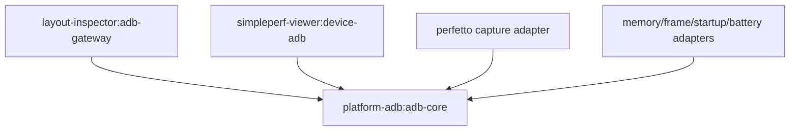

# ADB 公共模块提取方案

日期：2026-07-30
状态：已实施（本文前 12 节保留迁移时的历史方案，最终模块名与边界见第 13 节）

> **当前架构：** ADR-0007 已将方案中的 `platform-adb` 提升为
> `platform-core` composite build。其中 `host-toolchain` 是唯一的 Host Process
> 实现，`adb-core` 在该实现上提供唯一的共享 ADB 原语。下文的
> `platform-adb`、`device-adb` 和 `platform-toolchain` 作为迁移前名称保留，
> 不表示它们仍在当前构建图中。

## 1. 背景

Desktop Viewer 中多个功能都需要通过 ADB 完成设备发现、命令执行、文件传输和端口转发。目前这些能力分散在不同模块中：

- CPU、Memory、Frame、Startup、Battery、Perfetto 等功能主要复用
  `simpleperf-viewer/device-adb`。
- Layout Inspector 在 `layout-inspector/adb-gateway` 中维护了另一套 ADB
  设备模型、输出解析和进程执行代码。
- `perfetto-viewer` 下仍存在未接入当前构建的历史重复源码目录。

这种结构已经引发过运行时二进制不兼容问题。例如，同一个完整类名
`com.androidperformancestudio.adb.AdbDevice` 出现在不同构建产物中，且构造函数签名不同。
最终加载到错误版本时，CPU Profiler 会在解析设备列表时抛出
`NoSuchMethodError`。

因此，应把通用 ADB 能力提取为独立、稳定、无业务依赖的基础模块，并让各
Profiler 和 Inspector 只保留自己的业务协议与采集逻辑。

## 2. 当前结构与主要问题

### 2.1 当前复用关系

`simpleperf-viewer/device-adb` 已经被以下功能使用：

- CPU Profiler
- Memory Profiler
- Frame Profiler
- Startup Profiler
- Battery Profiler
- Perfetto Capture / Viewer

但该模块目前依赖：

- `simpleperf-application`
- `profile-model`
- `platform-toolchain`

它虽然事实上承担了共享 ADB 模块的职责，却仍位于 Simpleperf 子工程内，并依赖
CPU Profiler 相关上层模块，不适合作为所有功能共同依赖的基础设施层。

### 2.2 Layout Inspector 的重复实现

Layout Inspector 当前独立维护以下能力：

- ADB 可执行文件定位；
- ADB 命令参数构造；
- 外部进程执行；
- `adb devices -l` 输出解析；
- 设备状态与设备信息模型；
- Shell、截图、层级导出等设备操作。

这些能力与 `simpleperf-viewer/device-adb` 存在明显重叠。若两个模块继续使用相同
package 和类名，任何构建依赖变化都可能再次产生类加载冲突。

### 2.3 风险

当前结构的主要风险包括：

1. **重复完整类名**：不同 JAR 中存在相同 FQCN，运行时加载结果取决于 classpath
   顺序。
2. **二进制不兼容**：数据类新增字段后，旧调用方可能仍引用旧构造函数。
3. **依赖倒置失败**：通用 ADB 能力依赖具体 Profiler 的 application/model 模块。
4. **修复不一致**：设备解析、超时、序列号校验等修复需要在多处重复落地。
5. **能力缺口**：部分 ADB 执行器只支持文本输出，Layout Inspector 的截图和
   hierarchy dump 还需要可靠的二进制输出。

## 3. 目标与非目标

### 3.1 目标

- 建立唯一的 ADB 设备模型、输出解析器和执行入口。
- 消除跨模块重复 FQCN 和对应的 `NoSuchMethodError` 风险。
- 让公共模块不依赖任意 Profiler、Inspector、Compose UI 或业务 model。
- 同时支持文本命令和二进制 `exec-out`。
- 统一超时、协程取消、错误模型、输入校验和进程回收策略。
- 允许各功能在公共能力之上保留独立、可测试的业务网关。
- 支持渐进迁移，不要求一次性重写所有 Profiler。

### 3.2 非目标

- 不把 Simpleperf、Perfetto、HPROF、gfxinfo 等业务协议放进公共模块。
- 不统一各 Profiler 的页面状态、采集状态或错误文案。
- 不在本次提取中改变已有采集流程、文件格式或用户交互。
- 不引入新的第三方 ADB SDK；优先复用现有进程执行方式。
- 不直接删除尚未确认用途的历史目录；先验证构建图，再清理无引用代码。

## 4. 建议模块结构

建议在 Desktop Viewer 根构建下新增独立基础模块：

```text
desktop-viewer/
  platform-adb/
    adb-core/
      build.gradle.kts
      src/main/kotlin/com/androidperformancestudio/platform/adb/
        AdbExecutableLocator.kt
        AdbClient.kt
        AdbCommand.kt
        AdbCommandResult.kt
        AdbDevice.kt
        AdbDeviceState.kt
        AdbDevicesParser.kt
        AdbException.kt
        AdbInputValidator.kt
        ProcessRunner.kt
```

建议使用新 package：

```text
com.androidperformancestudio.platform.adb
```

不要继续使用过于宽泛的 `com.androidperformancestudio.adb`。更换 package 可以在
迁移期强制调用方显式选择新类型，并避免旧 JAR 与新 JAR 产生相同 FQCN。

### 4.1 依赖方向



`adb-core` 只能依赖 Kotlin/JDK 和仓库中真正通用的底层工具，不得反向依赖：

- `simpleperf-application`
- `profile-model`
- Layout Inspector
- 任意 Compose presentation 模块
- 任意具体 Profiler application 模块

## 5. 公共模块职责

### 5.1 ADB 可执行文件定位

`AdbExecutableLocator` 统一处理：

- 显式配置的 ADB 路径；
- `ANDROID_SDK_ROOT` / `ANDROID_HOME`；
- SDK `platform-tools/adb`；
- 系统 `PATH`；
- Windows、macOS、Linux 的可执行文件差异；
- 路径存在性和可执行性校验。

定位结果应包含来源信息，便于设置页和错误日志说明实际使用了哪个 ADB。

### 5.2 设备模型与解析

公共模型只描述 ADB 层可确认的事实：

```kotlin
data class AdbDevice(
    val serial: String,
    val state: AdbDeviceState,
    val product: String? = null,
    val model: String? = null,
    val device: String? = null,
    val transportId: Int? = null,
    val attributes: Map<String, String> = emptyMap(),
)
```

`AdbDevicesParser` 负责解析 `adb devices -l`，并覆盖：

- `device`
- `offline`
- `unauthorized`
- `no permissions`
- emulator、USB、无线设备序列号
- 未知属性
- 空行、daemon 提示和异常输出

业务层不得复制另一份同名设备数据类。若页面需要展示名称或能力，应通过 mapper
转换为各自的 UI model。

### 5.3 进程执行

公共 `ProcessRunner` 必须支持：

- 参数数组执行，禁止拼接未经转义的 shell 字符串；
- 标准输出、标准错误分别读取；
- 文本输出；
- 原始字节输出；
- 超时；
- 协程取消；
- 取消或超时后的子进程销毁；
- 退出码与执行耗时；
- 可注入实现，便于单元测试。

文本命令与二进制命令应明确分离，避免截图字节被字符编码破坏：

```kotlin
suspend fun executeText(command: AdbCommand): AdbTextResult

suspend fun executeBinary(command: AdbCommand): AdbBinaryResult
```

### 5.4 通用 ADB 操作

`AdbClient` 提供与具体 Profiler 无关的操作：

```kotlin
interface AdbClient {
    suspend fun listDevices(): List<AdbDevice>

    suspend fun shell(
        serial: String,
        arguments: List<String>,
        timeout: Duration,
    ): AdbTextResult

    suspend fun execOut(
        serial: String,
        arguments: List<String>,
        timeout: Duration,
    ): AdbBinaryResult

    suspend fun push(
        serial: String,
        localPath: Path,
        remotePath: String,
        timeout: Duration,
    ): AdbTextResult

    suspend fun pull(
        serial: String,
        remotePath: String,
        localPath: Path,
        timeout: Duration,
    ): AdbTextResult

    suspend fun forward(
        serial: String,
        local: String,
        remote: String,
        timeout: Duration,
    ): AdbTextResult

    suspend fun removeForward(
        serial: String,
        local: String,
        timeout: Duration,
    ): AdbTextResult
}
```

实际 API 可以在实施阶段按现有调用方式微调，但必须保持以下边界：

- 公共层接受 ADB 参数，不接受 Simpleperf/Perfetto 专用 request。
- 公共层返回进程和 ADB 结果，不返回页面状态。
- 默认超时可统一配置，长任务允许调用方覆盖。
- 设备序列号和远端路径在进入参数数组前统一校验。

### 5.5 错误模型

建议区分：

- ADB 未找到；
- ADB 不可执行；
- 设备未连接；
- 设备 offline；
- 设备 unauthorized；
- 命令超时；
- 命令被取消；
- 非零退出码；
- 输出解析失败；
- 本地文件或远端路径错误。

公共错误保留技术信息；各功能在 presentation 层转换为本地化用户文案。

## 6. 必须保留在业务模块的能力

公共模块只负责可靠地“执行 ADB”。以下逻辑继续归各自功能所有。

### 6.1 Layout Inspector

- 前台应用和窗口识别；
- View hierarchy / UIAutomator 输出解析；
- 截图采集和图像解码；
- AgentSession 协议；
- Layout capture archive；
- Layout 专用 fallback 策略。

### 6.2 CPU Profiler

- Simpleperf 可用性和 ABI 检测；
- Simpleperf 二进制部署；
- 进程、线程和性能事件目录；
- record/stat 命令构建；
- Simpleperf 会话管理。

当前 `simpleperf-viewer/device-adb` 可以先降级为 CPU 专用 adapter，并依赖
`adb-core`，之后再根据职责重命名。

### 6.3 Perfetto

- trace config；
- Perfetto 服务能力检测；
- trace 启动、停止和状态轮询；
- trace 文件命名、拉取和解析。

### 6.4 其他 Profiler

- Memory：HPROF dump 与转换。
- Frame：gfxinfo、FrameMetrics 和帧数据解析。
- Startup：实验流程和 Agent 协议。
- Battery：电量、功耗和系统统计命令语义。
- Network：抓包、端口和网络分析协议。

## 7. 分阶段迁移计划

### 阶段 0：锁定兼容行为

1. 保留现有 ADB classpath 唯一性回归测试。
2. 为两套 `adb devices -l` 解析器补齐等价 fixture。
3. 为文本、二进制、超时和取消补进程执行测试。
4. 记录各功能当前使用的 ADB 命令和预期错误行为。

### 阶段 1：提取无业务依赖的值对象

优先提取：

- `AdbExecutableLocator`
- `AdbDevice`
- `AdbDeviceState`
- `AdbDevicesParser`
- 输入校验器

调用方通过 mapper 适配现有业务模型。此阶段不改变采集流程。

### 阶段 2：建立统一 `AdbClient`

1. 提取参数数组构造和进程执行器。
2. 统一文本输出、stderr、退出码和超时行为。
3. 迁移设备刷新和基础 shell 操作。
4. 禁止新代码直接创建 `ProcessBuilder("adb", ...)`。

### 阶段 3：补齐二进制输出

为 Layout Inspector 补齐可靠的 `exec-out` 字节通道，覆盖：

- `screencap -p`
- 二进制或非 UTF-8 hierarchy/window dump
- 大输出读取
- 超时与取消时的流关闭

完成此阶段后，Layout Inspector 才具备迁移全部 ADB 入口的条件。

### 阶段 4：迁移 Layout Inspector

1. `layout-inspector/adb-gateway` 改为依赖 `adb-core`。
2. 删除重复的设备模型、locator、基础 parser 和 process runner。
3. 保留 Layout 专用 command adapter、解析器和 fallback capture。
4. 对比迁移前后的设备列表、截图和 hierarchy capture 结果。

### 阶段 5：收敛现有共享模块

1. `simpleperf-viewer/device-adb` 改为依赖 `adb-core`。
2. 将 Simpleperf 专用能力留在原模块或重命名后的 adapter 模块。
3. Perfetto、Memory、Frame、Startup、Battery 逐一移除对旧基础类型的直接引用。
4. 确认所有复合构建只解析到一个公共 ADB 坐标和一套公共类型。

### 阶段 6：删除重复与历史实现

满足以下条件后再删除：

- 所有功能已迁移；
- classpath 唯一性测试通过；
- 根应用和各 composite build 均可独立构建；
- CPU、Layout、Perfetto 的设备操作 smoke test 通过；
- Git 搜索确认没有旧 package 引用。

最后清理 Layout 的重复基础代码，以及 Perfetto 中未被当前
`settings.gradle.kts` 引用的历史 `device-adb` / `platform-toolchain` 目录。

## 8. 兼容与发布策略

### 8.1 避免再次发生二进制冲突

- 新公共类型使用新的 package。
- 仓库中不得出现两个相同 FQCN 的 `AdbDevice`。
- 不通过 typealias 长期兼容旧 package；typealias 不解决 JVM 二进制类冲突。
- 迁移期 adapter 显式完成旧 model 到新 model 的转换。
- Desktop App 打包测试应扫描运行时 classpath 中的重复 class。

### 8.2 API 演进

- 公共 API 尽量使用接口和命名参数明确的数据类。
- 不把频繁变化的业务字段加入 `AdbDevice`。
- 新增可选设备属性时优先使用默认值，并同步做二进制兼容检查。
- 对外暴露的结果对象保持稳定；原始 ADB 输出只用于诊断和兼容兜底。

### 8.3 渐进切换

迁移应按功能逐个完成，每一步都保持可回退：

- 新旧 adapter 不使用相同 FQCN；
- 单个功能迁移失败时可回退到旧 adapter；
- 在所有调用方迁移完成前，不删除旧模块；
- 不在同一变更中同时修改公共层、所有 Profiler 和 UI。

## 9. 测试方案

### 9.1 单元测试

- ADB 路径定位优先级和不同操作系统路径。
- `adb devices -l` 全状态解析。
- USB、emulator、无线设备序列号。
- 未知属性和 daemon 噪声。
- 参数数组构造与危险输入拒绝。
- 文本 stdout/stderr 和非零退出码。
- PNG 等二进制输出不被转码。
- 超时、协程取消和子进程回收。
- push、pull、forward 参数构造。

### 9.2 依赖与打包测试

- 运行时 classpath 不包含重复 ADB class。
- Desktop App 测试运行时可实例化唯一的 `AdbDevice`。
- 根构建和各 composite build 的依赖解析结果一致。
- DMG/PKG/EXE/MSI/DEB/RPM 打包产物不包含旧重复类。

### 9.3 集成测试

至少覆盖一台真机和一个 emulator：

- 设备发现与状态刷新；
- unauthorized/offline 恢复；
- shell 文本命令；
- screenshot 二进制采集；
- push/pull；
- forward/remove-forward；
- 长命令取消；
- ADB server 重启后的恢复。

### 9.4 功能回归

- CPU Profiler 可选择设备并启动采集，不再出现 `NoSuchMethodError`。
- Layout Inspector 可获取设备、截图和 hierarchy。
- Perfetto 可启动、停止并拉取 trace。
- Memory、Frame、Startup、Battery 的设备列表和采集入口保持可用。
- 错误信息仍通过各页面现有多语言资源展示。

## 10. 验收标准

方案实施完成需同时满足：

1. 仓库中只有一个被构建使用的公共 `AdbDevice` 定义。
2. 公共 ADB 模块不依赖任何具体 Profiler 或 Inspector。
3. 所有直接 ADB 进程执行都集中到公共 client/runner。
4. 文本与二进制输出均有自动化测试。
5. CPU Profiler 连接设备后可以正常启动。
6. Layout Inspector 的截图和 hierarchy fallback 不退化。
7. Perfetto 的 trace 拉取流程不退化。
8. classpath 重复类检查、单元测试和 Desktop App 打包测试通过。
9. 旧重复基础实现已经删除或明确标记为不参与构建。

## 11. 风险与回滚

| 风险 | 缓解方式 |
| --- | --- |
| 公共 API 过度抽象，难以满足特殊命令 | 公共层只抽象 ADB 传输和进程语义，业务命令留在 adapter |
| 二进制输出引入内存压力 | 支持有上限的字节读取；大文件优先使用 pull |
| 迁移造成超时行为变化 | 迁移前记录各命令超时，调用方可显式覆盖默认值 |
| composite build 解析到不同版本 | 固定统一坐标，并增加依赖解析和 classpath 扫描测试 |
| 一次性迁移范围过大 | 按设备模型、client、二进制、Layout、其他 Profiler 分阶段提交 |
| 删除历史模块后遗漏调用方 | 删除前执行全仓库引用搜索和所有独立构建验证 |

若任一功能迁移后出现回归，回滚该功能的 adapter 依赖即可；新旧实现因 package
不同可以在短期内并存，但不得重新引入相同 FQCN。

## 12. 最终建议

ADB 操作适合提取到公共模块，但不应直接把现有
`simpleperf-viewer/device-adb` 原样提升为公共依赖。正确方向是：

1. 新建低层、无业务依赖的 `platform-adb:adb-core`；
2. 使用新的 `com.androidperformancestudio.platform.adb` package；
3. 先统一设备模型、解析、进程执行和二进制通道；
4. 再让 Layout、Simpleperf 和其他 Profiler 的业务 adapter 逐步依赖它；
5. 通过 classpath 唯一性测试防止重复类和二进制不兼容再次发生。

这一方案既能复用 ADB 基础能力，也能保持各 Profiler 的采集协议独立，是当前仓库
风险最低、可渐进实施的收敛路径。

## 13. 实施结果

本方案已按 ADR-0007 的最终分层边界落地：

- `platform-core/host-toolchain` 提供 canonical
  `com.androidperformancestudio.platform.toolchain` API；`JvmHostProcessRunner`
  是唯一启动 JVM 子进程的实现。`StudioHostProcessExecutor` 只在共享边界把
  typed Host Toolchain 失败映射为 `StudioError`，不启动进程。
- `platform-core/adb-core` 统一 ADB executable 定位、无状态
  `DeviceTarget`、设备发现、输入校验、文本/二进制执行、超时与取消、
  push/pull/forward 及类型化错误；它组合 `host-toolchain`，不保留第二套
  process runner。
- Layout Inspector、Simpleperf、Perfetto、Memory、Frame、Startup、Battery、
  Network 以及其他已迁移功能直接解析 `platform-core` 坐标；功能网关只保留
  自身命令和领域映射。
- Simpleperf 历史 `device-adb` 和 `platform-toolchain` 模块、旧
  `com.androidperformancestudio.toolchain` package 与兼容 shim 均已删除；
  Simpleperf 的采集、parser、强类型模型和 UI 保持独立。
- Perfetto 设备发现和采集执行经 `adb-core`，Trace Processor 的校验、
  动态私有端口和生命周期则由独立 `platform-perfetto` 负责。
- parser、locator、文本与二进制通道、超时、取消、参数校验、旧坐标拒绝和
  Desktop runtime classpath 唯一性均有自动化结构契约。
