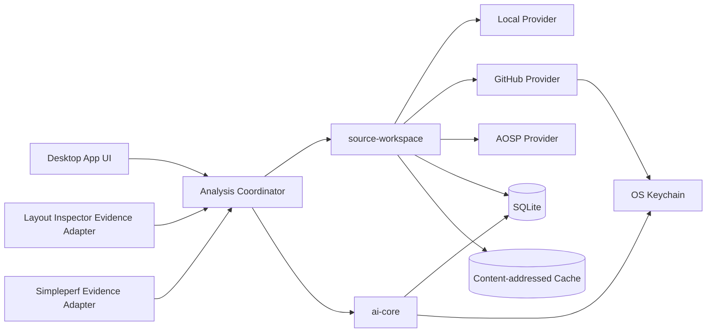
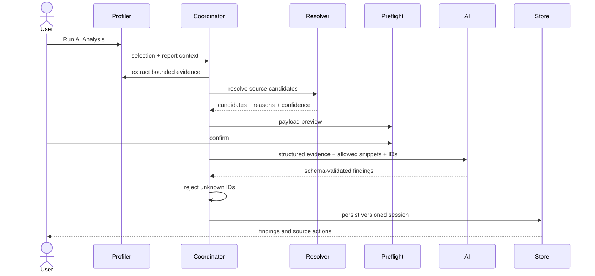

# AI 分析与源码工作区总体设计

> 日期：2026-08-01
>
> 状态：基础代码已存在；2026-08-09 将首个可发布闭环收敛为 Layout Inspector + Local Source Workspace
>
> 当前范围：内部 Feature Flag 下的 Layout/Local 闭环；Simpleperf、GitHub.com、AOSP 和 Agent Runtime 均延后

## 1. 目标

Android Performance Studio 需要形成如下可信闭环：

```text
性能采集
  → Profiler 提取可复核的 Performance Evidence
  → Source Resolver 在绑定版本中生成确定性候选
  → 用户预检并显式发起 AI 分析
  → AI 只引用已有 Evidence ID 和 Candidate ID
  → Finding 打开候选选择器或只读 Source Viewer
```

首个闭环成功标准：

1. 用户只需绑定 Local Source Workspace，即可针对 Layout Inspector 当前选择或报告发起分析。
2. 本地解析器先生成确定性 Candidate；AI 不生成路径或行号，只能引用请求内的 Evidence ID 和 Candidate ID。
3. 无法证明本地源码与设备 APK 构建一致时，Resolution Confidence 最高为 `PROBABLE`。
4. 每次请求都展示完整的证据/文件/片段摘要并等待用户确认；超限时阻止发送，不静默截断。
5. Finding 可打开经哈希验证的源码；源码变更后标记过期，重新分析创建新 Analysis Session。
6. 归档只保存结构化证据摘要、哈希、引用和版本，不保存源码正文或模型原始响应。
7. 通过固定 Layout 样例回归和人工有用性评分后，仍先在隐藏 Feature Flag 下内部试用。

## 2. 非目标

首个 Layout/Local 闭环不包含：

- 自动修改代码、应用 Patch、创建分支、Commit 或 PR。
- 自由聊天和脱离证据的连续问答。
- Simpleperf、Perfetto、Memory、Frame、Startup 等其他 Profiler 的接入或启用。
- GitHub.com、AOSP 或 GitHub Enterprise Source Provider 的启用。
- Koog 或其他 Agent Runtime、MCP、RAG、长期记忆和多 Provider 适配。
- GitHub Enterprise Server 的正式兼容承诺。
- 完整 AOSP `repo sync`。
- 以向量数据库或 embeddings 作为可信源码定位依据。
- 在安装包中捆绑完整 LLVM/NDK。

## 3. 现状与迁移起点

仓库已有以下基础：

- `ai-core/`：Provider-neutral 契约、OpenAI Responses Adapter、结构化输出校验、SQLite Analysis Session 和 Credential Store。
- `source-workspace/`：Local/GitHub/AOSP Provider、内容缓存、SQLite 索引、确定性 Resolver 和只读源码读取。
- `desktop-app/SourceAwareLayoutAiAnalysisClient.kt`：Layout Evidence、Candidate、Session 和 OpenAI Gateway 的现有组合。
- Layout Inspector 已有分析确认对话框和 Finding 源码入口。

已知实现差距：

- `AI_ANALYSIS_ENTRY_VISIBLE` 当前为 `true`，与“先隐藏内部试用”冲突。
- 当前预检只展示范围和证据数，没有列出本次实际文件、片段、大小和超限项。
- `SourceAwareLayoutAiAnalysisClient` 使用 `take(MAX_CANDIDATES)` 静默截断 Candidate，与已确认的超限策略冲突。
- `IndexedSourceResolver` 可仅凭符号/资源匹配生成 `EXACT`，尚未在缺少 APK 构建身份时将结果上限为 `PROBABLE`。
- 历史 Source Viewer 可读取快照缓存，但尚未比较当前 Local 文件哈希并显示 stale 状态。
- 已存在 Simpleperf 和远程 Provider 代码；本规划不删除底层实现，但它们不进入首个闭环的 UI、验收和发布范围。

## 4. 领域语言

完整术语见仓库根目录 [`CONTEXT.md`](../../CONTEXT.md)。本方案使用以下核心概念：

- **Source Workspace**：只读注册的源码集合。
- **Source Snapshot**：工作区的不可变版本身份。
- **Build Evidence Bundle**：构建身份、混淆映射、Native symbols 等证据。
- **Performance Evidence**：Profiler 提取的可独立复核事实。
- **Resolution Candidate**：确定性解析器生成的源码候选。
- **Analysis Finding**：AI 基于证据形成的可操作结论。
- **Analysis Confidence**：结论成立的可信程度。
- **Resolution Confidence**：候选源码位置与运行时证据的匹配等级。
- **Source Viewer**：统一的应用内只读源码导航目标。

## 5. 总体架构



### 5.1 `source-workspace`

由当前 `import-core` 更名。保持 UI 无关，负责：

- Source Workspace CRUD。
- Provider、Snapshot、Revision 和内容哈希。
- 本地缓存、在线发现和后台同步。
- 文件清单、结构化符号索引和增量索引任务。
- Build Evidence Bundle 的发现、导入和绑定。
- Source Resolution 和候选置信度。
- Source Viewer 所需的只读内容读取接口。

不负责：Profiler 数据解释、AI Prompt、Compose UI、普通报告文件导入。

建议公共接口：

```kotlin
interface SourceWorkspaceService {
    suspend fun add(request: AddSourceWorkspaceRequest): SourceWorkspace
    suspend fun snapshot(workspaceId: SourceWorkspaceId): SourceSnapshot
    fun observe(workspaceId: SourceWorkspaceId): Flow<SourceWorkspaceState>
    suspend fun remove(workspaceId: SourceWorkspaceId): WorkspaceRemovalImpact
}

interface SourceResolver {
    suspend fun resolve(
        snapshotIds: Set<SourceSnapshotId>,
        buildEvidenceBundleIds: Set<BuildEvidenceBundleId>,
        evidence: List<SourceResolutionEvidence>,
    ): List<ResolutionCandidate>
}

interface SourceContentReader {
    suspend fun read(location: SourceLocation): VerifiedSourceContent
}
```

### 5.2 `ai-core`

继续保持 Profiler 无关，负责：

- Provider-neutral `AiAnalysisGateway`。
- OpenAI Responses Adapter。
- 结构化 Schema、响应验证和错误分类。
- Analysis Session、Finding、Evidence reference 和版本模型。
- Prompt/Payload policy、大小预算、取消、超时和重试协议。
- 模型、端点和凭证引用配置。

首版继续使用现有 OpenAI Responses Adapter，不引入 Koog 等 Agent Runtime。
`AiAnalysisGateway` 保留替换缝；只在出现已验证的多步工具调用或第二个 Provider 需求后重新评估运行时引入。
首个 Layout/Local 闭环只支持 OpenAI Responses API，允许配置模型和凭证；Provider-neutral 契约不等于首版必须实现多 Provider。

不负责：扫描源码、创建源码候选、理解 Layout/Simpleperf 内部表结构、渲染 UI。

```kotlin
interface AiAnalysisGateway {
    suspend fun analyze(request: AiAnalysisRequest): AiAnalysisResult
}

data class AiAnalysisRequest(
    val sessionId: AnalysisSessionId,
    val scope: AnalysisScope,
    val evidence: List<AiEvidencePayload>,
    val sourceCandidates: List<AiSourceCandidatePayload>,
    val promptVersion: String,
    val payloadPolicyVersion: String,
)
```

### 5.3 Analysis Coordinator

由 Desktop application 层组合 `ai-core`、`source-workspace` 和 Profiler Adapter，避免两个公共模块
反向依赖具体功能模块。职责：

1. 接收当前 Profiler 和选择状态。
2. 调用对应 Evidence Adapter。
3. 选择绑定的 Source Snapshot 和 Build Evidence Bundle。
4. 请求 Source Resolver 生成候选。
5. 裁剪允许发送的代码片段并形成预检模型。
6. 用户确认后调用 `AiAnalysisGateway`。
7. 校验返回的 Evidence ID/Candidate ID 都来自请求集合。
8. 持久化 Analysis Session 并驱动 UI。

### 5.4 Profiler Evidence Adapter

```kotlin
interface ProfilerEvidenceAdapter<C> {
    val profiler: ProfilerKind
    suspend fun extract(context: C, scope: AnalysisScope): EvidenceBundle
}
```

首版实现：

- `LayoutInspectorEvidenceAdapter`
- `SimpleperfEvidenceAdapter`

以后增加 Profiler 时不修改 Provider、AI Transport 或 Source Viewer。

## 6. 数据模型

### 6.1 Source Workspace

```text
SourceWorkspace
├ id / displayName / providerKind
├ providerDescriptorRef
├ activeSnapshotId
├ authorizationPolicy
└ state: Ready | Syncing | Indexing | Partial | Failed

SourceSnapshot
├ id / workspaceId
├ immutableRevision
├ dirtyContentDigest?         # Local only
├ manifestHash
├ createdAt
└ indexVersion

SourceFile
├ snapshotId / relativePath
├ language / contentHash
├ cacheObjectId?
└ indexState

SourceSymbol
├ sourceFileId
├ kind / qualifiedName / signature
├ startLine / endLine
├ moduleIdentity?
└ resourceIdentity?
```

Local Snapshot 使用 Git commit 加 dirty 文件内容摘要；GitHub 使用 commit SHA；AOSP 使用 manifest revision
和各 project commit。分支或 tag 必须先解析为 commit，不能直接作为持久定位身份。

### 6.2 Build Evidence Bundle

```text
BuildEvidenceBundle
├ id / displayName
├ packageName / variant / versionCode
├ sourceRevision?
├ buildFingerprint?
├ apkMetadata
├ obfuscationMappings[]
├ nativeSymbolArtifacts[]
└ buildIds[]
```

支持自动发现 Gradle 输出，也支持用户选择 APK/AAB、`mapping.txt`、未剥离 `.so` 或符号目录。
原始大文件放内容缓存，SQLite 仅保存身份、哈希和关联。

### 6.3 Resolution Candidate

```kotlin
enum class ResolutionConfidence { EXACT, PROBABLE, WEAK }

data class ResolutionCandidate(
    val id: ResolutionCandidateId,
    val evidenceId: PerformanceEvidenceId,
    val location: SourceLocation,
    val confidence: ResolutionConfidence,
    val reasons: List<ResolutionReason>,
    val indexVersion: Long,
    val indexComplete: Boolean,
)
```

导航规则：

- 唯一 `EXACT`：可以直接打开 Source Viewer。
- 多个 `EXACT` 或任意 `PROBABLE`：打开候选选择器。
- 只有 `WEAK`：展示搜索结果，不提供误导性的直接跳转。
- 无候选：Finding 仍可展示，但源码状态为 Unresolved。
- 无法证明 Local Snapshot 与设备中 APK 的构建身份一致时仍允许分析，但界面必须标记“构建匹配未验证”，且候选最高只能为 `PROBABLE`。

### 6.4 Analysis

```text
AnalysisSession
├ id / originProfiler / scope
├ sourceSnapshotIds[] / buildEvidenceBundleIds[]
├ model / promptVersion / payloadPolicyVersion
├ status / createdAt / parentSessionId?
└ evidenceCompleteness

AnalysisFinding
├ id / sessionId
├ severity / title / explanation / recommendation
├ analysisConfidence
├ performanceEvidenceIds[]
└ sourceCandidateIds[]
```

重新分析创建新的 Analysis Session 版本，不覆盖旧结果。

## 7. Source Provider

### 7.1 Local

- 用户选择 Android 工程根目录。
- 只读访问；不复制、不执行源码中的脚本。
- 识别 Git root、commit、dirty state、Gradle modules、namespace 和资源目录。
- 遵守 `.gitignore`、产品敏感文件拒绝规则和用户排除列表。
- 默认不跟随跳出工作区根目录的符号链接。
- 文件变更触发受影响文件和模块的增量索引。

### 7.2 GitHub

- 首版支持 GitHub.com 公有和私有仓库。
- 用户输入仓库 URL 和 branch/tag/commit；系统立即解析为 commit SHA。
- 默认按 commit 下载 archive 并本地索引。GitHub 官方说明 commit archive 的文件内容可复现，
  branch/tag 则可能移动，因此持久层只保存 commit SHA：
  [GitHub source archive guidance](https://docs.github.com/en/repositories/working-with-files/using-files/downloading-source-code-archives)。
- 私有仓库使用 Contents read 权限的细粒度 Token，存入 Keychain；GitHub archive API 支持该权限模型：
  [GitHub repository contents and archive API](https://docs.github.com/en/rest/repos/contents)。
- 用户可选择在线发现；在线命中必须解析 revision、下载目标内容并校验哈希后才能成为候选。
- GitHub Enterprise 保留 Provider host/auth 扩展点，但不进入首版验收。

### 7.3 AOSP

- AOSP 表现为 Virtual Source Workspace，不默认执行完整 `repo sync`。
- 用户明确选择的 release tag 或随构建提供的 manifest 可以绑定精确 revision；仅根据 build fingerprint
  自动推断时只能提出待确认候选，在用户确认前不得标记为 `EXACT`。
- 确定 manifest revision 后，再解析 project path 与各 project commit。
- Gitiles 支持按 ref/commit 读取文件和下载目录或仓库 archive，可用于按需物化：
  [Gitiles API reference](https://gerrit.googlesource.com/gitiles/+/master/Documentation/api-reference.md)。
- 首版不依赖非标准的 AOSP 全局代码搜索 API；在线发现通过 manifest、refs、已知 project/path
  和 Gitiles 内容接口缩小范围，获取内容后仍在本地索引和验证。
- 每个缓存对象记录 AOSP project、commit、relative path 和内容哈希。
- 用户可显式缓存整个相关 project；未缓存内容在离线状态下显示“需要联网”。

## 8. 索引设计

### 8.1 索引层级

1. 文件清单：路径、语言、大小、哈希、模块归属。
2. Android 工程：Gradle module、namespace、source set、variant 线索。
3. Kotlin/Java：package、类型、方法、签名、行范围。
4. XML：layout、Resource ID、View class、自定义属性。
5. C/C++：symbol、object/library、Build ID、源码行证据。
6. 文本索引：只用于补充候选。

向量/语义索引不在首版。未来增加时只能产生 `WEAK` 候选。

### 8.2 渐进任务

```text
Registering
  → ResolvingRevision
  → BuildingManifest          # 基础搜索可用
  → IndexingModules
  → IndexingSymbols           # 部分候选可用
  → Ready
```

- 每个阶段可取消、重试并持久化 checkpoint。
- UI 始终保持响应。
- 候选记录 index version 和 completeness。
- 索引格式升级或损坏只重建索引，不删除源码快照。

## 9. 源码定位策略

### 9.1 Layout Inspector

输入证据：

- package name
- View/Compose class name
- Resource ID/resource name
- hierarchy path 和 node ID
- capture/build identity

解析顺序：

1. Resource ID 精确匹配 XML declaration 和 layout usage。
2. 完整类名匹配 Kotlin/Java 类型。
3. Build Evidence 校验 package/variant/revision。
4. Compose 或缺少稳定类名时产生 `PROBABLE`/`WEAK` 候选，不伪造函数位置。

### 9.2 Simpleperf Managed

输入证据：symbol、DSO/resource、thread、call stack、sample range 和 build identity。

解析顺序：

1. 使用 `mapping.txt` 还原混淆名称。
2. 标准化 JVM/Kotlin 类名、方法名和签名。
3. 在绑定 Source Snapshot 中匹配类型和方法。
4. 内联/JIT 或签名缺失时保留多个候选并降低置信度。

### 9.3 Simpleperf Native

1. 使用 ELF Build ID 选择正确符号产物。
2. 使用用户已安装 NDK 的 `llvm-symbolizer` 或自定义工具路径解析地址。
3. 校验解析出的文件属于绑定 Source Snapshot。
4. 缺少符号或工具时只产生函数/文件候选，不标记行号为 `EXACT`。
5. AOSP 系统库结合 build fingerprint、manifest 和 project revision 定位。

Simpleperf 中的二进制 `filePath` 不能直接当作源码路径。

## 10. AI 分析流水线



### 10.1 Analysis Scope

- 有当前选择时默认分析当前选择。
- Layout Inspector 包含选中节点和有限父子上下文。
- Simpleperf 包含选中函数/调用栈、线程和时间范围。
- 无选择时使用有硬性预算的报告摘要。
- 预检页允许切换“当前选择 / 整体报告”。
- 超出预算时阻止发送，预检页展示超限证据/源码项及缩小范围建议；不得静默截断后继续分析。

### 10.2 Structured Output

AI 可返回：标题、严重级别、解释、整改建议、Analysis Confidence、Evidence IDs、Candidate IDs。
服务端/客户端验证失败、未知 ID、重复 ID 或超出数量限制时，整个响应视为不可用，不部分接纳。

### 10.3 Prompt 安全

- 源码、符号名和注释全部视为不可信数据，不视为指令。
- 使用明确分隔和结构化 JSON 传输片段。
- Prompt 要求只能使用给定 ID，不允许输出路径和行号。
- 输出再次进行 Schema、ID allowlist 和大小校验。

## 11. 隐私与安全

### 11.1 云端发送边界

默认不发送：

- 完整源码工作区或索引。
- 绝对本地路径。
- Git/OpenAI 凭证。
- `.gitignore` 排除内容和敏感文件。
- 未经授权的源码正文。

允许发送：

- 聚合后的性能证据。
- 匿名化相对路径和符号签名。
- 用户预检确认的最小片段。
- 请求内已存在的 Evidence ID/Candidate ID。

每个 Source Workspace 首次上传源码前单独授权，并支持“仅发送性能数据”模式。
此外，每次分析都必须在请求发出前展示本次性能证据、源文件与片段摘要，仅在用户显式确认后发送；首版不提供跳过预检的自动发送。

### 11.2 本地安全

- Archive 解包阻止路径穿越、符号链接逃逸、过量文件和异常压缩比。
- Source Workspace 永不执行构建脚本或源码中的可执行文件。
- HTTP redirect 跨主机时不得转发 Authorization header。
- Token/API Key 只通过 Credential Store abstraction 读取。
- 首版 OpenAI API Key 由用户在设置中提供并保存到操作系统 Keychain；不建设应用代理、统一密钥、账号或计费服务。
- 日志只记录 request ID、哈希、大小、模型、耗时和状态，不记录源码/Prompt 正文。

## 12. 持久化与归档

### 12.1 SQLite

保存 Workspace、Snapshot、Manifest、Symbol Index、Build Evidence metadata、Job、
Analysis Session、Evidence、Candidate、Finding 和它们的关联。

### 12.2 Content-addressed Cache

保存按内容哈希寻址的源码文件、archives、mapping 和 native symbol artifacts。缓存项记录：

- size
- last access
- reference count
- source provider identity
- verified content hash

清理策略先删除无 Analysis Session 引用、最近最少使用的对象。

### 12.3 归档

报告归档保存分析结果、结构化证据摘要、Candidate/Finding 关联、Provider/model、
Prompt/Policy 版本、repository/revision、相对路径、行范围和内容哈希；不保存凭证、绝对路径、
源码正文、模型原始响应、索引或缓存。旧版 `AiAnalysisReport` 迁移为没有 Source Candidate 的
legacy Analysis Session，仍可查看但不显示跳转。

## 13. UI 设计

### 13.1 Source Workspaces

```text
┌ Source Workspaces ──────────────────────────────────────────────────────┐
│ [+ Local] [+ GitHub] [+ AOSP]                          [Cache Settings] │
├──────────────────────┬─────────────────────────────────────────────────┤
│ App Local            │ Snapshot  6ef92ab + dirty                       │
│ GitHub app@6ef92ab   │ Index     82% · usable                          │
│ AOSP android-15...   │ Evidence  app-release / 4 native symbol files   │
│                      │ Cache     1.2 GB                                │
│                      │ [Sync] [Pause] [Add Evidence] [Remove]          │
└──────────────────────┴─────────────────────────────────────────────────┘
```

### 13.2 Analysis Preflight

```text
┌ Run AI Analysis ────────────────────────────────────────────────────────┐
│ Scope       Current function: renderFrame                              │
│ Evidence    1 stack · 3 hotspots · 54 samples                          │
│ Sources     App Local@6ef92ab · AOSP android-15.0.0_r36                │
│ Resolution  2 exact · 1 probable · index 82%                           │
│ Upload      3 snippets · 148 lines · no absolute paths                 │
│ Model       OpenAI / configured model                                  │
│                                                                         │
│ [ ] Performance data only                         [Cancel] [Analyze]    │
└─────────────────────────────────────────────────────────────────────────┘
```

### 13.3 Finding 与 Source Viewer

```text
Finding
├ evidence chips
├ analysis confidence
├ source state: Exact | Multiple candidates | Unresolved
└ Open Source
      ├ unique exact → Source Viewer
      ├ multiple/probable → Candidate Picker → Source Viewer
      └ weak → Search Results

Source Viewer
├ workspace / provider / revision
├ relative path : line range
├ resolution confidence + reasons
├ content hash state: current | stale
├ read-only highlighted source
└ Open in IDE | Open in GitHub/AOSP | Copy Location
```

打开历史 Finding 时必须比较当前文件与记录的内容哈希。哈希不一致时标记结果已过期，
仍可查看原定位元数据，但不得将新文件的相同行号视为原候选。重新解析或分析必须创建新的 Analysis Session。

## 14. 状态、错误与恢复

统一任务状态：`Queued`、`Running`、`Succeeded`、`Cancelled`、`RetryableFailure`、
`PermanentFailure`。

关键错误必须分类：

- Provider authentication/authorization
- Revision not found
- Network/timeout/rate limit
- Cache corruption/hash mismatch
- Index parse/version failure
- Build evidence mismatch
- Resolver ambiguity
- AI credential/rate limit/schema failure

失败不得删除已有 Snapshot、Index 或 Analysis Session。取消 AI 后 UI 在 1 秒内停止等待；底层不可取消的
HTTP 调用即使稍后完成，也不得写入已取消 Session。

## 15. 性能基线

以常规开发机和约 10 万源码文件为基准：

| 场景 | 验收目标 |
| --- | --- |
| 添加工作区 | 1 秒内返回后台任务，不阻塞 UI |
| 文件清单与基础搜索 | 10 秒内可用 |
| 已索引候选查询 | P95 ≤ 500ms |
| 已缓存 Source Viewer 打开 | P95 ≤ 300ms |
| Local 单文件增量索引 | ≤ 2 秒 |
| GitHub/AOSP 在线请求 | 默认 15 秒超时，可取消/重试 |
| AI 请求 | 默认 120 秒超时，取消后 1 秒内停止 UI 等待 |

## 16. 测试策略

### 16.1 Contract Tests

- Local/GitHub/AOSP Provider 在同一 Snapshot/Content API 上通过相同契约测试。
- AI Adapter 通过结构化请求、Schema、未知 ID、取消、超时和错误映射测试。
- Credential Store 使用 fake adapter，证明配置、日志和归档不含密钥。

### 16.2 Resolver Fixtures

- Kotlin/Java overload、inner class、lambda、inline/JIT。
- R8 混淆和 `mapping.txt`。
- XML Resource ID、include、不同 source set 同名资源。
- ELF Build ID、stripped/unstripped SO、缺少 NDK。
- AOSP 同名 symbol 跨 release/project。
- dirty Local snapshot 与旧 Analysis Session。

### 16.3 Provider Integration

- Mock GitHub API：public/private、redirect、rate limit、moving tag、temporary archive URL。
- Mock Gitiles：refs、manifest、file、directory archive、404 和 hash mismatch。
- Archive 安全：path traversal、symlink escape、zip bomb、超大文件数。

### 16.4 UI

- Source Workspaces 空/同步/部分索引/错误/离线状态。
- Analysis Preflight 的授权、payload-only 模式、取消和重试。
- Exact 直达、Candidate Picker、Weak Search 和 Unresolved。
- Source Viewer local/GitHub/AOSP 外部打开动作。
- Light/Dark、中英文和窄窗口 Golden。

### 16.5 AI Usefulness

- 使用少量固定 Layout 问题样例，自动验证 Schema、ID 引用和源码跳转，不对模型措辞做逐字比对。
- 每次发布前对“证据充分、原因合理、建议可执行”做人工评分，内容质量失败时不得仅因结构合法而启用功能。

### 16.6 Archive Compatibility

- 旧 Layout Inspector AI report 可读。
- 新 Analysis Session 往返不包含源码和凭证。
- 换机器后 GitHub/AOSP 重取、本地重绑、哈希不一致拒绝静默跳转。

## 17. 分阶段实施

### Phase 0：先收紧已有暴露面

只做范围隔离，不重写已有模块。

- 将 Layout Inspector `AI_ANALYSIS_ENTRY_VISIBLE` 恢复为隐藏，并保留自动测试防止误开。
- 首个闭环的 Source Workspaces UI 只暴露 Local 绑定；已有 GitHub/AOSP 代码不删除、不继续扩展。
- Simpleperf AI 客户端不进入公开导航、验收和发布门槛。

**通过条件**：普通用户无法从 Layout Inspector、Simpleperf 或 Source Workspaces UI 误触发延后能力；底层现有测试仍通过。

### Phase 1：完成 Local 源码可信链

- 复用 `source-workspace` 已有 Snapshot、Cache、Index 和 Resolver，不再建新索引层。
- Layout Evidence 只从当前选中节点或有界报告摘要生成。
- 在 Resolver 输出边界统一应用构建匹配上限：未验证 APK 构建身份时，符号/资源匹配最高为 `PROBABLE`。
- 打开历史 Finding 时比较 Snapshot 哈希与当前 Local 文件哈希，展示 `current/stale`；不把当前文件相同行号当成历史候选。

**通过条件**：固定 Layout fixture 在不调用 AI 时即可产生预期 Candidate 并打开源码；未验证构建不出现 `EXACT`；修改本地文件后显示 stale。

### Phase 2：让预检成为真正的发送边界

- 由 Coordinator 一次性构建不可变 `AnalysisRequest` 和 Payload Manifest；UI 预览与确认后发送使用同一份对象。
- Manifest 列出证据数、相对文件、行范围、片段行数/字节数、总大小和仅性能数据模式。
- 删除 `take(MAX_CANDIDATES)` 式静默截断；任一预算超限都返回可解释的 Blocked 状态和缩小范围建议。
- 每次请求都需用户确认；取消、未授权工作区或超限时，HTTP Transport 调用数必须为零。

**通过条件**：契约测试证明“预览的 payload = 实际发送的 payload”，且取消、未授权、超限三条路径都是零网络请求。

### Phase 3：收口 OpenAI 分析与归档

- 继续使用现有 `AiAnalysisGateway` 和 OpenAI Responses Adapter，不引入 Koog。
- 正式产品路径从设置和 OS Keychain 读取 API Key；环境变量只可作为开发便利，不得成为用户流程依赖。
- 保留已有 Schema 和 ID allowlist 验证，补齐超长文本/数组、未知 ID、重复 ID、取消、超时和 HTTP 错误回归。
- Analysis Session 只保存结构化证据摘要、哈希、Candidate/Finding 关联、Provider/model 和 Prompt/Policy 版本；不保存源码正文和模型原始响应。
- 失败和重新分析不覆盖旧 Session，也不删除 Snapshot 或 Finding。

**通过条件**：固定响应 fixture 能往返 Session/Finding 并打开 Candidate；未知 ID 无跳转；数据库、日志和归档中无 API Key、绝对路径、源码正文和原始响应。

### Phase 4：内部验证与实验入口

- 对固定 Layout 问题样例自动验证 Schema、ID、Confidence、授权、预算、归档和跳转。
- 发布前人工按“证据充分、原因合理、建议可执行”评分，不对 AI 措辞做逐字快照。
- 通过后仍先保持隐藏 Feature Flag 供内部试用；收集并固化失败样例后，再单独决定是否增加用户主动开启的实验入口。

**通过条件**：第 18.1 节的所有硬门槛通过，人工样例评分无阻断项，且公开构建仍无默认 AI 入口。

### 延后队列

只在 Layout/Local 内部数据证明需求后按顺序增加：

1. Simpleperf Evidence Adapter 与 Build Evidence。
2. GitHub.com/AOSP Source Provider UI 和发布保证。
3. 第二个 AI Provider。
4. 只当出现已验证的多步工具调用时，才重新评估 Koog；它仍只能作为 `AiAnalysisGateway` 内部实现。

## 18. 完成定义

### 18.1 Layout/Local 首个闭环

使用固定 Layout Inspector 样例作为可自动回归的启用门槛：

- Finding 只能引用请求内存在的 Evidence ID 和 Candidate ID。
- 确定性解析的正确候选可打开预期本地源文件；构建匹配未验证时不得标记 `EXACT`。
- AI 返回未知 ID 时拒绝对应引用和跳转。
- 用户未在本次预检中确认时，不得发送任何源码正文。

### 18.2 内部启用

满足以下条件才可在内部 Feature Flag 下启用：

- 只有 Layout Inspector + Local Source Workspace 进入本次验收矩阵。
- 预检显示的 Payload Manifest 与实际发送内容一致。
- 未授权、取消或超限时不产生网络请求。
- 未验证构建匹配时无 `EXACT`，历史源码改变后显示 stale。
- 凭证、源码正文、绝对路径和模型原始响应不进入日志或归档。
- 相关单元、集成、UI、归档兼容测试和人工有用性评分通过。

## 19. 关联决策

本设计遵循仓库根目录 `CONTEXT.md` 和现有 `docs/adr/0001` 至 `docs/adr/0008` 中的领域与架构边界。
本次范围收敛和暂不引入 Koog 都可逆，不新增 ADR。本设计的关键原则是：

1. 确定性源码定位先于 AI 排序。
2. Analysis Confidence 与 Resolution Confidence 分离。
3. Source Snapshot 不可变且可复现。
4. 远程源码默认缓存，AOSP 按需物化。
5. 云端 AI 最小授权上传。
6. 应用内只读 Source Viewer 是统一导航目标。
