# UI 布局与控件地图

> 目的：把当前桌面端所有主要 UI 页面、弹窗、菜单和可交互控件统一整理到一份文档中，后续优化布局、调整功能入口或做视觉重构时优先从这里定位。
>
> 更新日期：2026-07-22  
> 代码范围：`desktop-viewer/desktop-app`、`desktop-viewer/layout-inspector/presentation`、`desktop-viewer/simpleperf-viewer/app-desktop`、`desktop-viewer/simpleperf-viewer/presentation`

## 维护约定

- **控件名称**优先使用 Compose 函数名 / model 字段名 / action 字段名；括号内补充当前展示文案。
- **布局图**使用 Mermaid 表示父子结构；同级节点默认按从上到下、从左到右排列。
- **源码锚点**列出修改时最常用的入口文件，不代表唯一实现文件。
- 如果新增页面、菜单、对话框或常驻工具栏，请同步补充本文件。

## 总体导航关系

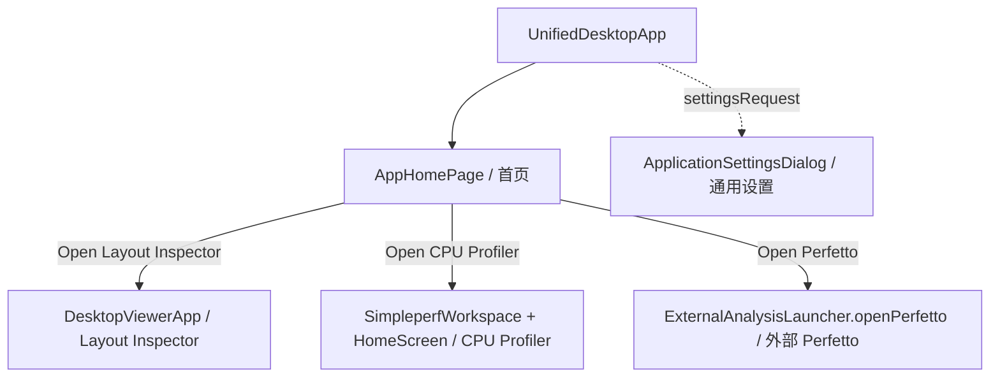

| 界面 | 控件 / 入口名称 | 当前文案 | 主要行为 | 源码 |
|---|---|---|---|---|
| 全局壳 | `UnifiedDesktopApp` | - | 根据 `AppDestination` 切换首页、Layout Inspector、Simpleperf；进入功能工作区时最大化窗口 | `desktop-viewer/desktop-app/src/main/kotlin/dev/agentperf/desktop/UnifiedDesktopApp.kt` |
| 首页 | `AppHomePage` | Android Performance Studio | 展示三个功能卡片 | `desktop-viewer/desktop-app/src/main/kotlin/dev/agentperf/desktop/AppHomePage.kt` |
| 通用设置 | `ApplicationSettingsDialog` | 通用设置 / General Settings | 修改全局语言、主题 | `desktop-viewer/desktop-app/src/main/kotlin/dev/agentperf/desktop/ApplicationSettingsDialog.kt` |
| Layout Inspector | `DesktopViewerApp` | Layout Inspector | Android View 层级、截图、属性、问题分析 | `desktop-viewer/layout-inspector/presentation/src/main/kotlin/dev/agentperf/desktop/DesktopViewerApp.kt` |
| CPU Profiler | `SimpleperfWorkspace` / `HomeScreen` | Simpleperf CPU Profiler | 采集/打开 simpleperf 会话并分析报告 | `desktop-viewer/simpleperf-viewer/app-desktop/src/main/kotlin/com/androidperformancestudio/desktop/SimpleperfWorkspace.kt` |
| Perfetto | `onOpenPerfetto` | Open Perfetto | 打开外部 Perfetto Web UI | `desktop-viewer/desktop-app/src/main/kotlin/dev/agentperf/desktop/AppHomePage.kt` |

---

## 界面线框示意图总览

> 本节是给设计/优化使用的线框图。后续做布局调整时，先更新对应线框，再改下方控件表和源码。

### A. 应用首页 `AppHomePage`

```text
┌──────────────────────────────────────────────────────────────────────────────┐
│                         Android Performance Studio                           │
│                 选择要使用的性能分析工具 / Choose a tool                     │
│                                                                              │
│   ┌──────────────────────┐  ┌──────────────────────┐  ┌──────────────────┐  │
│   │ Layout Inspector     │  │ Simpleperf CPU       │  │ Perfetto Trace   │  │
│   │                      │  │ Profiler             │  │ Analyzer         │  │
│   │ Android View 层级、  │  │ 采集/打开 simpleperf │  │ 打开 Perfetto    │  │
│   │ 截图、边界、属性     │  │ 会话并分析 CPU 样本  │  │ Web UI           │  │
│   │                      │  │                      │  │                  │  │
│   │ [进入布局检查]       │  │ [进入 CPU 分析]      │  │ [打开 Perfetto]  │  │
│   └──────────────────────┘  └──────────────────────┘  └──────────────────┘  │
└──────────────────────────────────────────────────────────────────────────────┘
```

### B. 通用设置 `ApplicationSettingsDialog`

```text
┌──────────────────────────── 通用设置 / General Settings ─────────────────────┐
│                                                                              │
│  ┌────────────────────────────────────────────────────────────────────────┐  │
│  │  语言 / Language:  [跟随系统 / System ▾]                              │  │
│  └────────────────────────────────────────────────────────────────────────┘  │
│  ┌────────────────────────────────────────────────────────────────────────┐  │
│  │  主题 / Theme:     [跟随系统 / System ▾]                              │  │
│  └────────────────────────────────────────────────────────────────────────┘  │
│                                                                              │
│                                                               [完成 / Done]  │
└──────────────────────────────────────────────────────────────────────────────┘
```

### C. Layout Inspector 主界面 `DesktopViewerApp`

```text
┌──────────────────────────────── NativeViewerMenuBar ─────────────────────────┐
│ File: Import / Import Screenshot / Export                                    │
│ Actions: Auto Scan / Node Navigation / Panel Toggles / Settings              │
│ View: Hide Invisible / Hide Indices / Layer Buttons / Visible Bounds         │
├──────────────────────────────────── Header ──────────────────────────────────┤
│ package │ Device ▾ │ Capture target ▾ │ Window ▾ │ ● status │ Refresh │ Auto │
│ metrics / timeline                                      [左][底][右] [⚙]     │
├────────────── HierarchyPane ──────────────┬──────────── PreviewPane ─────────┬─ DetailsPane ─┐
│ Hierarchy  128                            │ Canvas  1080 × 2400             │ Properties    │
│ [搜索节点 __________________] [↑][↓]      │ [App only] [Small area] [hidden] │ id: node-id   │
│ ▾ 001 LinearLayout                        │                                  │ ▾ Layout      │
│   ▸ 002 Toolbar        [hide/show layer]  │        ┌────────────────┐        │   width: ...  │
│   ▾ 003 Content                           │        │  screenshot /   │        │ ▾ Drawing     │
│     • 004 TextView                        │        │  layout bounds  │        │   alpha: ...  │
│     • 005 Button                          │        └────────────────┘        │              │
├────────────────────────────── FindingsPane / TimelineStrip ──────────────────┴──────────────┤
│ Findings  [Info 0] [Warning 2] [Error 1]         [Run AI Analysis]  Live capture             │
│ [Frame 1 summary] [Frame 2 summary]                                                        │
│ [004] Missing text contrast · ...                                                           │
└──────────────────────────────────────────────────────────────────────────────────────────────┘
```

### D. Layout Inspector 菜单弹出层 `NativeViewerMenuBar`

```text
┌ File ─────────────────────┐   ┌ Actions ────────────────────────────┐   ┌ View ───────────────────────────┐
│ Import Capture Archive    │   │ ✓ Toggle Auto Scan                  │   │ ✓ Hide Invisible Hierarchy Views │
│ Import Screenshot         │   │ Previous Node                       │   │ ✓ Hide Invisible Findings        │
│ ───────────────────────── │   │ Next Node                           │   │ ✓ Hide Hierarchy Indices         │
│ Export Capture Archive    │   │ Toggle Selected Node                │   │ ✓ Show Layer Visibility Buttons  │
└───────────────────────────┘   │ ─────────────────────────────────── │   │ ✓ Show Visible View Bounds       │
                                │ ✓ Toggle Hierarchy / Findings / ... │   └─────────────────────────────────┘
                                │ Open Settings                       │
                                └─────────────────────────────────────┘
```

### E. Layout Inspector 设置 `SettingsDialog`

```text
┌──────────────────────────── Layout Inspector Settings [×] ───────────────────┐
│ View                                                                         │
│ ┌──────────────────────────────────────────────────────────────────────────┐ │
│ │ Show hierarchy layer visibility buttons                              ○/● │ │
│ └──────────────────────────────────────────────────────────────────────────┘ │
│                                                                              │
│ Capture Archive                                                              │
│ ┌──────────────────────────────────────────────────────────────────────────┐ │
│ │ Layout snapshot archive limit                         value              │ │
│ │ [──────────────●────────────────────────────────────────────]            │ │
│ │ hint text                                                                 │ │
│ └──────────────────────────────────────────────────────────────────────────┘ │
│                                                                              │
│ Canvas Border Colors                                                         │
│ Default view bounds color   ● ● ●  [#AARRGGBB] Reset                         │
│ Hovered view bounds color   ● ● ●  [#AARRGGBB] Reset                         │
│ Selected view bounds color  ● ● ●  [#AARRGGBB] Reset                         │
└──────────────────────────────────────────────────────────────────────────────┘
```

### F. Layout Inspector 导入/导出结果 `ExportResultDialog`

```text
┌──────────────────── Import / Export Success or Failure ──────────────────────┐
│                                                                              │
│  archive path / error message                                                │
│                                                                              │
│                                                                    [Dismiss] │
└──────────────────────────────────────────────────────────────────────────────┘
```

### G. Simpleperf 设备与采集页 `DeviceTargetPage`

```text
┌──────────────────────────── SimpleperfFileMenuBar ───────────────────────────┐
│ File: Open / Export / Open Recent        Configuration: Templates / Config    │
├────────────────────────────── WorkspaceToolbar ──────────────────────────────┤
│ Device ▾ │ App ▾ │ Process ▾ │ Thread ▾ │ [Refresh] [Get data] [Capabilities] [Settings] │
├──────────────────────────────── ReportWorkspace ─────────────────────────────┤
│                                                                              │
│  未打开报告时：空白工作区                                                     │
│  已打开报告时：FirefoxReportWorkspace（见下方报告页线框）                     │
│                                                                              │
├────────────────────────────── WorkspaceFooter ───────────────────────────────┤
│ ● Ready to capture / Recording... │ session file │ path         [Stop and analyze] [Cancel] │
└──────────────────────────────────────────────────────────────────────────────┘
```

### H. Simpleperf 菜单弹出层 `SimpleperfFileMenuBar`

```text
┌ File ────────────────────────┐     ┌ Export ────────────────────────────────┐
│ Open…                        │     │ Session package                        │
│ Export ▸                     ├────▶│ JSON + CSV                             │
│ Open Recent ▸                │     │ Raw protobuf                           │
└──────────────────────────────┘     │ Firefox Profiler JSON (.json.gz)       │
                                     │ Screenshot                             │
┌ Open Recent ─────────────────┐     │ simpleperf report                      │
│ session-a                    │     │ report_html.py                         │
│ session-b                    │     │ External open                          │
│ ──────────────────────────── │     └────────────────────────────────────────┘
│ Clear Menu                   │
└──────────────────────────────┘     ┌ Configuration ─────────────────────────┐
                                     │ Capture Templates                      │
                                     │ Capture Configuration                  │
                                     │ Advanced Parameters                    │
                                     └────────────────────────────────────────┘
```

### I. Simpleperf 采集设置 `CaptureSettingsDialog`

```text
┌──────────────────────────────── CaptureSettingsDialog ───────────────────────┐
│ ┌ SettingsNavigation ────┐ ┌──────────────────── SettingsPanel ────────────┐ │
│ │ Settings               │ │ Sampling template                         [Done]│ │
│ │ Application            │ │ Choose a starting point for capture.            │ │
│ │                        │ │                                                │ │
│ │ > Sampling template    │ │ ┌────────────────────────────────────────────┐ │ │
│ │   Capture configuration│ │ │ TemplateChoice: CPU sampling              │ │ │
│ │   Advanced parameters  │ │ │ description                                │ │ │
│ │   Flame graph          │ │ └────────────────────────────────────────────┘ │ │
│ │   Simpleperf engine    │ │                                                │ │
│ │   User guide           │ │ 其他分组内容：Event/Rate/Duration、Call graph、 │ │
│ │                        │ │ Scope、Tooltip mode、Engine、Open User Guide   │ │
│ └────────────────────────┘ └────────────────────────────────────────────────┘ │
└──────────────────────────────────────────────────────────────────────────────┘
```

### J. Simpleperf 报告页通用骨架 `FirefoxReportWorkspace`

```text
┌────────────────────────────────── TimelineReport ────────────────────────────┐
│ Header: tracks / viewport / ruler                                             │
│ Process global track                                                          │
│   Thread track 1     ▂▃▇▁▂▆                                                   │
│   Thread track 2     ▄▆▂▂▁▅                                                   │
│ Marker lanes       ◆      ◆        ◆                                          │
├──────────────────────────── TimelineResizeHandle ────────────────────────────┤
│ [Overview] [Top functions] [Call tree] [Flame graph] [Stack chart] [Marker...] │
│                                                        [Hide details]          │
│ [All Frames] [Script] [Native] [Invert Call Stack] Filter Stacks [____]        │
├────────────────────────────── ReportContent ───────────────────────┬─────────┤
│ selected tab content                                                │ Details │
│                                                                     │ panel   │
└─────────────────────────────────────────────────────────────────────┴─────────┘
```

### K. Overview Tab `OverviewReport`

```text
┌──────────────────────────────────── Overview ────────────────────────────────┐
│ ┌ Samples ┐ ┌ Event weight ┐ ┌ Threads ┐ ┌ Lost rate ┐                      │
│ │  12345  │ │    98765     │ │   24    │ │  0.12%    │                      │
│ └─────────┘ └──────────────┘ └─────────┘ └───────────┘                      │
│ ┌ Data quality ────────────────────────────────────────────────────────────┐ │
│ │ Lost samples / Unwind errors / Unknown symbols / Empty stacks             │ │
│ └───────────────────────────────────────────────────────────────────────────┘ │
│ Top threads                                                                  │
│   thread name · TID · weight                                                 │
│ Top functions                                                                │
│   symbol name                                      inc / exc                 │
│ Artifacts                                                                    │
│   ✓ file · path                                                              │
│ Diagnostics                                                                  │
│   ┌ DiagnosticCard: severity / title / evidence / recommendations ┐          │
└──────────────────────────────────────────────────────────────────────────────┘
```

### L. Top Functions Tab `TopFunctionsReport`

```text
┌───────────────────────────────── Top Functions ──────────────────────────────┐
│ [Inclusive] [Exclusive] [Samples] [Threads] [Descending/Ascending]            │
│ Function / Library                         Inclusive Exclusive Samples Threads Navigate │
│ ┌──────────────────────────────────────────────────────────────────────────┐ │
│ │ symbolName                                                              │ │
│ │ filePath                                      123       45       9    2  │ │
│ │                                                        [Path] [Flame]   │ │
│ └──────────────────────────────────────────────────────────────────────────┘ │
│ ...                                                                          │
└──────────────────────────────────────────────────────────────────────────────┘
```

### M. Call Tree Tab `CallTreeReport`

```text
┌─────────────────────────────────── Call Tree ────────────────────────────────┐
│ Total (samples) | Self | Function                                            │
│─────────────────┼──────┼─────────────────────────────────────────────────────│
│ 100%  12,345    |  —   | ▾ root                                              │
│  45%   5,555    | 10   |   ▾ parentFunction                                  │
│  12%   1,480    |  6   |     ▸ childFunction          /path/to/file.cpp      │
│   3%     321    |  3   |       leafFunction           /path/to/file.cpp      │
│                                                                               │
│ 搜索命中由 FirefoxHighlightedText 高亮，选中行使用 accent 背景。             │
└──────────────────────────────────────────────────────────────────────────────┘
```

### N. Flame Graph Tab `FlameGraphPanel`

```text
┌────────────────────────────────── Flame Graph ───────────────────────────────┐
│ FirefoxTransformNavigator: [transform breadcrumb] [Undo] [Clear]             │
├────────────────────────── FirefoxFlameGraphViewport ─────────────────────────┤
│ ┌──────────────────────────────────────────────────────────────────────────┐ │
│ │ FlameGraphCanvas                                                         │ │
│ │ ┌────────────── root ──────────────┐                                     │ │
│ │ │ ┌──── frame A ────┐ ┌─ frame B ┐ │                                     │ │
│ │ │ │ child A1        │ │ child B1 │ │                                     │ │
│ │ │ └────────────────┘ └──────────┘ │                                     │ │
│ │ └─────────────────────────────────┘                                     │ │
│ │                                                                          │ │
│ │ Hover: FirefoxFlameGraphTooltip                                          │ │
│ │ Right click: FirefoxFlameGraphContextMenu                                │ │
│ └──────────────────────────────────────────────────────────────────────────┘ │
│ FirefoxFrameDetailsBottomBox: Source / Disassembly / Symbol details [Close]  │
└──────────────────────────────────────────────────────────────────────────────┘
```

### O. Stack Chart Tab `StackChartPanel`

```text
┌────────────────────────────────── Stack Chart ───────────────────────────────┐
│ StackChartCanvas                                                             │
│ ┌──────────────────────────────────────────────────────────────────────────┐ │
│ │ Thread / stack depth                                                     │ │
│ │ depth 3        ███      ██                                               │ │
│ │ depth 2   ██████████  ███████                                            │ │
│ │ depth 1 ███████████████████████                                          │ │
│ │ time ───────────────────────────────────────────────────────────────▶    │ │
│ └──────────────────────────────────────────────────────────────────────────┘ │
│ Empty/error: StackChartMessage + [Retry]                                     │
└──────────────────────────────────────────────────────────────────────────────┘
```

### P. Marker Chart Tab `MarkerChartPanel`

```text
┌───────────────────────────────── Marker Chart ───────────────────────────────┐
│ Filter markers [________________________]                                    │
│ ┌──────────────────────────────── MarkerChartCanvas ───────────────────────┐ │
│ │ lane: Main      ◆         ◆──────◆                                      │ │
│ │ lane: Render       ◆                                                   │ │
│ │ lane: Global  ◆             ◆                                          │ │
│ │ time ───────────────────────────────────────────────────────────────▶    │ │
│ └──────────────────────────────────────────────────────────────────────────┘ │
│ Empty/error: MarkerPanelMessage                                              │
└──────────────────────────────────────────────────────────────────────────────┘
```

### Q. Marker Table Tab `MarkerTablePanel`

```text
┌───────────────────────────────── Marker Table ───────────────────────────────┐
│ Filter markers [________________________]                                    │
│ Start ↑        Duration       Name                         Thread    Schema  │
│ ──────────────────────────────────────────────────────────────────────────── │
│ marker name     100000        3200                         main      schema  │
│ marker name     120000        900                          Global    schema  │
│ ...                                                                          │
│ 点击表头切换排序；点击行选择 marker，并在 Details 面板显示 payload。          │
└──────────────────────────────────────────────────────────────────────────────┘
```

### R. 报告详情面板 `FirefoxReportDetails`

```text
┌──────────────────── Details ────────────────────┐
│ Overview:     Finding details / recommendations │
│ Top function: Function details / weights        │
│ Call stack:   Function details / source file    │
│ Stack chart:  Stack block details / start/end   │
│ Marker:       Marker details / JSON payload     │
│                                                  │
│ 未选择时显示：Select ... to inspect details.     │
└──────────────────────────────────────────────────┘
```


---

## 1. 应用首页

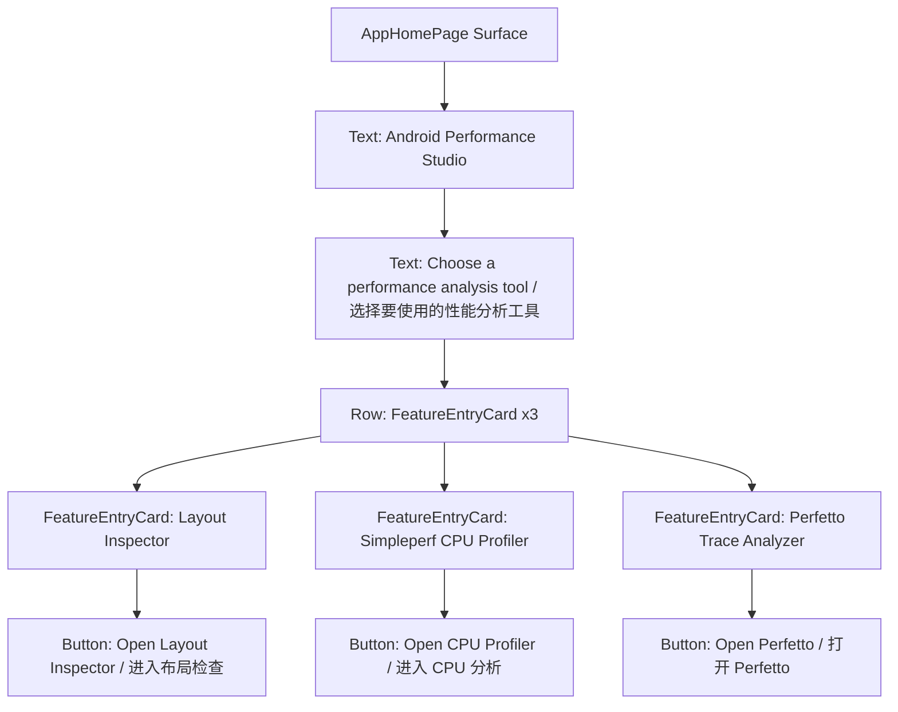

| 控件名称 | 当前文案 | 类型 | 行为 |
|---|---|---|---|
| `FeatureEntryCard(Layout Inspector)` | Layout Inspector | 卡片 + 按钮 | `navigator.open(AppDestination.LAYOUT_INSPECTOR)` |
| `FeatureEntryCard(Simpleperf CPU Profiler)` | Simpleperf CPU Profiler | 卡片 + 按钮 | `navigator.open(AppDestination.SIMPLEPERF)` |
| `FeatureEntryCard(Perfetto Trace Analyzer)` | Perfetto Trace Analyzer | 卡片 + 按钮 | `externalAnalysisLauncher.openPerfetto()` |

源码：`AppHomePage.kt`、`AppDestination.kt`、`UnifiedDesktopApp.kt`

---

## 2. 通用设置弹窗

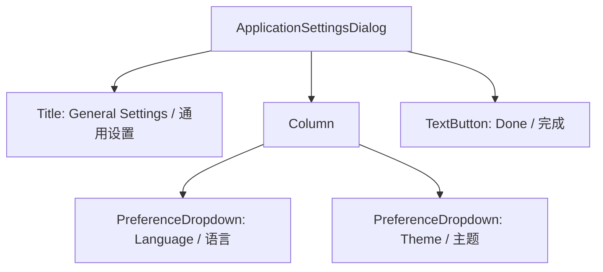

| 控件名称 | 当前文案 | 类型 | 可选项 / 行为 |
|---|---|---|---|
| `PreferenceDropdown(settings.language)` | Language / 语言 | 下拉按钮 | System / Simplified Chinese / English |
| `PreferenceDropdown(settings.theme)` | Theme / 主题 | 下拉按钮 | System / Light / Dark |
| `TextButton(onDismiss)` | Done / 完成 | 按钮 | 关闭弹窗 |

源码：`ApplicationSettingsDialog.kt`、`ApplicationUiSettings.kt`

---

## 3. Layout Inspector 主界面

### 3.1 主布局

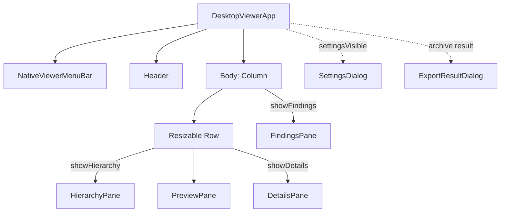

源码入口：`DesktopViewerApp.kt`

### 3.2 原生菜单栏

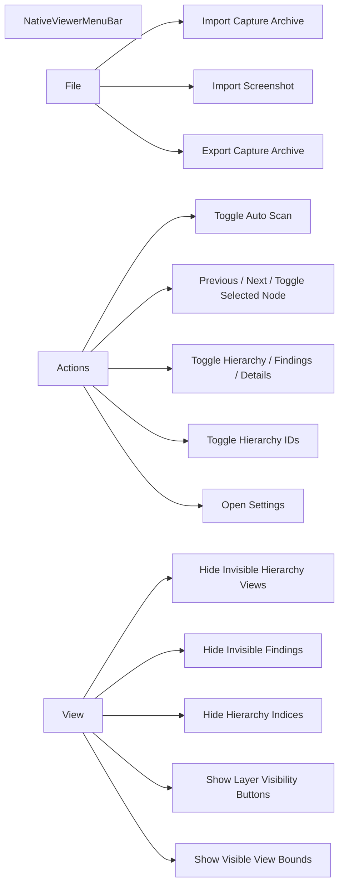

| 控件名称 | 菜单路径 | 行为 |
|---|---|---|
| `onImportArchive` | File → Import | 导入 `.apc` 采集归档 |
| `onImportScreenshot` | File → Import Screenshot | 为当前布局导入截图 |
| `onExportArchive` | File → Export | 导出当前采集归档 |
| `ViewerAction.TOGGLE_AUTO_SCAN` | Actions | 开关自动扫描 |
| `ViewerAction.PREVIOUS_NODE` / `NEXT_NODE` | Actions | 层级树上下移动选中节点 |
| `ViewerAction.TOGGLE_SELECTED_NODE` | Actions | 展开/折叠当前节点 |
| `ViewerAction.TOGGLE_HIERARCHY` | Actions | 显示/隐藏左侧层级面板 |
| `ViewerAction.TOGGLE_FINDINGS` | Actions | 显示/隐藏底部问题面板 |
| `ViewerAction.TOGGLE_DETAILS` | Actions | 显示/隐藏右侧属性面板 |
| `ViewerAction.TOGGLE_HIERARCHY_IDS` | Actions | 显示/隐藏节点 ID |
| `ViewerAction.OPEN_SETTINGS` | Actions | 打开 Layout Inspector 设置弹窗 |
| `ViewDisplayOption.*` | View | 切换层级、问题、索引、可见性按钮、可见 View 边界显示 |

源码：`NativeViewerMenuBar.kt`、`ViewerActionMenu.kt`、`ViewDisplayOptions.kt`

### 3.3 Header 工具栏

```mermaid
flowchart LR
    Header[Header Row]
    Package[Text: packageName / noApp]
    Device[DeviceSelector]
    Target[CaptureTargetSelector]
    Window[WindowSelector]
    Status[StatusDot + connectionLabel]
    Refresh[ManualRefreshButton]
    Auto[AutoScanSwitch]
    Metrics[metricsText + timelineText]
    Toggles[PanelToggleButton x3]
    Settings[SettingsButton]

    Header --> Package --> Device --> Target --> Window --> Status --> Refresh --> Auto --> Metrics --> Toggles --> Settings
```

| 控件名称 | 当前文案 / 状态 | 类型 | 行为 |
|---|---|---|---|
| `DeviceSelector` | Auto device / 设备 label | 下拉 | 选择 ADB 设备或自动选择 |
| `CaptureTargetSelector` | Capture target: Foreground app / System UI | 下拉 | 切换采集前台应用或 System UI |
| `WindowSelector` | Window: title | 下拉 | 多窗口时选择当前窗口 |
| `ManualRefreshButton` | Refresh | 按钮 | 关闭自动扫描时手动刷新一次 |
| `AutoScanSwitch` | Auto Scan | 开关 | 自动连接并周期采集 |
| `PanelToggleButton(LEFT)` | 左侧面板图标 | 图标按钮 | 显示/隐藏 `HierarchyPane` |
| `PanelToggleButton(BOTTOM)` | 底部面板图标 | 图标按钮 | 显示/隐藏 `FindingsPane` |
| `PanelToggleButton(RIGHT)` | 右侧面板图标 | 图标按钮 | 显示/隐藏 `DetailsPane` |
| `SettingsButton` | 齿轮图标 | 图标按钮 | 打开 `SettingsDialog` |

源码：`DesktopViewerApp.kt` (`Header` 及其私有控件)

### 3.4 层级面板 `HierarchyPane`

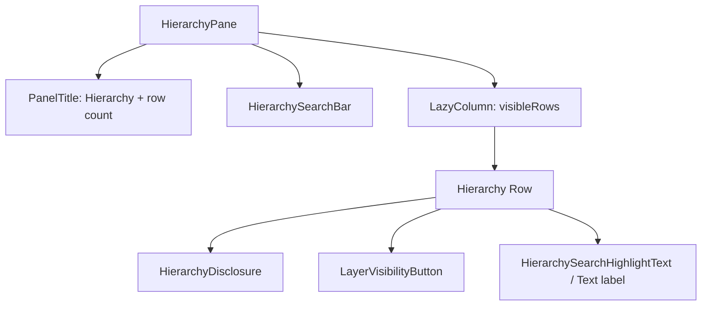

| 控件名称 | 当前文案 / 标识 | 类型 | 行为 |
|---|---|---|---|
| `HierarchySearchBar` | 搜索输入框 | 文本输入 + 前后导航 | 过滤/定位层级节点 |
| `SearchNavButton(previous)` | `strings.searchPrevious` | 按钮 | 跳到上一条搜索命中 |
| `SearchNavButton(next)` | `strings.searchNext` | 按钮 | 跳到下一条搜索命中 |
| `HierarchyDisclosure` | 折叠箭头 | 图标按钮 | 展开/折叠子节点 |
| `LayerVisibilityButton` | Hide / Show layer | 小按钮 | 隐藏/显示对应节点图层 |
| `Hierarchy row` | `ViewDisplayProjection.hierarchyLabel(...)` | 列表行 | 单击选中节点；上下键导航；Enter 展开/折叠；H 隐藏层 |

源码：`DesktopViewerApp.kt` (`HierarchyPane`、`HierarchySearchBar`、`HierarchyDisclosure`)

### 3.5 画布预览面板 `PreviewPane`

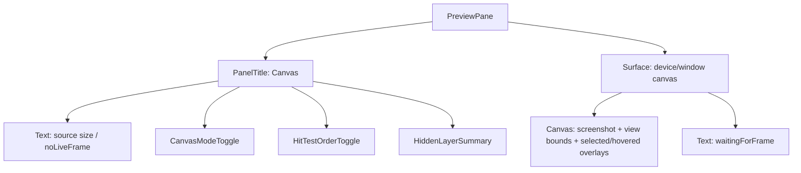

| 控件名称 | 当前文案 / 状态 | 类型 | 行为 |
|---|---|---|---|
| `CanvasModeToggle` | App only on/off | 文本按钮 | 切换仅应用窗口或完整窗口预览 |
| `HitTestOrderToggle` | Small area / Z order hit testing | 文本按钮 | 切换点击命中顺序 |
| `HiddenLayerSummary` | hidden layer count | 文本按钮 | 清空隐藏图层 |
| `Canvas` pointer move | - | 指针交互 | 悬停高亮命中节点 |
| `Canvas` pointer press | - | 指针交互 | 点击选择节点并同步层级树 |
| `showVisibleViewBounds` overlay | - | 视图边界叠加层 | 来自 View 菜单或设置项 |

源码：`DesktopViewerApp.kt` (`PreviewPane`)、`CanvasGeometry.kt`、`CanvasHitTester.kt`、`ViewBoundsOverlay.kt`

### 3.6 属性面板 `DetailsPane`

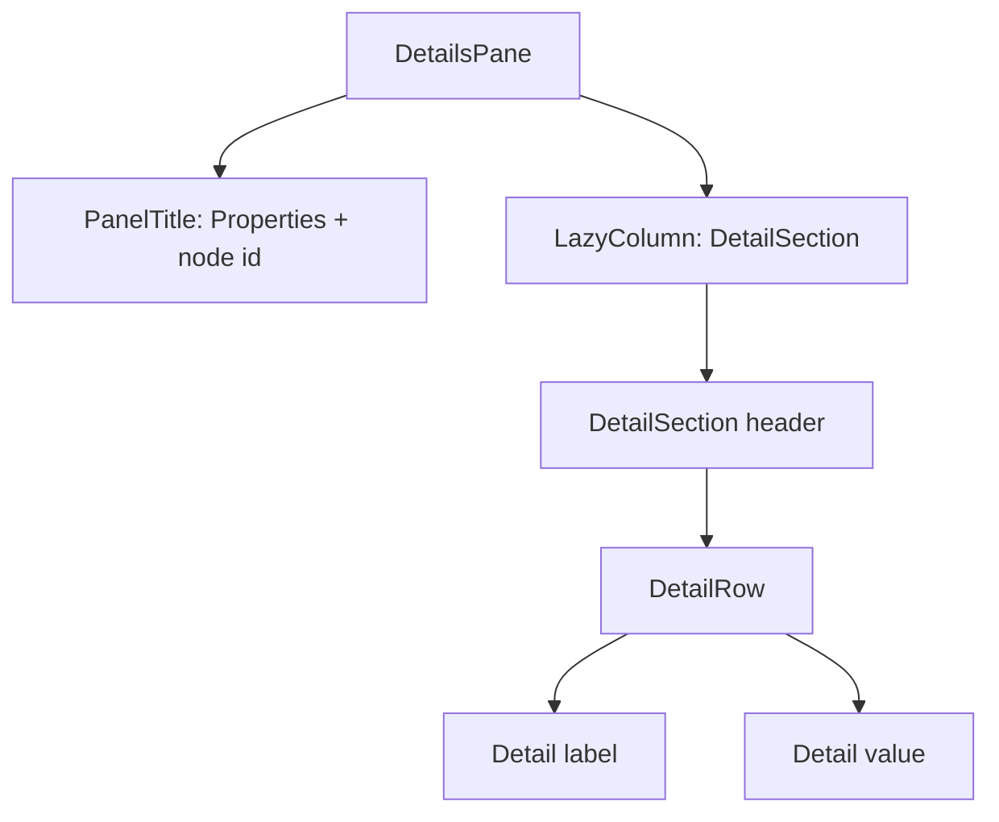

| 控件名称 | 类型 | 行为 / 内容 |
|---|---|---|
| `DetailSection` | 可折叠分组 | 展开/折叠属性分类；风险分类使用 warning 样式 |
| `DetailRow` | 键值行 | 显示属性 label/value；value 可选择复制 |
| `PanelTitle` | 标题栏 | 显示 Properties 与当前节点 id |

源码：`DesktopViewerApp.kt` (`DetailsPane`、`DetailSection`、`DetailRow`)、`InspectorPresenter.kt`

### 3.7 问题与时间线面板 `FindingsPane`

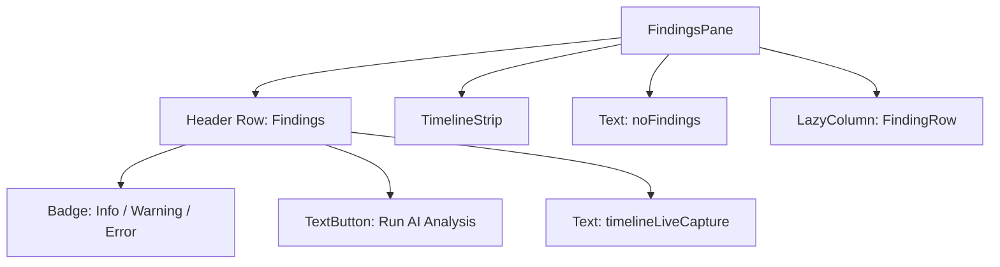

| 控件名称 | 当前文案 / 标识 | 类型 | 行为 |
|---|---|---|---|
| `Badge(info/warning/error)` | Info / Warning / Error count | 状态徽标 | 展示问题严重级别统计 |
| `TextButton(onRunAiAnalysis)` | Run AI Analysis | 按钮 | 调用 AI 分析当前布局 |
| `TimelineStrip` | frame label + summary | 横向列表 | 切换归档/实时捕获帧 |
| `FindingRow` | `[nodeNumber] title · message` | 列表行 | 双击选择对应 View 节点 |
| `FindingsResizeSeparator` | - | 拖拽条 | 调整底部面板高度 |

源码：`DesktopViewerApp.kt` (`FindingsPane`、`TimelineStrip`、`FindingRow`)

### 3.8 Layout Inspector 设置与结果弹窗

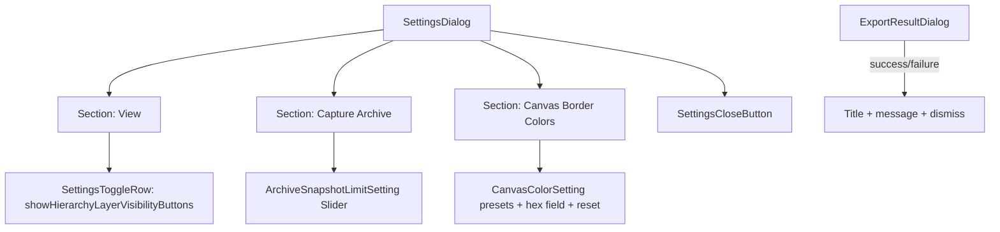

| 控件名称 | 当前文案 | 类型 | 行为 |
|---|---|---|---|
| `SettingsToggleRow` | Show hierarchy layer visibility buttons | 开关行 | 显示/隐藏层级树中的图层可见性按钮 |
| `ArchiveSnapshotLimitSetting` | Layout snapshot archive limit | Slider | 修改采集归档可接受的快照大小倍数 |
| `CanvasColorSetting(normal)` | Default view bounds color | 色块 + 文本框 + Reset | 修改普通边界颜色 |
| `CanvasColorSetting(hovered)` | Hovered view bounds color | 色块 + 文本框 + Reset | 修改悬停边界颜色 |
| `CanvasColorSetting(selected)` | Selected view bounds color | 色块 + 文本框 + Reset | 修改选中边界颜色 |
| `SettingsCloseButton` | X 图标 | 图标按钮 | 关闭设置 |
| `ExportResultDialog` | import/export success/failure title | AlertDialog | 展示导入/导出/截图导入结果 |

源码：`ThemeSettingsDialog.kt`、`DesktopViewerApp.kt`

---

## 4. Simpleperf CPU Profiler：采集与目标选择界面

### 4.1 Simpleperf 工作区与菜单

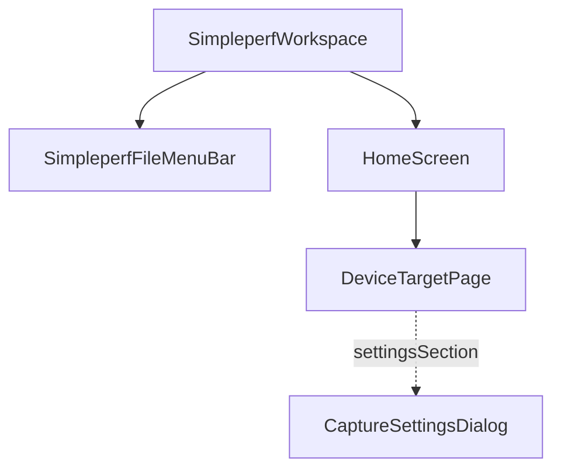

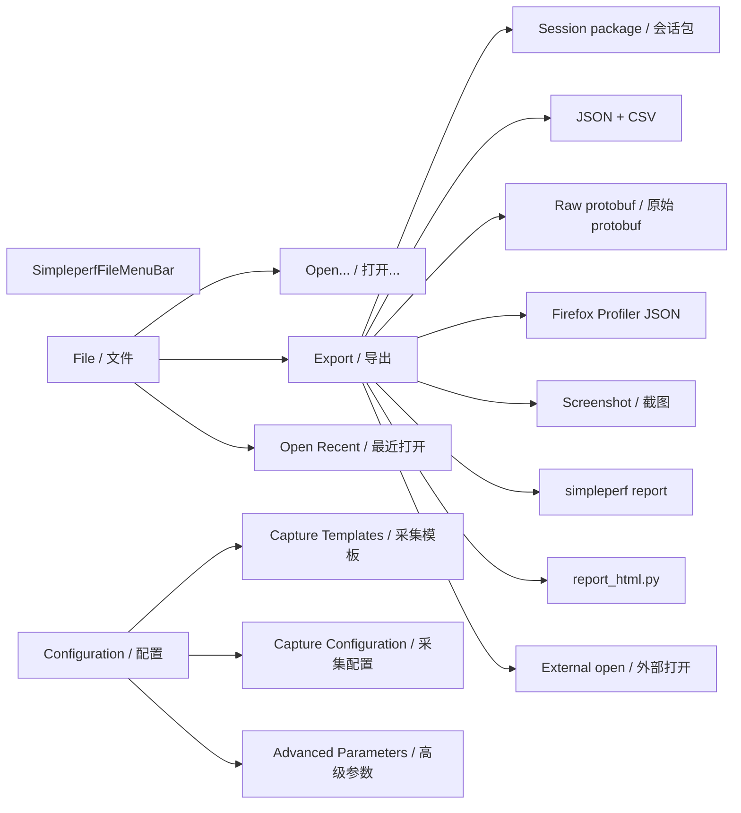

| 控件名称 | 菜单路径 | 行为 |
|---|---|---|
| `onOpen` | File → Open | 打开已有 simpleperf 会话 |
| `onExportSession` | File → Export → Session package | 导出会话包 |
| `onExportReport` | File → Export → JSON + CSV | 导出 JSON + CSV 报告 |
| `onExportRawProtobuf` | File → Export → Raw protobuf | 导出原始 protobuf |
| `onExportGeckoProfile` | File → Export → Firefox Profiler JSON | 导出 Gecko/Firefox profile JSON |
| `onExportScreenshot` | File → Export → Screenshot | 导出截图 |
| `onGenerateSimpleperfReport` | File → Export → simpleperf report | 生成 simpleperf report |
| `onGenerateHtmlReport` | File → Export → report_html.py | 生成 HTML 报告 |
| `onExportExternalGuide` | File → Export → External open | 外部打开/引导 |
| `onOpenRecent` / `onClearRecent` | File → Open Recent | 打开或清空最近会话 |
| `onOpenCaptureSettings(section)` | Configuration | 打开采集设置指定分组 |

源码：`SimpleperfWorkspace.kt`、`SimpleperfFileMenu.kt`

### 4.2 设备与采集页 `DeviceTargetPage`

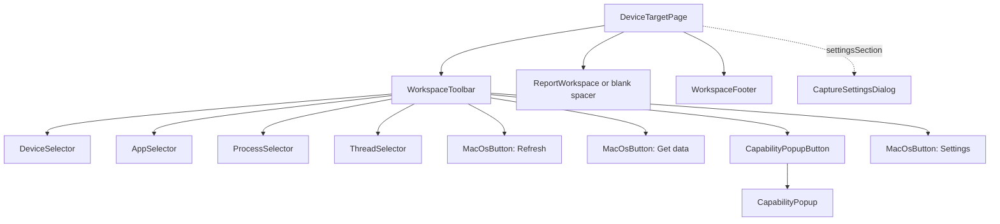

| 控件名称 | 当前文案 | 类型 | 行为 |
|---|---|---|---|
| `DeviceSelector` | Device | 下拉 | 选择在线设备；菜单二级信息显示 serial 与 Online/Unavailable |
| `AppSelector` | App | 下拉 | 选择应用包名 |
| `ProcessSelector` | Process | 下拉 | 选择进程；二级信息显示 PID 与 user |
| `ThreadSelector` | Thread | 下拉 | 选择线程；二级信息显示 TID |
| `MacOsButton(onRefresh)` | Refresh / Refreshing… | 按钮 | 刷新设备和目标列表 |
| `MacOsButton(onStartCapture)` | Get data | 主按钮 | 开始采集并导入分析 |
| `CapabilityPopupButton` | Capabilities | 按钮 + 下拉 | 展示设备能力、Android/SDK、ABI、Root、Scope、Simpleperf、Events、Limits |
| `MacOsButton(onOpenSettings)` | Settings | 按钮 | 打开采集设置弹窗，默认 `SAMPLING_TEMPLATE` |
| `WorkspaceFooter` | Ready to capture / Recording… | 状态栏 | 展示采集状态、当前文件；采集中显示 `Stop and analyze` 与 `Cancel` |
| `MacOsButton(onStopCapture)` | Stop and analyze | 主按钮 | 停止采集并分析 |
| `MacOsButton(onCancelCapture)` | Cancel | 按钮 | 取消采集 |

源码：`DeviceTargetPage.kt`、`DeviceTargetActions.kt`

### 4.3 采集设置弹窗 `CaptureSettingsDialog`

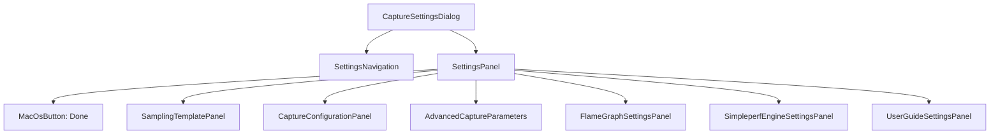

| 分组 / 控件名称 | 当前文案 | 类型 | 行为 / 可选项 |
|---|---|---|---|
| `CaptureSettingsSection.SAMPLING_TEMPLATE` | Sampling template | 导航项 | 显示采样模板列表 |
| `TemplateChoice` | template.displayName | 可选行 | 切换 `SamplingTemplate` |
| `CaptureSettingsSection.CAPTURE_CONFIGURATION` | Capture configuration | 导航项 | 配置事件、采样率、时长 |
| `MacOsTextField(Event)` | Event | 输入框 | 设置 simpleperf event |
| event chips | available event names | 选择 chip | 快速选择常用事件 |
| `MacOsChoiceChip(Frequency/Period)` | Frequency / Period | chip | 切换采样率模式 |
| `MacOsTextField(Hz / Events per sample)` | Hz / Events per sample | 输入框 | 设置采样频率或 period |
| `MacOsTextField(Duration seconds...)` | Duration seconds (blank = manual stop) | 输入框 | 设置自动停止时长 |
| `CaptureSettingsSection.ADVANCED_PARAMETERS` | Advanced parameters | 导航项 | 高级参数 |
| `ParameterChoices(Call graph)` | Call graph | chip 组 | 切换 call graph 模式 |
| `ParameterChoices(Scope)` | Scope | chip 组 | 切换事件作用域 |
| `CaptureSettingsSection.FLAME_GRAPH` | Flame graph | 导航项 | 火焰图提示框行为 |
| `MacOsChoiceChip(Fixed / Follow mouse)` | Fixed / Follow mouse | chip | 固定或跟随鼠标显示 frame info |
| `CaptureSettingsSection.SIMPLEPERF_ENGINE` | Simpleperf engine | 导航项 | 分析引擎 |
| `MacOsChoiceChip(New engine)` | New engine | chip | 使用内置新引擎 |
| `MacOsChoiceChip(Firefox Profiler local engine)` | Firefox Profiler local engine | chip | 打开本地固定 Firefox Profiler |
| `MacOsChoiceChip(Firefox Profiler)` | Firefox Profiler | chip | 打开官方 Firefox Profiler |
| `CaptureSettingsSection.USER_GUIDE` | User guide | 导航项 | 用户文档 |
| `MacOsButton(onOpenUserGuide)` | Open User Guide in Browser | 按钮 | 用浏览器打开离线文档 |
| `MacOsButton(onDismiss)` | Done | 主按钮 | 关闭弹窗 |

源码：`CaptureConfigurationWorkspace.kt`

---

## 5. Simpleperf 报告工作区

### 5.1 报告页骨架

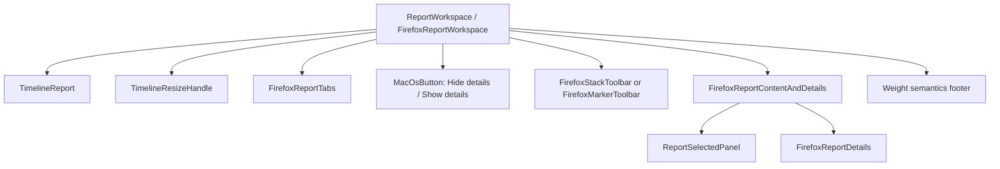

| 控件名称 | 当前文案 / 标识 | 类型 | 行为 |
|---|---|---|---|
| `TimelineReport` | `testTag("report-timeline")` | 时间线区域 | 显示线程轨道、marker lane；支持键盘/滚轮缩放导航 |
| `TimelineResizeHandle` | Drag to resize timeline | 拖拽条 | 调整时间线高度，范围 120–480 dp |
| `FirefoxReportTabs` | Overview / Top functions / Call tree / Flame graph / Stack chart / Marker chart / Marker table | TabRow | 切换报告面板；左右键切换 |
| `MacOsButton(onDetailsVisible)` | Hide details / Show details | 按钮 | 显示/隐藏右侧/底部详情面板 |
| `FirefoxStackToolbar` | All Frames / Script / Native / Invert Call Stack / Filter Stacks | 工具栏 | call stack 筛选、方向、搜索 |
| `FirefoxMarkerToolbar` | Filter markers | 工具栏输入框 | Marker Chart/Table 页过滤 marker |
| `FirefoxReportDetails` | Details panel | 详情面板 | 根据当前 tab 展示 finding/function/call stack/stack block/marker 详情 |

源码：`FirefoxReportWorkspace.kt`、`FirefoxReportTabs.kt`、`FirefoxStackToolbar.kt`、`FirefoxMarkerToolbar.kt`、`FirefoxReportDetails.kt`

### 5.2 时间线 `TimelineReport`

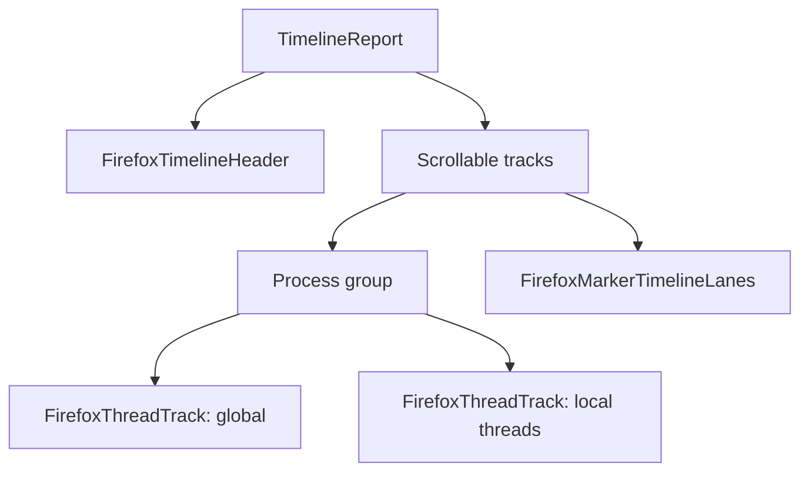

| 控件名称 | 类型 | 行为 / 内容 |
|---|---|---|
| `FirefoxTimelineHeader` | 时间线头部 | 显示轨道数量、时间范围、刻度信息 |
| `FirefoxThreadTrack` | 线程轨道 | 展示 sample/activity；选择线程、预览时间范围 |
| `FirefoxMarkerTimelineLanes` | marker lane | 展示 marker；选择 marker |
| 键盘 / 鼠标滚轮 | 导航交互 | 缩放、平移时间范围 |

源码：`FirefoxTimeline.kt`

### 5.3 报告 Tab 与控件

#### Overview

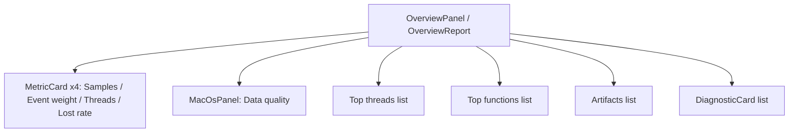

| 控件名称 | 类型 | 行为 / 内容 |
|---|---|---|
| `MetricCard` | 指标卡 | Samples、Event weight、Threads、Lost rate |
| `DiagnosticCard` | 可点击卡片 | 选择 finding，并按 target 导航到函数/线程证据 |
| `Top functions` 行 | 可点击行 | `actions.onFocusFunction(symbolName)` |

源码：`OverviewPanel.kt`、`ReportPage.kt` (`OverviewReport`)

#### Top Functions

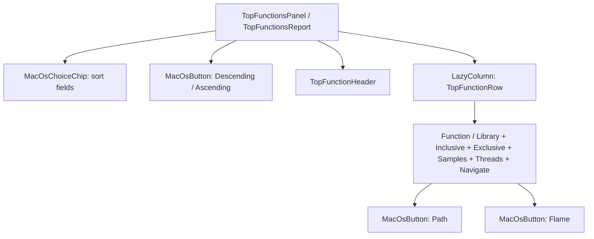

| 控件名称 | 当前文案 | 类型 | 行为 |
|---|---|---|---|
| `MacOsChoiceChip(sort)` | TopFunctionSort.displayName | chip | 切换排序字段 |
| `MacOsButton(direction)` | Descending / Ascending | 按钮 | 切换排序方向 |
| `TopFunctionRow` | function row | 可点击行 | 选择函数 |
| `MacOsButton(Path)` | Path | 按钮 | 聚焦 Call Tree 中的函数路径 |
| `MacOsButton(Flame)` | Flame | 按钮 | 聚焦 Flame Graph 中的函数 |

源码：`TopFunctionsPanel.kt`、`ReportPage.kt` (`TopFunctionsReport`)

#### Call Tree

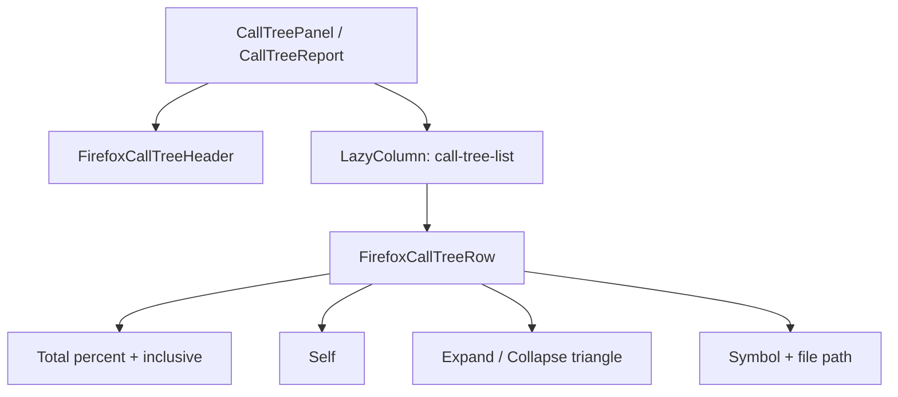

| 控件名称 | 类型 | 行为 / 内容 |
|---|---|---|
| `FirefoxCallTreeHeader` | 表头 | Total、Self、函数列 |
| `FirefoxCallTreeRow` | 树表行 | 选择 call node；显示 total/self 权重、函数名、文件路径 |
| row toggle | 折叠图标 | 展开/折叠子调用 |
| `FirefoxHighlightedText` | 文本 | 高亮 `Filter Stacks` 搜索命中 |

源码：`CallTreePanel.kt`、`ReportPage.kt` (`CallTreeReport`)

#### Flame Graph

```mermaid
flowchart TD
    Flame[FlameGraphPanel]
    Navigator[FirefoxTransformNavigator]
    Viewport[FirefoxFlameGraphViewport]
    Canvas[FlameGraphCanvas]
    Semantics[FlameGraphSemanticsOverlay]
    Tooltip[FirefoxFlameGraphTooltip]
    Context[FirefoxFlameGraphContextMenu]
    Details[FirefoxFrameDetailsBottomBox]
    Empty[FirefoxFlameGraphEmptyState]

    Flame --> Navigator
    Flame --> Viewport
    Viewport --> Canvas
    Viewport --> Semantics
    Viewport --> Tooltip
    Viewport --> Context
    Viewport --> Details
    Viewport --> Empty
```

| 控件名称 | 当前文案 / 标识 | 类型 | 行为 |
|---|---|---|---|
| `FirefoxTransformNavigator` | transform breadcrumb | 导航条 | Undo / Clear 已应用的 call stack transform |
| `FlameGraphCanvas` | Flame graph call stacks | Canvas | 点击/悬停/滚动/键盘导航火焰图节点 |
| `FlameGraphSemanticsOverlay` | `flame-node-*` | 无障碍覆盖层 | 为每个 frame 提供语义、选择、打开详情/菜单 |
| `FirefoxFlameGraphTooltip` | `firefox-flame-tooltip` | 浮层 | 显示悬停 frame 信息；模式由设置决定 |
| `FirefoxFlameGraphContextMenu` | Merge / Focus / Collapse / Drop / Copy / Undo / Clear | 右键菜单 | 对函数或 call node 应用 transform、复制函数名 |
| `FirefoxFrameDetailsBottomBox` | Source / Disassembly / Symbol details | 底部详情 | 展示源码、反汇编或符号 fallback；可 Close |
| `FirefoxFlameGraphEmptyState` | empty reason | 空状态 | 无数据或投影失败时展示提示/Retry |

源码：`FlameGraphPanel.kt`、`FlameGraphContextMenu.kt`、`FlameGraphTooltip.kt`、`FlameGraphDetailsPanel.kt`

#### Stack Chart

```mermaid
flowchart TD
    Stack[StackChartPanel]
    Ready[PanelProjection.Ready]
    Canvas[StackChartCanvas]
    Message[StackChartMessage]

    Stack --> Ready --> Canvas
    Stack --> Message
```

| 控件名称 | 类型 | 行为 / 内容 |
|---|---|---|
| `StackChartCanvas` | Canvas | 显示 stack blocks；选择 block；拖选提交时间范围 |
| `StackChartMessage` | 空/错误状态 | 展示失败或无数据原因；可 Retry |
| `FirefoxReportDetails(StackBlockDetails)` | 详情面板 | 展示选中 block 的函数、resource、start/end |

源码：`StackChartPanel.kt`、`StackChartCanvas.kt`

#### Marker Chart

```mermaid
flowchart TD
    MarkerChart[MarkerChartPanel]
    Canvas[MarkerChartCanvas]
    Message[MarkerPanelMessage]
    Toolbar[FirefoxMarkerToolbar: Filter markers]

    MarkerChart --> Toolbar
    MarkerChart --> Canvas
    MarkerChart --> Message
```

| 控件名称 | 类型 | 行为 / 内容 |
|---|---|---|
| `FirefoxMarkerToolbar` | 输入框 | 过滤 marker |
| `MarkerChartCanvas` | Canvas | 绘制 marker；选择 marker |
| `MarkerPanelMessage` | 空/错误状态 | 展示 markers 未采集、无数据、范围为空或过滤为空 |
| `FirefoxReportDetails(MarkerDetails)` | 详情面板 | 展示 marker name/start/end/duration/process/thread/schema/payload |

源码：`MarkerChartPanel.kt`、`MarkerChartCanvas.kt`、`FirefoxMarkerToolbar.kt`

#### Marker Table

```mermaid
flowchart TD
    Table[MarkerTablePanel]
    Toolbar[FirefoxMarkerToolbar: Filter markers]
    Header[MarkerTableHeader]
    Rows[LazyColumn: MarkerTableRow]
    Row[Name + Start + Duration + Thread + Schema]
    Message[MarkerPanelMessage]

    Table --> Toolbar
    Table --> Header
    Table --> Rows --> Row
    Table --> Message
```

| 控件名称 | 当前文案 | 类型 | 行为 |
|---|---|---|---|
| `MarkerTableHeader` | Start / Duration / Name / Thread / Schema | 可点击表头 | 切换排序字段和升降序 |
| `MarkerTableRow` | marker row | 可点击行 | 选择 marker |
| `FirefoxMarkerToolbar` | Filter markers | 输入框 | 过滤 marker |
| `MarkerPanelMessage` | empty/failure message | 状态文本 | 展示无数据原因 |

源码：`MarkerTablePanel.kt`

---

## 6. 页面与控件修改索引

| 想修改的区域 | 优先查看文件 | 典型控件 / 函数 |
|---|---|---|
| 首页卡片、首页文案 | `desktop-viewer/desktop-app/src/main/kotlin/dev/agentperf/desktop/AppHomePage.kt` | `AppHomePage`、`FeatureEntryCard` |
| 全局设置语言/主题 | `desktop-viewer/desktop-app/src/main/kotlin/dev/agentperf/desktop/ApplicationSettingsDialog.kt` | `ApplicationSettingsDialog`、`PreferenceDropdown` |
| 功能页跳转与最大化策略 | `desktop-viewer/desktop-app/src/main/kotlin/dev/agentperf/desktop/UnifiedDesktopApp.kt` | `UnifiedDesktopApp`、`AppDestination.shouldMaximizeWindow` |
| Layout Inspector 主界面布局 | `desktop-viewer/layout-inspector/presentation/src/main/kotlin/dev/agentperf/desktop/DesktopViewerApp.kt` | `Header`、`HierarchyPane`、`PreviewPane`、`DetailsPane`、`FindingsPane` |
| Layout Inspector 菜单 | `desktop-viewer/layout-inspector/presentation/src/main/kotlin/dev/agentperf/desktop/NativeViewerMenuBar.kt` | `NativeViewerMenuBar` |
| Layout Inspector 动作/快捷键 | `desktop-viewer/layout-inspector/presentation/src/main/kotlin/dev/agentperf/desktop/ViewerActionMenu.kt` | `ViewerAction`、`ViewerActionMenu.items` |
| Layout Inspector 显示选项 | `desktop-viewer/layout-inspector/presentation/src/main/kotlin/dev/agentperf/desktop/ViewDisplayOptions.kt` | `ViewDisplayOption`、`ViewDisplayOptions` |
| Layout Inspector 设置弹窗 | `desktop-viewer/layout-inspector/presentation/src/main/kotlin/dev/agentperf/desktop/ThemeSettingsDialog.kt` | `SettingsDialog`、`CanvasColorSetting` |
| Simpleperf 菜单 | `desktop-viewer/simpleperf-viewer/app-desktop/src/main/kotlin/com/androidperformancestudio/desktop/SimpleperfFileMenu.kt` | `SimpleperfFileMenuBar`、`SimpleperfFileMenuModel` |
| Simpleperf 工作区接线 | `desktop-viewer/simpleperf-viewer/app-desktop/src/main/kotlin/com/androidperformancestudio/desktop/SimpleperfWorkspace.kt` | `SimpleperfWorkspace`、`SimpleperfMenu` |
| 设备/目标/采集工具栏 | `desktop-viewer/simpleperf-viewer/presentation/src/main/kotlin/com/androidperformancestudio/presentation/DeviceTargetPage.kt` | `DeviceTargetPage`、`WorkspaceToolbar`、`WorkspaceFooter` |
| 采集设置弹窗 | `desktop-viewer/simpleperf-viewer/presentation/src/main/kotlin/com/androidperformancestudio/presentation/CaptureConfigurationWorkspace.kt` | `CaptureSettingsDialog`、`SettingsNavigation`、`SettingsPanel` |
| 报告整体布局 | `desktop-viewer/simpleperf-viewer/presentation/src/main/kotlin/com/androidperformancestudio/presentation/FirefoxReportWorkspace.kt` | `FirefoxReportWorkspace`、`FirefoxReportContentAndDetails` |
| 报告 Tab | `desktop-viewer/simpleperf-viewer/presentation/src/main/kotlin/com/androidperformancestudio/presentation/FirefoxReportTabs.kt` | `FirefoxReportTabs` |
| Overview / Top / Call Tree | `desktop-viewer/simpleperf-viewer/presentation/src/main/kotlin/com/androidperformancestudio/presentation/ReportPage.kt` | `OverviewReport`、`TopFunctionsReport`、`CallTreeReport` |
| Flame Graph | `desktop-viewer/simpleperf-viewer/presentation/src/main/kotlin/com/androidperformancestudio/presentation/FlameGraphPanel.kt` | `FlameGraphPanel`、`FirefoxFlameGraphViewport` |
| Flame Graph 右键菜单 | `desktop-viewer/simpleperf-viewer/presentation/src/main/kotlin/com/androidperformancestudio/presentation/FlameGraphContextMenu.kt` | `FirefoxFlameGraphContextMenu`、`FlameGraphContextCommands` |
| Flame Graph 详情/Tooltip | `FlameGraphDetailsPanel.kt`、`FlameGraphTooltip.kt` | `FirefoxFrameDetailsBottomBox`、`FirefoxFlameGraphTooltip` |
| Timeline | `desktop-viewer/simpleperf-viewer/presentation/src/main/kotlin/com/androidperformancestudio/presentation/FirefoxTimeline.kt` | `TimelineReport`、`FirefoxThreadTrack` |
| Stack Chart | `desktop-viewer/simpleperf-viewer/presentation/src/main/kotlin/com/androidperformancestudio/presentation/StackChartPanel.kt` | `StackChartPanel`、`StackChartCanvas` |
| Marker Chart / Table | `MarkerChartPanel.kt`、`MarkerTablePanel.kt` | `MarkerChartPanel`、`MarkerTablePanel` |
| 报告详情面板 | `desktop-viewer/simpleperf-viewer/presentation/src/main/kotlin/com/androidperformancestudio/presentation/FirefoxReportDetails.kt` | `FirefoxReportDetails` |

## 7. 覆盖边界

- 本文覆盖 Compose Desktop 常驻页面、主要弹窗、原生菜单和报告 Tab。
- 文件选择器、系统浏览器、JOptionPane 等 Swing/系统级弹窗仅在触发控件中标注，不单独画布局。
- Perfetto 是外部 Web UI，仅保留入口，不展开外部界面布局。
