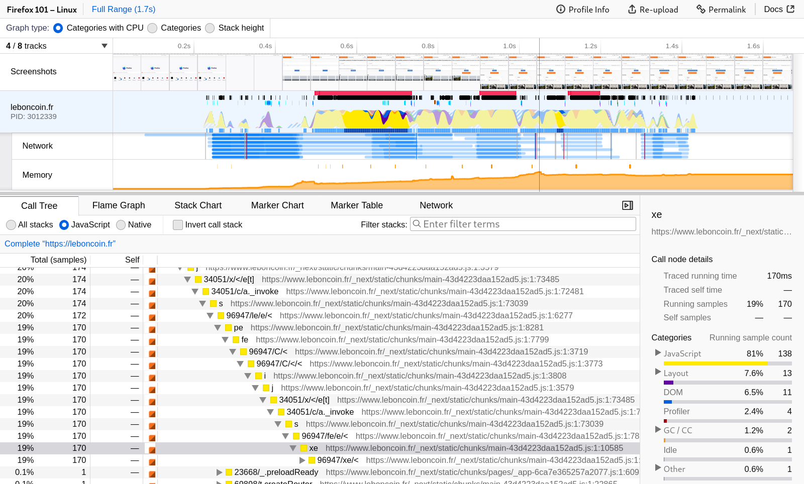

# 用户指南

捕获性能配置文件。分析它。分享它。让网页更快。

欢迎查阅 [profiler.firefox.com](https://profiler.firefox.com) 的用户文档。该 Web 应用是用于分析 Firefox 和 Gecko 浏览器引擎性能配置文件的官方 Firefox 分析器。访问 [profiler.firefox.com](https://profiler.firefox.com)，并按照说明开始进行性能分析。本指南包含各种文档和视频，演示如何开始进行性能分析。想要贡献代码？请查看 [github.com/firefox-devtools/profiler](https://github.com/firefox-devtools/profiler)。
