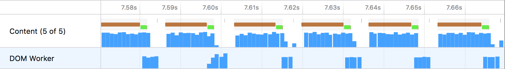
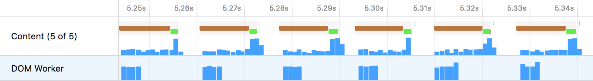
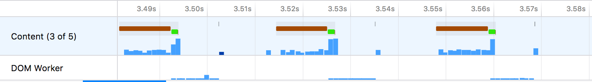
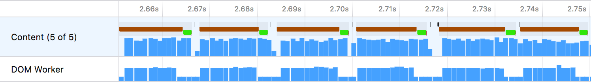

# 案例研究

## 利用并行性

考虑[之前的案例研究](bunny.md)。通过一些性能修复，减少的工作量使得帧率变得更快。然而，这段代码仍然存在一个问题：它没有利用工作线程的并行性优势。

考虑来自之前案例研究的优化配置文件：[https://perfht.ml/2IqQTH2](https://perfht.ml/2IqQTH2)



查看线程堆栈图的放大视图，可以看到内容进程的主线程正在将可视化绘制到屏幕上，然后向工作线程请求下一个绘制调用。这使得两个线程实际上是同步的，因为它们互相阻塞，轮流执行工作。内容线程中的空白区域（包含空闲堆栈）代表了内容线程被阻塞并等待工作线程完成其工作的时间。

## 代码

在一个简化的代码示例中，使用 [`CanvasRenderingContext2D`](https://developer.mozilla.org/en-US/docs/Web/API/CanvasRenderingContext2D API) 进行绘制的 iframe 运行类似如下的代码：

```js
worker.addEventListener('message', (message) => {
  if (message.data.type === 'draw') {
    requestAnimationFrame(() => {
      // Draw the current set of rectangles.
      drawRects(message.data.drawCalls);
      // Post a message to the worker asking for the next draw calls.
      worker.postMessage({ type: 'generate-draw-calls' });
    });
  }
});
```

在此示例中，iframe 绘制到画布，完成后向工作线程发送一条消息，要求它生成新的绘制调用列表。虽然这可行，但它没有利用工作线程可以并行执行代码这一事实。幸运的是，修复方法很明确：交换 `drawRect` 和 `worker.postMessage` 调用的顺序。

```js
worker.addEventListener('message', (message) => {
  if (message.data.type === 'draw') {
    requestAnimationFrame(() => {
      // Ask the worker to generate the new draw calls for the NEXT frame.
      worker.postMessage({ type: 'generate-draw-calls' });
      // Draw the current frame.
      drawRects(message.data.drawCalls);
    });
  }
});
```

## 新的配置文件

对此更改进行剖析揭示了新的行为：https://perfht.ml/2IpSRr4



现在，内容进程的主线程不再被工作线程阻塞。绘制单帧的总时间相同，但在概念上这有一个重要的区别。内容线程中的空白区域不再代表它被阻塞的时间。现在它真正代表空闲时间，即不需要执行任何工作的时间。

## 这如何提升性能

考虑如果工作线程花费很长时间来计算新的绘制调用会发生什么。随着工作量的扩展，它以并行方式发生。为了模拟这种情况，可以向工作线程添加一个名为 `doWork` 的函数。

## 繁忙的同步线程

这是同步顺序下的配置文件：https://perfht.ml/2wuFSj1



工作线程花费的时间足够长，导致帧在每次渲染之间开始跳过。结果是两个线程都产生了大量的空闲时间，最终用户感知到的性能变慢。

## 繁忙的并行线程

这是并行处理的配置文件：https://perfht.ml/2KajgWV



这里绘制了更多的帧。最终用户会感知到更流畅的动画，体验感觉要快得多。最终用户感知到的这种性能提升意味着实际上，每个线程都在做更多的工作。工作量在两个线程之间均匀分布，它们确实因为被阻塞而花费空闲时间。

## 总结

代码可以被优化以减少工作量，这对于实现更流畅运行的代码和更长的电池寿命非常有益。另一类优化是更好的并行性。使代码非阻塞意味着可以同时执行更多工作，并将结果呈现给用户。

更高并行性的主要权衡是，当线程不保持空闲状态时，可能会消耗更多的电力。在上面的示例中，通过并行化任务实现了更高的帧率，但实际上，更流畅运行的并行代码执行了更多的工作。

在处理大型多线程应用程序时，这种类型的优化具有很多相关性。虽然同步 IPC（进程间通信）可能导致代码在等待响应时被阻塞，但异步通信也可能导致代码在执行时被阻塞。重要的是进行剖析以验证实际代码中任务调度假设的正确性。
