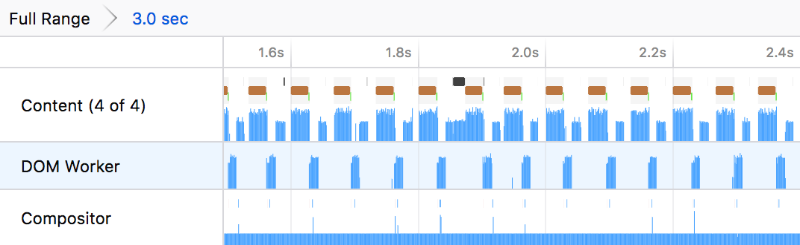
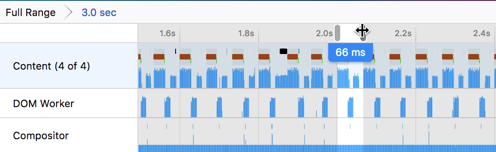
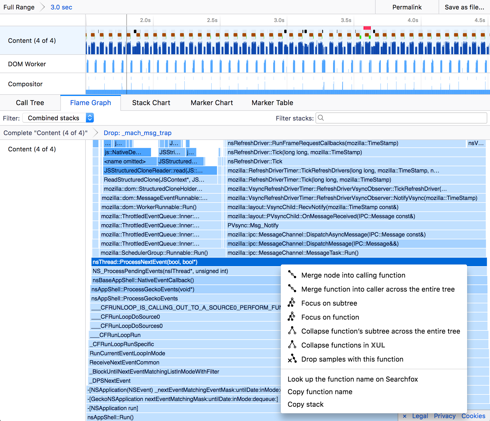
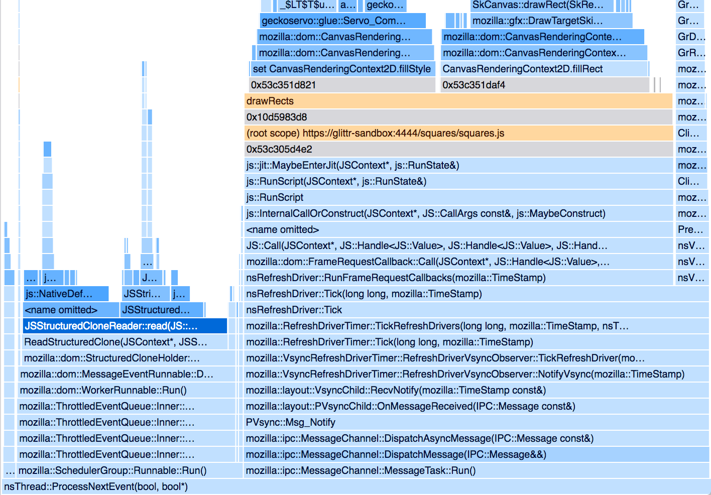
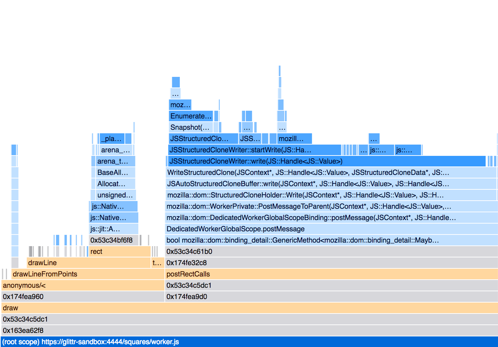
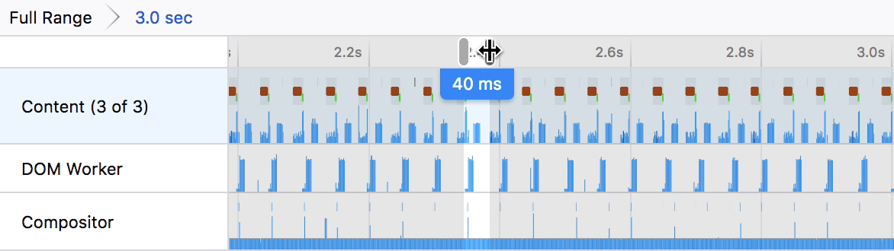
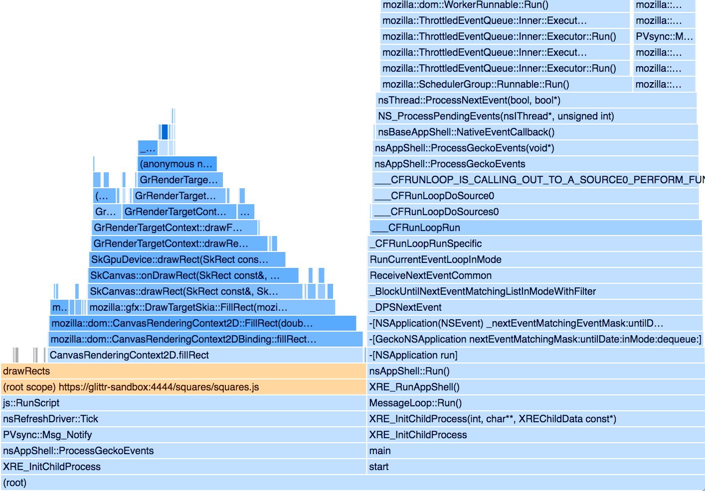
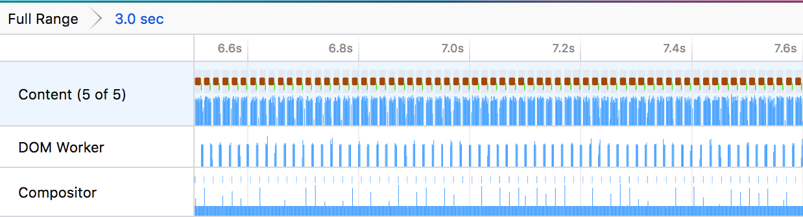
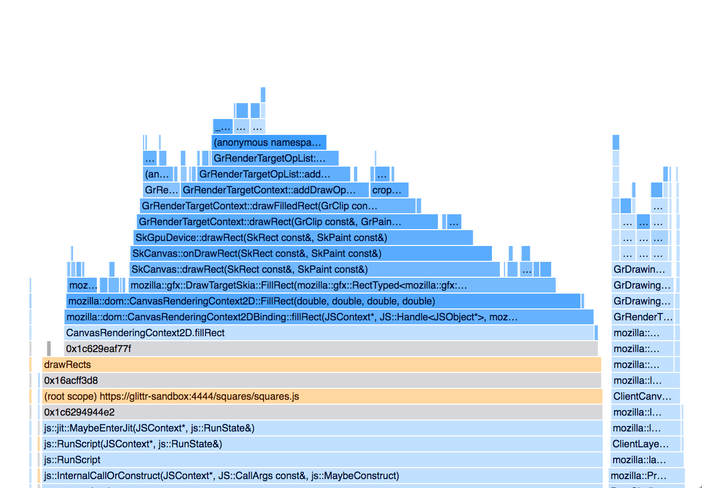
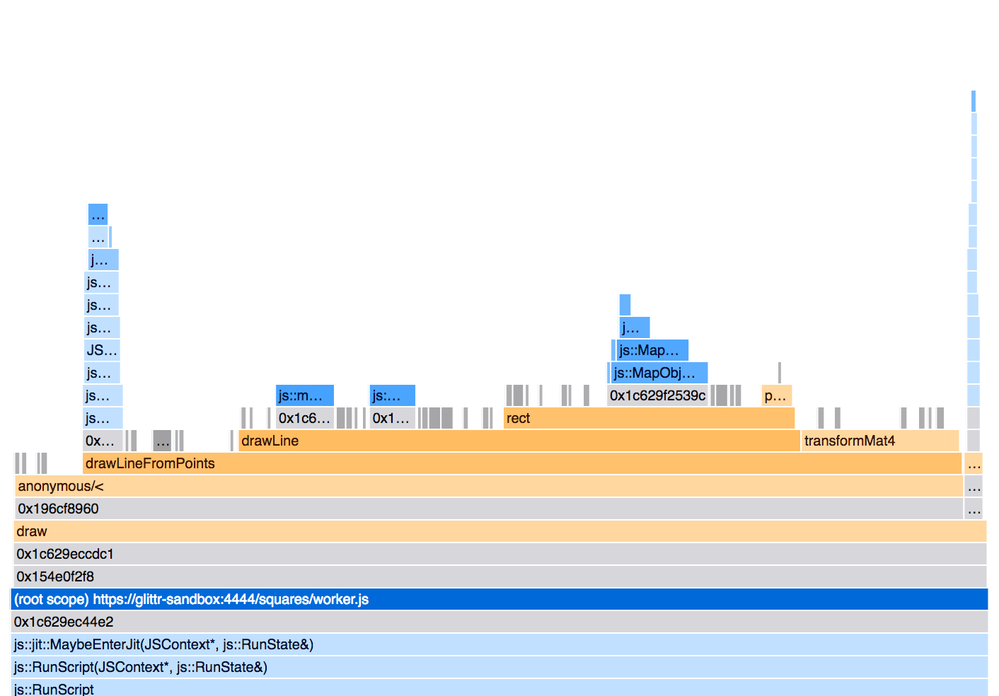

# 案例研究

## 2D Canvas 和 Worker 消息传递

以下文章是一个使用分析器识别性能问题的案例研究。所做的修复使代码运行速度快了四倍，并将帧率从相当缓慢的 15fps 提升到了流畅的 60fps。此分析过程遵循一个常见的模式：

- 对代码进行剖析
- 识别缓慢的区域
- 针对其缓慢的原因形成假设
- 根据假设采取行动并更改代码
- 对代码进行剖析以衡量差异
- 评估代码更改的有效性

## 项目描述


该项目是一个网站，它接收用户的 JavaScript 代码并运行它以生成可视化效果。用户的代码只能访问 ``rect(color, x, y, width, height)`` 函数，该函数将矩形绘制到屏幕上。在实现方面，网站将用户的代码发布到一个沙盒 iframe 中。iframe 包含一个 ``<canvas>`` 元素，通过 [`CanvasRenderingContext2D`](https://developer.mozilla.org/en-US/docs/Web/API/CanvasRenderingContext2D) API 进行渲染。用户的代码在 WebWorker 中求值，然后将 ``rect()`` 的结果发布回 iframe 的代码中。

在一个简化的示例中，``worker.js`` 可能会运行如下内容：

```js
// Evaluate the user's code string:
eval(`
rect('#fff', 10, 10, 3, 3);
rect('#fff', 20, 20, 3, 3);
rect('#fff', 30, 30, 3, 3);
rect('#fff', 40, 40, 3, 3);
rect('#fff', 50, 50, 3, 3);
`);

// worker.js would post something like this to the iframe:
self.postMessage({
  color: ['#fff', '#fff', '#fff', '#fff', '#fff'],
  x: [10, 20, 30, 40, 50],
  y: [10, 20, 30, 40, 50],
  w: [3, 3, 3, 3, 3],
  h: [3, 3, 3, 3, 3],
});
```

然后 iframe 使用以下代码绘制代码：

```js
worker.addEventListener('message', (message) => {
  const { data } = message;
  for (let i = 0; i < data.color.length; i++) {
    ctx.fillStyle = data.color[i];
    ctx.fillRect(data.x[i], data.y[i], data.w[i], data.h[i]);
  }
});
```

这将导致用户的求值代码在屏幕上绘制一些内容，如上图中的兔子模型。

## 问题

基线剖析：https://perfht.ml/2IxTwqi

这段代码在绘制大量矩形到屏幕时扩展性不佳。存在大量的卡顿和缓慢的帧率。修复此问题的用户影响将是拥有更流畅的帧率，以及能够在不降低速度的情况下绘制更多矩形。为了验证修复效果，使用了以下步骤来重现问题。

- 加载带有兔子可视化的页面。
- 按 Ctrl Shift 1 打开 Gecko Profiler。
- 等待约 5 秒。
- 按 Ctrl Shift 2 捕获剖析数据。
- 将范围设置为 3.0 秒的相对稳定的帧，这些帧没有卡顿或 GC 暂停。
- 通过右键单击火焰图中的 ``__psync_cvwait`` 和 ``mach_msg_trap``，并选择 **“Drop samples with this function”**（丢弃具有此函数的样本）来隐藏空闲堆栈。
- 过滤线程以包含：
   - 相关的 content process（内容进程）
   - 相关的 DOM Worker
   - compositor（合成器）

### 熟悉环境

一个好的起点是熟悉线程堆栈图。这些位于标题部分，显示了示例代码的堆栈高度。

请记住，较高的堆栈并不意味着代码执行时间更长。它仅意味着堆栈高度较高，这是一个相当任意的度量标准，仅有助于在剖析中定位自己。在此图中，时间是 X 轴。堆栈之间存在间隙。这些间隙是在重现步骤中隐藏的空闲堆栈。



可以使用范围选择来测量帧之间的时间。棕色标记代表 ``RefreshDriverTick``，它显示浏览器屏幕上的图像何时刷新。这对于描述平滑动画将是一个有用的指标。



这里的时间通常在 60-70ms 之间。这大约是每秒 15 帧 (fps)，这确实太长了。可视化效果每帧应花费约 ~16ms 才能获得流畅的 60fps 视觉体验。

线程列表还很好地显示了内容进程主线程和 worker 线程之间的消息传递。内容进程发布一条消息，然后有效地等待响应，然后再做任何事情。这是在多线程代码中看到的相当常见的模式。

### 内容进程主线程中的问题

火焰图提供了时间花费情况的摘要视图。X 轴代表在所有可见堆栈中，该函数在该堆栈中花费的时间百分比。在前一步中，空闲时间已经从分析中隐藏了。

这里的堆栈相当深，所以一个好的第一步是只关注感兴趣的子树。从视觉上看，``nsThread::ProcessNextEvent`` 是树中最常见的最后一个函数。右键单击并聚焦于该子树。



有两个函数在花费大量时间方面非常突出。``JSStructuredCloneReader::read`` 占据了近 30% 的时间。它是一个 C++ 函数，当 iframe 从 worker 接收消息时被调用。它安全地读取数据的副本并将其提供给 iframe 的 JavaScript 代码。

更大的罪魁祸首是 ``drawRects``，它占据了 60% 的时间。这是调用 ``CanvasRenderingContext2D`` API 实际绘制到屏幕的函数。有两个函数是从 `drawRects` 调用的。它们是 ``set CanvasRenderingContext2D.fillStyle`` 和 ``CanvasRenderingContext2D.fillRect``。

https://perfht.ml/2Ios9PH



### Worker 中的问题

查看 worker 线程，首先聚焦于 ``(root scope) https://glittr-sandbox:4444/squares/worker.js`` 的子树，因为它包含分析的相关代码。

https://perfht.ml/2Iu4mh4



有两个主要函数在占用大量时间方面非常突出。第一个是 ``drawLineFromPoints``。这恰好是被求值的用户代码。我们大部分无法控制它。``rect`` 函数出现了，但它只占总时间的一小部分。``DedicatedWorkerGlobalScope.postMessage`` 和 ``JSStructuredCloneWriter::write`` 出现并占据了大部分时间。这是 worker 向 iframe 的 JavaScript 发布消息的代码部分。

## 假设

基于此基线报告，似乎有问题的两个区域是 ``fillStyle`` 和结构化克隆在发布消息时的行为。修复这些问题将显著提高帧率。

## 修复 `set fillStyle`

重复调用 ``set fillStyle`` 对于兔子来说是不必要的，因为只有两种颜色被绘制。第一种是灰色背景，第二种颜色是用于绘制到屏幕的大量矩形的白色。没有理由不断重新求值颜色。事实上，这可能是浏览器的潜在修复方案，而不是这个特定网站。

### `set fillStyle` 的代码更改

此修复将是仅在颜色更改时设置颜色。

```js
worker.addEventListener('message', (message) => {
  const { data } = message;
  for (let i = 0; i < data.color.length; i++) {
    const nextColor = data.color[i];
    if (prevColor !== nextColor) {
      // Only update the color if it's changed.
      ctx.fillStyle = nextColor;
      prevColor = nextColor;
    }
    ctx.fillRect(data.x[i], data.y[i], data.w[i], data.h[i]);
  }
});
```

### 结果剖析：

严格遵循上述的重现步骤会产生以下剖析：

https://perfht.ml/2IlI15x

标题显示绘制到屏幕所花费的时间大大减少。之前的时间约为每帧 ~65ms，而现在约为 ~40ms。在帧率方面，这是从 15fps 到 25fps 的提升。速度提高了 1.6 倍。



火焰图显示了时间花费情况的摘要。当花费的时间减少时，X 轴的总长度不会改变，但它仍然可以显示差异的幅度。首先，在 ``drawRects`` 上，没有可见的 ``fillStyle`` 样本。这表明修复正在起作用。



火焰图仍然可以提供关于变化幅度的信息。要做到这一点，需要查看堆栈上的 ``(root)`` 函数。在重现步骤中丢弃了空闲堆栈，因此剩余的样本是（假设）正在工作的样本。``(root)`` 之前的运行时间为 2107ms，之后的运行时间为 1613ms。这是 1.3 倍的差异。然而，范围选择有点模糊，所以 FPS 可能是此分析的更好指标，也是最终用户可见的实际结果。始终重要的是针对感知性能特征进行优化。

## 修复结构化克隆

较大的工作块，可能更难优化的是 [structured clone](https://developer.mozilla.org/en-US/docs/Web/API/Web_Workers_API/Structured_clone_algorithm)。该算法的定义可在 MDN 上找到，并声明：

> 结构化克隆算法是 HTML5 规范定义的用于复制复杂 JavaScript 对象的算法。它在内部用于通过 postMessage() 在 Workers 之间传输数据或在使用 IndexedDB 存储对象时。它通过递归遍历输入对象来构建克隆，同时维护一个先前访问过的引用的映射，以避免无限遍历循环。

这听起来需要做很多工作，那么是否有更简单的方法来传输此数据并使其更紧凑？目前结构如下所示：

```js
// worker.js would post something like this to the iframe:
self.postMessage({
  color: ['#fff', '#fff', '#fff', '#fff', '#fff'],
  x: [10, 20, 30, 40, 50],
  y: [10, 20, 30, 40, 50],
  w: [3, 3, 3, 3, 3],
  h: [3, 3, 3, 3, 3],
});
```

结构已经过优化，不包含许多小对象，使其对 GC 更友好。也许可以使其更紧凑。结构化克隆算法必须考虑 JavaScript 数组的许多复杂性。需要遍历整个数组才能进行复制，并且需要考虑每个项目。我们知道 ``x`` 处的数组只包含数字，但 JS 引擎不知道。

也许发送类型化数组会更好，它们更好地匹配将要发送的数据。类型化数组在克隆的内部表示中可能简单得多。

另一件事是重复复制字符串可能会变得昂贵并不必要地膨胀代码。最好存储一个字符串表并使用一个存储指向该表的索引的数组。

## 代码

这对于此分析来说可能有点冗长，所以这可能只适合略读。

第一个技巧是提供一个可扩展的数组，它由类型化数组支持，但允许任意推送新数据。这类似于 Rust 的 ``Vec`` 类型的工作方式。

```js
class GrowableArray {
  constructor(dataType, capacity) {
    this.dataType = dataType;
    this.length = 0;
    this.capacity = capacity;
    this._array = new dataType(capacity);
  }

  push(number) {
    if (this.length === this.capacity) {
      this.capacity *= 2;
      const newArray = new this.dataType(this.capacity);
      for (let i = 0; i < this._array.length; i++) {
        // Copy over the values.
        newArray[i] = this._array[i];
      }
      this._array = newArray;
    }
    this._array[this.length] = number;
    this.length++;
  }

  reset() {
    this.length = 0;
  }
}
```

然后由以下代码使用：

```js
// Create a Uint16Array with an initial capacity of 512;
const array = new GrowableArray(Uint16Array, 512);
array.push(1);
array.push(3);
array.push(5);

console.log(array._array);
// > Uint16Array(16) [1, 3, 5, 0, 0, 0, 0, ... ]
console.log(array.length);
// > 3
```

最后，在发布消息时，代码将发送裸类型化数组。

```js
self.postMessage({
  stringTable,
  color: colorArray._array,
  x: xArray._array,
  y: yArray._array,
  h: hArray._array,
  w: wArray._array,
  length: colorArray.length,
});
```

<!--alex ignore simple-->

这使得代码更加复杂且难以维护，但这可能是获得更好性能的关键。这是快速代码和简单代码之间常见的权衡。重要的是，任何额外的复杂性都必须由分析支持，证明它实际上影响了用户感知的性能。

### 结果结构化克隆剖析：

线程列表的视觉外观立即变得更加紧凑。屏幕上渲染了更多帧。

https://perfht.ml/2Ir30DT



现在放大以查看时间，每帧都在每帧 16ms 的预算内。脚本现在以 60fps 运行。

现在查看内容进程，时间主要花在 ``fillRect`` 调用上。结构化克隆甚至没有显示出来。在过滤它时有几个样本，但在那里花费的时间几乎可以忽略不计。



结构化克隆也从 worker 进程中消失了。现在主要是用户的求值代码，我们无法控制它。



## 结论

剖析代码揭示了一个快速修复 ``fillStyle`` 的方法。这些代码更改并没有真正增加代码库的复杂性，但产生了可观的用户影响。这是一个缓存节省了重新计算值成本的案例。

结构化克隆代码是一个更复杂的问题。解决方案最终增加了代码的复杂性，但由于相当显著的最终用户利益而得到证明。解决方案是通过思考结构化克隆算法的算法复杂性得出的，并找到一种将项目数据的约束适应到更快的数据结构中的方法。

在分析中，只考虑了花费最多时间的函数进行优化。这有助于优先考虑影响性的工作，并减轻向代码库引入不必要复杂性的危险。

一个好的后续步骤是对各种不同测试用例进行更多分析，以确保这些更改没有在其他示例上导致性能回归。

| 指标                                            | 基线 | 修复 1   | 修复 2   | 变化幅度 |
| ------------------------------------------------ | -------- | ------ | ------ | ---------------- |
| 每帧时间                                    | ~65ms     | ~40ms   | ~16ms   | 4x (更快)       |
| 每秒帧数                                 | ~15fps    | ~25fps | ~60fps | 4x (更快)       |
| 内容进程中 `(root)` 的非空闲时间 | 2107ms    | 1613ms | 725ms   | 2.9x (更快)     |
| Worker 中 `(root)` 的非空闲时间           | 666ms     | 814ms   | 725ms   | 0.9x (更慢)     |
