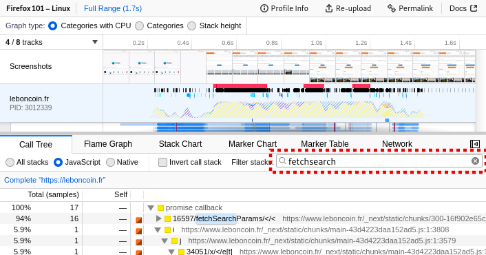
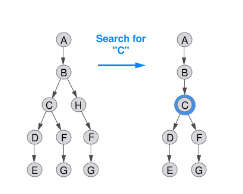
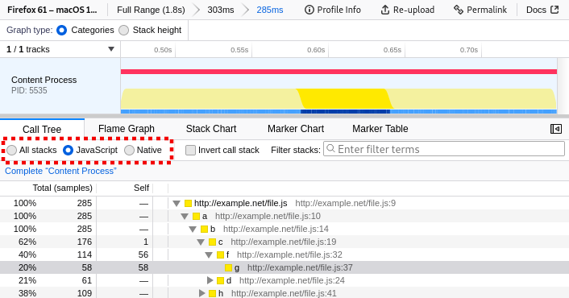
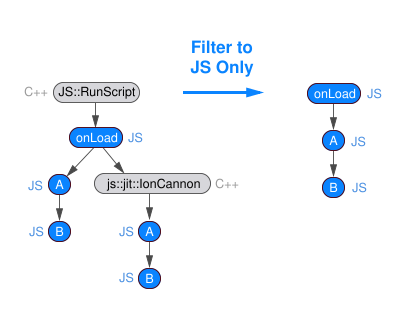
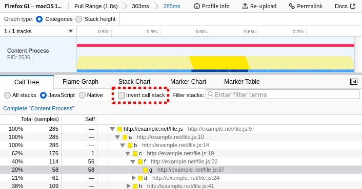
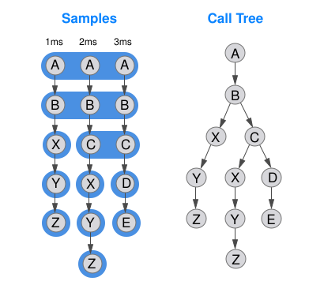
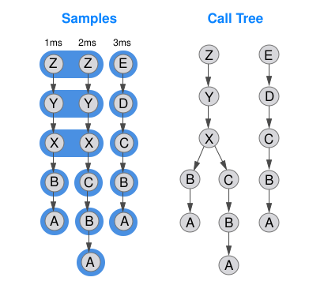
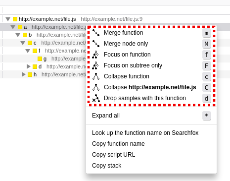

# 过滤调用树

调用树可能会变得非常大，尤其是在分析浏览器引擎时。通常，对于任何给定的分析，只有调用树的一部分是有用的。Firefox 分析器提供了多种工具来过滤和转换调用树，以便仅显示相关部分。在过滤时，了解“过滤掉样本”与“转换堆栈”之间的区别非常重要。当移除样本时，调用树的形状基本保持不变，但可能会缺少某些仅在特定样本中存在的分支。当转换调用树时，样本堆栈的形状将被修改。只有当样本的堆栈在转换操作中被完全移除时，这些样本才会被丢弃。

以下是支持的不同类型的过滤操作。

| 过滤类型            | 描述                                                                                               |
| --------------------- | -------------------------------------------------------------------------------------------------------- |
| 搜索过滤器          | 丢弃与文本字符串不匹配的样本。                                                             |
| 实现过滤器 | 将堆栈限制为特定的实现——原生（C++）堆栈或 JavaScript 堆栈。                        |
| 反转调用堆栈      | 将样本的堆栈上下翻转并构建一个新的调用树。                                           |
| 变换             | 根据某些操作修改调用树的形状。通常，这仅修改堆栈。 |

## 搜索过滤器

搜索将排除与搜索字符串不匹配的样本。搜索过滤器会检查样本堆栈中的每个函数。如果函数的名称、资源或 URL 匹配，则该样本将被保留；否则，它将被过滤掉。可以添加多个搜索词，只要它们用逗号分隔即可。

上图在以下配置文件中重现：

- 搜索前: [https://perfht.ml/2I3SMsR](https://perfht.ml/2I3SMsR)
- 搜索后: [https://perfht.ml/2rbcj0N](https://perfht.ml/2rbcj0N)

以下是一些关于如何使用搜索词的想法：

- `js::` - 过滤 C++ 命名空间。
- `www.example.com` - 过滤域名。
- `www.example.com/assets/scripts.js` - 过滤单个脚本。

## 实现过滤器

实现过滤器可用于将调用树缩小到堆栈类型的子集。例如，仅显示原生堆栈（C++ 和 Rust）或仅显示 JavaScript 堆栈可能很有用。

下图演示了仅过滤到 JavaScript 堆栈的有用性。

在使用实现过滤器之前，调用树包含 C++ JavaScript 内部结构以及 JavaScript 堆栈。这种交错对于诊断 JS 引擎如何优化代码可能很有用，但对于正常的 JS 性能分析，查找热点 JS 函数可能会令人困惑。当移除原生堆栈时，生成的调用树更能合理地表示 JavaScript 代码的执行情况。

实现过滤器将修改堆栈的形状并生成一个全新的调用树。如果样本中的任何过滤堆栈为空（例如，在只有 C++ 堆栈时过滤 JavaScript），那么这些具有空堆栈的样本将从分析中丢弃。

## 反转调用堆栈

反转样本的调用堆栈将生成一个全新的调用树。所有的自时间（self time）都将位于调用树的根节点处。对调用树形状的影响可能令人惊讶，但请考虑以下图形。

在此配置文件中，为了简洁起见，只收集了 3 个间隔为 1ms 的样本。在大多数未反转的调用树中，只有一个根节点。在这种情况下，`A` 调用 `B`，直到第三个堆栈帧，调用才分叉到函数 `X` 和函数 `C`。右侧的调用树是由这些样本生成的。现在考虑反转样本中的所有堆栈。

以前，堆栈 `X -> Y -> Z` 分别位于不同的层级。然而，在反转视图中，这些堆栈现在位于同一层级。当从这些样本创建调用树时，现在有两个不同的根节点，分别从函数 `Z` 和函数 `E` 开始。反转使得堆栈的 `Z -> Y -> X` 部分落入同一层级。

反转在揭示实际花费时间的函数方面非常有用。这些树通常比未反转的调用树更大且噪声更多。

## 变换

调用树变换提供了更细粒度的控制，以修改调用树的方式。它们通过不同的操作修改堆栈。它们可以在树上的单个调用节点上操作，也可以针对给定函数的整个树进行操作。不同的程序使用不同的术语来描述这些操作，但 Firefox 分析器定义了某些操作。

### 合并 (Merge)

合并操作接受一个调用节点并将其从调用树中移除。该节点的任何自时间随后将计入其父节点。这可以对单个调用节点或树中的所有函数执行。这种类型的操作可用于修改树的形状并从调用树中移除无用的函数。

### 聚焦 (Focus)

聚焦于某个函数或调用节点会移除所有祖先调用节点——子调用节点保留。如果堆栈不包含该函数或节点，则将其移除。这有效地聚焦于调用树上的子树或一组子树。

### 聚焦于函数自时间 (Focus on Function Self)

聚焦于函数自时间与聚焦于函数类似，但更严格：它仅保留那些聚焦函数是最内层实现过滤器帧的样本。这有助于分析函数内部自时间的花费情况，通过移除函数调用其他代码的样本来实现。

例如，如果您使用 JS 实现过滤器对 JavaScript 函数进行聚焦自时间操作，您将只看到该 JS 函数具有自时间的样本，并且其下方的任何原生（C++）调用都将显示为后代。这特别适用于：

- 找出函数的哪些部分较慢（通过查看汇编或源代码行）
- 了解 JS 函数调用了哪些引擎内部结构（通过在聚焦后切换实现过滤器）
- 消除函数调用的代码中的噪声，以专注于函数自身的执行

如果同一函数在堆栈中出现多次（递归），则仅保留最内层的实例作为根节点。

### 聚焦于类别 (Focus on Category)

聚焦于与所选节点属于同一类别的节点，从而合并所有属于其他类别的节点。

### 折叠 (Collapse)

折叠函数是一种操作，它接受多个调用节点并将它们全部组合成一个新的单一调用节点。这可以对整个子树执行，以减少树中的节点数量。这也对连续的调用节点执行。例如，折叠属于某个库的所有函数或递归的调用节点可能很有用。

### 丢弃 (Drop)

丢弃用于表示移除样本，但不改变堆栈的任何属性。这对于丢弃普遍存在的但妨碍分析的函数（如空闲函数）可能很有用。
