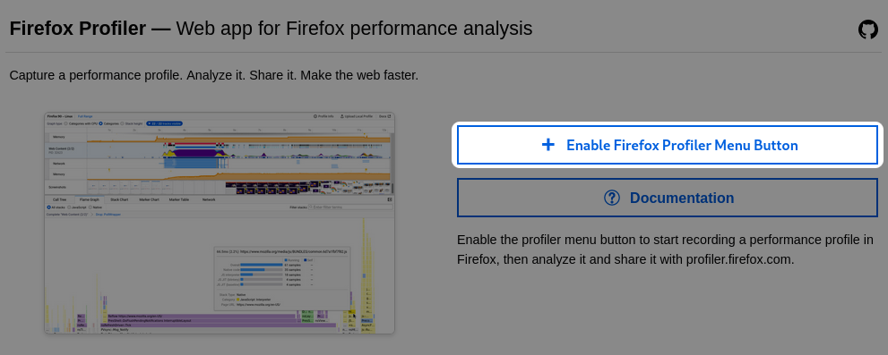
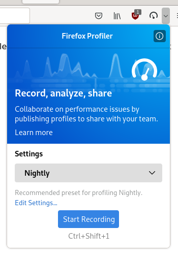
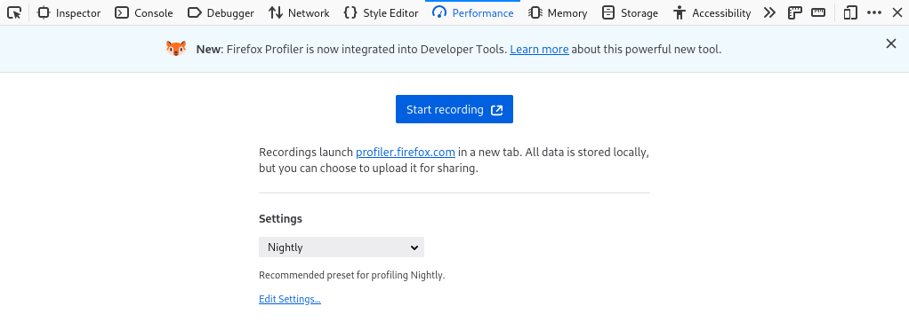
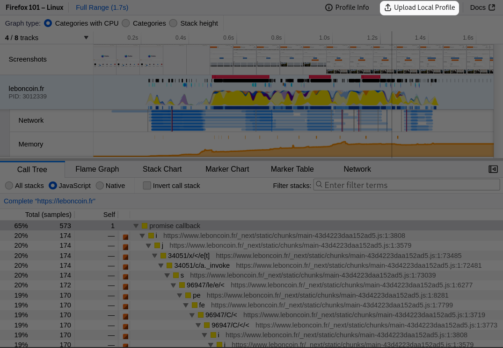
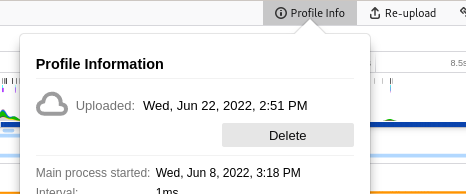
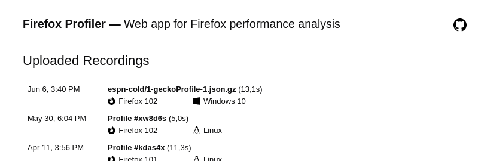
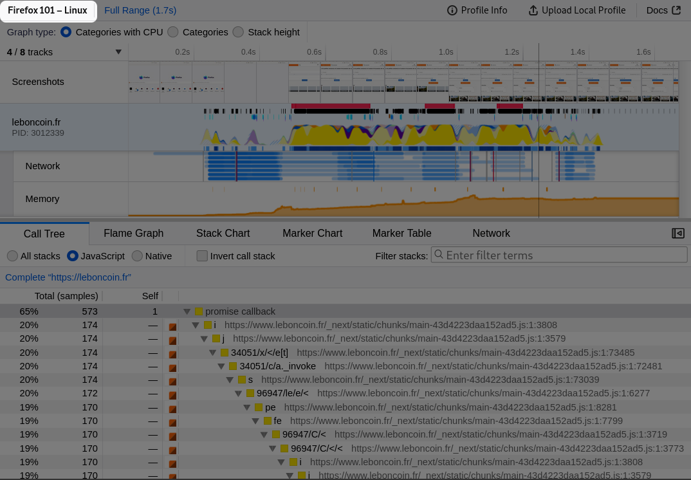

# 入门指南

本页概述了捕获性能分析（profile）的一般流程。

## 访问 Firefox Profiler 控件

Firefox Profiler 可以通过两个入口点使用：要么从弹出窗口（popup），要么从开发者工具面板（devtools panel）。

?> 我们建议使用弹出窗口，以避免其他开发者工具带来的开销。

### 启用弹出窗口

启用弹出窗口的最简单方法是前往 https://profiler.firefox.com 并点击页面上的大按钮 `Enable Firefox Profiler Menu Button`。

你也可以从工具栏自定义界面拖放图标。

### 打开弹出窗口

通过点击分析器图标侧面的小箭头来打开弹出窗口。

在这里你可以更改预设，并访问高级设置。

?> 如果你想要分析整个浏览器（例如 [报告 Firefox 中的性能问题](https://firefox-source-docs.mozilla.org/performance/reporting_a_performance_problem.html)），建议使用预设 `Firefox`（如果在 Firefox 的 nightly 版本中运行，也称为 `Nightly`）；如果你想要分析一个网站，则使用 `Web Developer`。

### 使用开发者工具面板

相同的设置也可以在开发者工具面板中使用。

!> 如上所述，打开 Devtools 工具箱时会产生开销，这是由于打开了额外的面板所致。我们尽量保持最小的开销，但在查看从此面板捕获的性能分析数据时，你需要将此因素考虑在内。

## 捕获性能分析

### 使用弹出窗口或开发者工具面板

[展示如何使用 profiler 弹出窗口的视频](images/getting-started-use-popup.webm ':include :type=video controls')

你可以从图标处使用弹出窗口，或者类似地通过点击 `Start Recording`，然后点击 `Capture` 来使用开发者工具面板。随后，Profiler 用户界面将打开以显示捕获的数据。

请注意，Profiler 用户界面是一个外部网页，但在你首次访问时它会被缓存在本地。这意味着你在使用它的第一次时需要网络连接以下载它。如果在后续使用中你有网络连接且有新版本可用，UI 会提示你切换到新版本。

还需要注意的是，数据在上传之前一直保留在你的计算机本地（见下文）。

### 使用分析器按钮

可以点击该按钮以当前设置启动分析器。然后再次点击它以捕获性能分析并打开 Profiler UI。

[展示如何使用 profiler 图标的视频](images/getting-started-use-icon.webm ':include :type=video controls')

### 使用键盘快捷键

提供以下键盘快捷键：

- `Ctrl + Shift + 1`：启动分析器，如果它已经在运行，则停止并丢弃数据。
- `Ctrl + Shift + 2`：从当前运行的会话中捕获性能分析。如果分析器未运行，此操作无效。

## 分享性能分析

Firefox Profiler 最强大和有用的功能之一是上传和共享性能分析的能力。第一步是点击 _Upload Local Profile_（上传本地配置）按钮。在上传之前，你可以排除一些信息。然后，该配置将上传到在线存储。随后可以在在线聊天、电子邮件和错误报告中分享此配置。请注意，任何拥有链接的人都可以访问上传的数据，因为否则它没有受到保护。

当前视图以及应用于性能分析的所有过滤器都将编码到 URL 中。在最初分享性能分析后，会添加一个 _Permalink_（永久链接）按钮，随后可用于提供当前视图的便捷缩短 URL。

[展示如何上传性能分析以及如何获取永久链接的视频](images/getting-started-upload-permalink.webm ':include :type=video controls')

?> 配置也可以保存到文件，尽管 UI 中的当前视图不会被保存。可以通过 [profiler.firefox.com](https://profiler.firefox.com) 界面重新加载该文件，方法可以是拖放，或者通过文件上传界面。

## 删除已上传的性能分析

上传性能分析后，你可以从 `Profile info` 面板中删除它。

你也可以前往 [Uploaded Recordings page](/uploaded-recordings/ ':ignore') 列出你上传的所有性能分析并删除它们。请注意，此列表仅存储在 Firefox 本地，因此你只能删除从同一浏览器实例上传的性能分析。

## 命名性能分析

可以为性能分析命名，以便稍后通过地址栏搜索方便地找到它。该名称是你与他人分享的 URL 的一部分，但除此之外不会存储在配置数据中。
