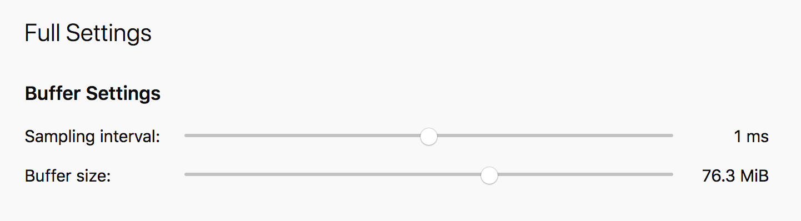

# 分析器基础

在对代码进行分析时，主要有两种信息来源——堆栈：样本（Samples）和标记（Markers）。

## 样本

对于样本而言，分析器会以固定的频率停止被分析代码的执行，例如每 1ms 一次，并记录当前堆栈等相关信息。这些样本会被聚合在一起，从而提供对程序执行的统计视角。虽然不能保证所有正在运行的代码都会被采样，但只要有足够的样本，就能很好地展示在运行目标代码时时间都花在了哪里。

### 统计显著性与样本的开销

有两种方法可以获取更多样本以提高统计显著性。第一种方法是提高采样率。可以通过调整 `about:profiling` 中的采样间隔来更改采样率。

例如，通过将间隔从 1ms 更改为 0.1ms，可以将样本数量增加 10 倍。这使得被分析程序运行的次数可以减少，但这伴随着权衡。当分析器收集更多样本时，它需要执行更多工作来收集这些样本，因此分析器的开销也会更大。与正在运行的实际程序相比，这可能会通过测量更多的分析开销来扭曲结果。

另一种增加样本数量的方法是更频繁地运行代码，而不提高采样率。例如，要分析鼠标点击事件，在 1ms 的频率下，单次点击事件的样本很少。然而，在一分钟内多次执行点击事件会增加收集的样本数量，而不会引入额外的分析器开销。

## 标记

样本提供的是基于概率的被分析程序视图。随着时间的推移，只要有足够的样本，分析结果中很可能包含已运行代码的样本。但是，它可能会错过发生得非常快的重要事件。

标记提供的是对执行代码的无遗漏视图。标记是在特定事件发生时收集的小块数据。例如，当点击鼠标时，C++ 实现可以调用一个函数来收集当前鼠标坐标和事件的时间戳。这些信息随后会存储在分析器的缓冲区中。这次鼠标点击可能发生得非常快，如果没有标记，它很可能被分析器错过。

样本是一种通用的解决方案，用于了解代码中正在发生的事情，而标记提供的是特定的、有观点的视图。在低采样率下，非常快的鼠标事件很有可能被遗漏，但作为标记始终会被收集。标记的问题是它们必须在代码中进行手动插桩并保持更新。它们是拥有领域特定信息的工程师展示程序执行更多细节的好方法。标记信息可以与样本交叉引用，以更好地理解代码正在做什么。

标记也可以用于类似堆栈的目的。例如，在使用 React 或任何前端组件系统时，JavaScript 堆栈都将显示为框架内部实现。这些内部实现正在解决组件请求的工作，但它们并不直接映射到组件作者编写的代码。为了解决这个问题，组件可以发出带有开始和结束时间戳的标记，表示它们何时被更新。这些标记随后可以转换为图表，展示组件如何根据层次结构进行渲染，以及更新它们花费了多少时间。然后可以将这些标记信息与统计收集的样本交叉引用。

### 标记的开销与权衡

虽然标记可以提供关于给定系统的非常详细的信息，但它们也伴随着一些权衡。与作为通用解决方案的样本不同，每种类型的标记都必须作为源代码中的代码行编写和维护。这需要领域专家的时间和精力来创建。此外，如果这些信息没有得到正确维护，它可能会过时并提供错误的信息。

收集样本的过程有一个方便的旋钮来调整开销——采样率。标记将在每次事件发生时被收集。这对于被分析程序中有趣的部分来说非常好，但如果过度使用，情况可能会开始恶化。例如，如果 JavaScript 引擎的每个部分都被插桩以收集其执行方式的标记，这将迅速变成需要缓慢处理的千兆字节内存，难以存储，并可能因大量开销而扭曲结果。
