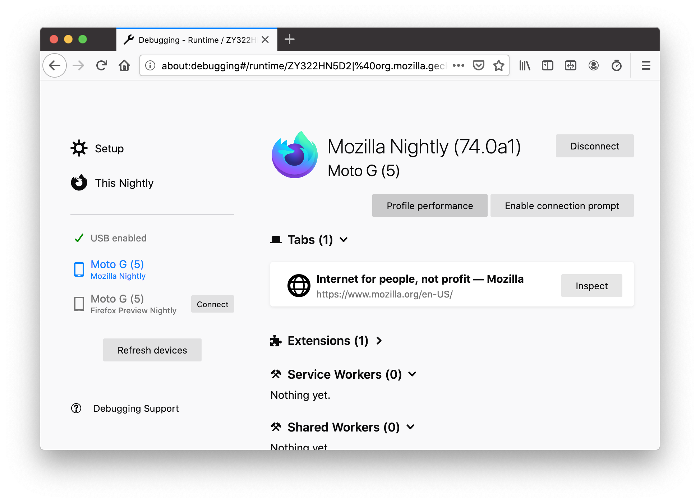
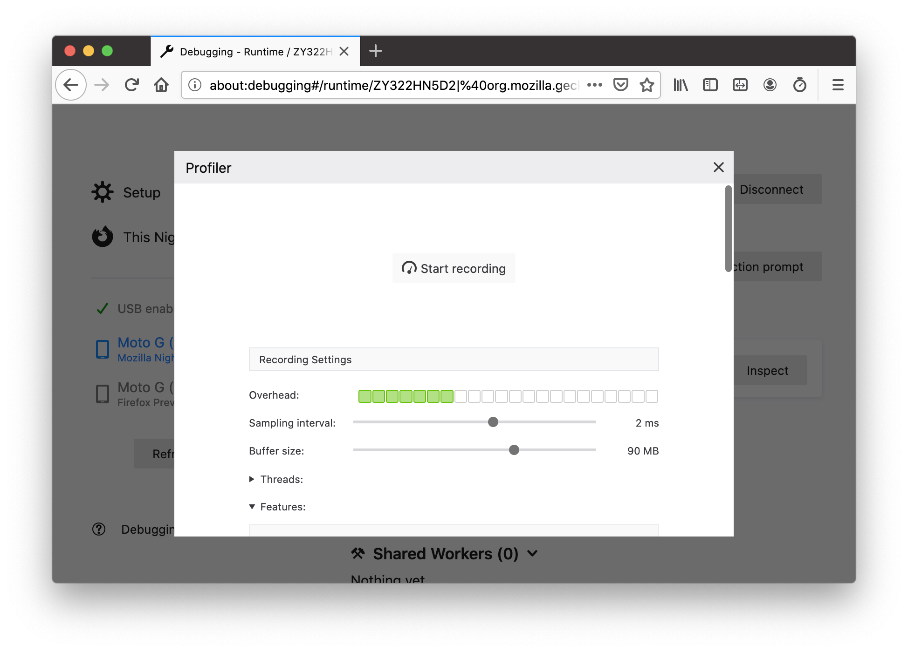

# 远程分析 Android 上的 Firefox

你可以使用 Firefox Profiler 来调查 Android 上的性能问题，而不仅仅是 Windows、macOS 和 Linux。

为此，你需要同时拥有安装了基于 Gecko 的移动浏览器的手机和运行 Firefox Desktop 的计算机。此外，还需要在这两个设备之间建立 USB 连接。然后，你可以在 Firefox Desktop 中使用 [about:debugging](https://developer.mozilla.org/en-US/docs/Tools/about:debugging) 连接到手机并在那里控制分析过程。结果将显示在 Firefox Desktop 中。

[在这个 1 分钟的视频演示中](https://www.youtube.com/watch?v=TxAlQBv6-yg)，你可以看到从 Fenix 捕获配置文件所需的几个步骤。有关更多详细信息和故障排除信息，请参阅下文。

## 设置

### 选择要分析的构建版本

我们建议分析来自任何发布渠道（即非 debug）的 Firefox 构建版本，无论是从 Google Play 下载、Taskcluster 获取还是本地构建。或者，你也可以选择分析 GeckoView-example。更多细节，请参阅下面的 [哪个移动浏览器？](#which-mobile-browser) 部分。

### 在移动设备上启用远程调试

在录制之前，需要将设备连接到计算机。你还需要确保你的基于 Gecko 的 Android 应用（例如 Firefox Preview）正在运行，并设置为通过 USB 进行远程调试。这通常需要 **两个** 设置：

- Android 系统本身需要配置为允许通过 USB 进行远程调试。这可以在进入“开发者模式”后的系统设置中完成，通过反复点击 Android 版本号即可进入开发者模式。详细信息请参阅 [Android 文档](https://developer.android.com/studio/debug/dev-options.html)。
- 应用本身需要配置为允许远程调试。通常在应用的设置菜单中有一个复选框用于此目的。

### 准备 `about:debugging`

要分析 Gecko Android 构建版本，你需要将其连接到桌面版 Firefox 浏览器。请为此使用 [Firefox Nightly](https://www.mozilla.org/en-US/firefox/channel/desktop/#nightly)。

- 在 Desktop Firefox 中，通过在 URL 栏输入 `about:debugging`，或通过“工具” > “Web 开发者” > “远程调试”打开 `about:debugging` 页面。
- 如有必要，点击“启用 USB 设备”。

## 录制

在 `about:debugging` 上，在左侧边栏中找到你的设备/浏览器并连接。如果你的设备未列出，请检查以下内容：

- Android 系统偏好中是否启用了 USB 调试？
- 你要分析的目标浏览器是否在运行？尝试导航到一个页面以确保 Gecko 已初始化。
- 手机上的浏览器是否启用了远程调试？如果你最近将新版本的应用推送到手机上，上一个版本的设置可能会丢失，因此你可能需要重新启用该 pref。
- 手机的屏幕是否已解锁？
- 仔细检查你的线缆连接。
- 如果你的桌面机器上有 `adb`，请检查 `adb devices` 是否看到了手机。如果没有，请先解决这个问题。

成功连接到手机浏览器后，继续阅读。

点击边栏中对应你手机/浏览器的项目。然后，在页面的主区域中，点击 _Profile Performance_（分析性能）按钮。

在显示的选项中做出必要的调整，例如要采样的线程或要启用的分析器功能，然后点击 _Start recording_（开始录制）。在 Android 设备上执行你打算分析的交互操作，然后在“Performance”面板中点击 _Capture Recording_（捕获录制）。一个新的标签页将在 [https://profiler.firefox.com/](https://profiler.firefox.com/) 中打开，其中包含已收集好的可供检查的配置文件。

## 符号和符号源

如果你分析的是来自 Google Play Store 的浏览器，你的配置文件应包含完全符号化的 C++ 调用栈，至少对于 libxul.so 是如此。如果没有，请检查以下内容：

- 你分析的是一个“可分发”（shippable）的 GeckoView 构建版本吗？一个常见的错误是分析来自 treeherder 的常规“opt”构建版本，即未使用“shippable”配置编译的版本。不幸的是，这些常规的 treeherder 构建版本不会将符号信息上传到 Mozilla 符号服务器。在这种情况下，请使用不同的构建版本。
- 你分析的是来自 tryserver 或本地构建的版本吗？请参阅下文以了解如何在这两种情况下获取符号信息。

## 哪个移动浏览器？

（以下内容截至 2021 年 8 月有效。）

你可能希望分析来自 Google Play Store 的 [Firefox Nightly](https://play.google.com/store/apps/details?id=org.mozilla.fenix)。继续阅读以获取更多细节，或者如果你已经确切知道要分析哪个浏览器，可以跳过下一部分。

Mozilla 目前在移动端的开发工作主要集中在 GeckoView 和 Firefox for Android（["Fenix"](https://github.com/mozilla-mobile/fenix)）。你可以 [从 Google Play Store 安装 Firefox Nightly](https://play.google.com/store/apps/details?id=org.mozilla.fenix)，也可以下载 APK（[32 位](https://firefox-ci-tc.services.mozilla.com/api/index/v1/task/mobile.v3.firefox-android.apks.fenix-nightly.latest.armeabi-v7a/artifacts/public/build/fenix/armeabi-v7a/target.apk)，[64 位](https://firefox-ci-tc.services.mozilla.com/api/index/v1/task/mobile.v3.firefox-android.apks.fenix-nightly.latest.arm64-v8a/artifacts/public/build/fenix/arm64-v8a/target.apk)）。Firefox Nightly 是首选的分析目标。它使用 [较新](https://github.com/mozilla-mobile/android-components/blob/master/buildSrc/src/main/java/Gecko.kt#L9) 版本的 Gecko，并且频繁且自动更新。

另一个合理的分析目标是所谓的 ["GeckoView-example"](https://searchfox.org/mozilla-central/source/mobile/android/geckoview_example)。这是一个小型 Android 应用，除了作为 GeckoView 的演示外没有太多其他功能，也没有太多 UI。你可以从 TaskCluster 下载最新的 GeckoView-example.apk（[32 位](https://firefox-ci-tc.services.mozilla.com/api/index/v1/task/gecko.v2.mozilla-central.shippable.latest.mobile.android-arm-opt/artifacts/public/build/geckoview_example.apk)，[64 位](https://firefox-ci-tc.services.mozilla.com/api/index/v1/task/gecko.v2.mozilla-central.shippable.latest.mobile.android-aarch64-opt/artifacts/public/build/geckoview_example.apk)），或者你可以自己编译 Gecko 并 [使用 `mach run`](https://firefox-source-docs.mozilla.org/mobile/android/geckoview/contributor/for-gecko-engineers.html#geckoview-example-app) 或 [使用 Android Studio](https://firefox-source-docs.mozilla.org/mobile/android/geckoview/contributor/geckoview-quick-start.html#build-using-android-studio) 将 Geckoview-example 推送到手机上。事实上，如果你正在开发 Gecko，这是快速验证你的更改在 Android 上的性能影响的最少摩擦的工作流程。

通常，分析 Fenix 优于分析 GeckoView-example，因为你可以看到来自 Fenix 特定性能问题的影响。如果你正在本地编译和修改 Gecko，你可以通过在你本地克隆的 [Fenix 仓库](https://github.com/mozilla-mobile/fenix) 中的 `local.properties` 文件中进行小幅调整，创建一个使用你自定义 Gecko 的 Fenix 版本 [参见此处](https://firefox-source-docs.mozilla.org/mobile/android/geckoview/contributor/geckoview-quick-start.html#dependency-substiting-your-local-geckoview-into-a-mozilla-project)。

你也可以分析本地构建或 Try 构建。这需要一些额外的步骤，本文档后面部分将描述这些步骤。

## 启动分析

要分析 GeckoView 或 Firefox for Android 的启动过程，请参阅 [专用页面上的额外指南](./guide-startup-shutdown#firefox-for-android)。

### Try 构建

如果你想分析 tryserver 为你创建的 Android 构建版本，你必须在 treeherder 上启动一个“Sym”作业（运行时间：约 3 分钟）：使用 treeherder 的 _Add new jobs_（添加新作业）UI，为每个你想要其符号的“B”作业对应的平台调度一个“Sym”作业。这些作业从相应的构建作业中收集符号信息并将其上传到 Mozilla 符号服务器，以便 Firefox Profiler 可以使用它。

### 本地构建

如果你已在本地编译了 Android Gecko 构建版本并想要分析它，你需要多做一个小步骤：在分析之前，在 `about:debugging` 的 _Profile Performance_（分析性能）面板中，进入 _Settings_（设置），向下滚动到 _Local build_（本地构建）部分，并将你的 Android 构建版本的 objdir 添加到列表中。然后像往常一样进行分析，你应该就能获得完整的符号信息。

## 提示

- 在分析之前启用“Screenshots”（截图）功能。这样你就可以在分析运行期间看到屏幕上发生的事情，这可能会非常有帮助。
- 限制分析运行的持续时间。这将减少配置文件的大小，从而减少点击“Capture Profile”（捕获配置文件）时需要等待的时间。较小的配置文件也更不容易因内存限制而崩溃。
- 避免点击 `about:debugging` 页面上列出的任何打开的标签页。点击标签页将打开工具箱并通过初始化内容侧 devtools 代码增加开销。因此，分析面板与工具箱是分开的。
- 选择更宽松的分析间隔以减少分析开销。2ms 到 5ms 效果良好。这将给你更少的数据但更准确的时间测量。
- 为了获得最逼真的时间测量，请考虑使用“No Periodic Sampling”（无周期性采样）功能：这将大幅减少分析开销，但你不会有调用栈。如果你的工作负载足够可重复，你可以获取两个配置文件：一个带有调用栈，一个不带。然后你可以从前者获取你的时间测量数据，从后者获取其他信息。
- 启动分析会揭示一些由仅在启用远程调试时运行的 devtools 代码引起的开销。为了查看关闭远程调试时启动过程做了什么，你可以在退出应用之前停用远程调试，并在启动完成后重新启用它。
- 如果点击开始按钮后录制没有开始，或者按钮处于非活动状态或其他混乱状态，可能需要断开并重新连接到手机以重置某些状态。
