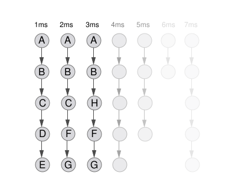
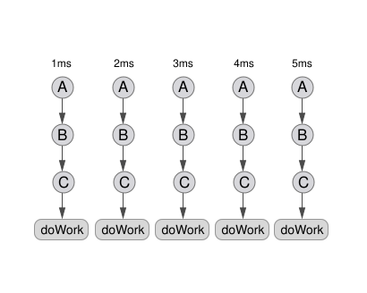
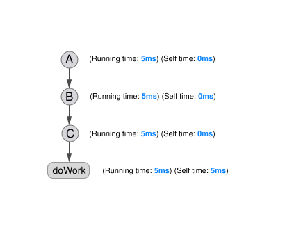
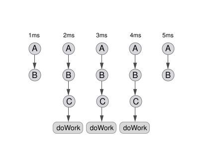
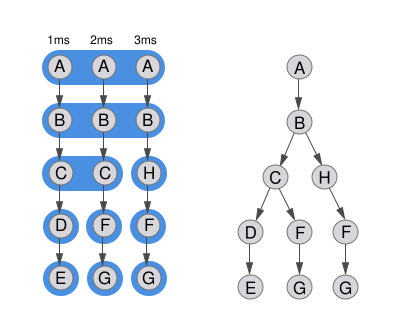

# 栈样本与调用树

虽然样本可以收集任何类型的任意信息，但最有用的无疑是当前正在执行的程序的调用栈。本文档探讨了如何聚合和分析这些栈。在阅读之前，先阅读 [分析器基础](./guide-profiler-fundamentals) 文档可能会有所帮助，其中包含关于采样工作原理的理论以及样本与标记（markers）之间的区别。

## 随时间收集的栈

这些示例假设分析器配置为每 1 毫秒收集一次样本。当目标代码运行时，分析器会暂停程序执行并对栈进行采样。通常，栈的根部分看起来非常相似，但随着代码调用程序的不同部分，叶子节点的变化会非常大。如果一个程序被分析了 3 秒，以每个样本 1 毫秒的速度计算，那么将有 3000 个样本。单独查看这些样本是不切实际的，因此这些样本将被聚合在一起，以更有效地分析程序执行过程。这种聚合后的数据结构就是调用树（call tree）。

## 简化的调用树

<!--alex ignore simple-->

这个示例创建了一个相当人为且简单的例子。`A` 调用 `B`，后者调用 `C`，然后调用 `doWork`。`A`、`B` 和 `C` 运行得非常快，分析器从未直接对它们进行采样。然而，`doWork` 被采样了 5 次。对该分析数据的聚合会将所有内容合并为一个图。

这个图是一棵简化的调用树。请注意，没有分支，因为聚合在一起的样本都共享相同的栈。分析器仅对函数 `doWork` 进行采样，但栈的其余部分包含在报告中。这意味着调用树上每个节点的运行时间都是 5ms。（从此刻起，调用树上的节点将被称为“调用节点”）。然而，由于仅观察到 `doWork` 函数，它是唯一具有 5ms 自时间的节点，因为它本身被观察到正在运行。`A`、`B` 和 `C` 的自时间均为 0ms。

## 调用树中的自时间

自时间实际上并不一定位于调用树的叶子节点。事实上，它可以位于树中的任何节点。自时间是分析器观察到函数运行的地方。想象一下在前面的示例中，函数 `B` 也需要一些时间来运行。

这张图片显示分析器在分析的开始和结束阶段对 `B` 进行了采样。这不会改变调用树的形状，但会改变报告的自时间和运行时间。

具有函数 `B` 的调用节点继续具有 5ms 的运行时间，但也具有 2ms 的自时间。函数 `C` 的运行时间减少为 `3ms`，而最后 `doWork` 仅被观察到 `3ms` 次用于运行和自时间。

总之，自时间是分析器观察到的实际发生工作的地方。

## 如何构建调用树

> 注意：您可以随时跟随一个重现此结构的真实调用树：[https://perfht.ml/2w45IdC](https://perfht.ml/2w45IdC)

<!--alex ignore simple-->

上面的简单调用树没有考虑任何分支栈。它只关注运行时间和自时间。本节将深入探讨调用树如何处理不同形状的栈。

考虑此分析中的前三个样本。

这三个样本有共同点。每个栈的根都是函数 `A`。这些可以聚合到一个节点中。节点 `B` 也是如此。然而，下一层具有函数 `C` 和 `H` 的栈不同。此时，调用树分裂为两个不同的节点。有一个用于函数 `C` 的节点，以及一个用于函数 `H` 的节点。

调用树将继续合并处于同一级别的函数，但仅当它们是当前分支模式的一部分时。例如，考虑函数 `F` 和 `G`。虽然这两个函数都处于栈的同一级别，但它们处于不同的分支点。中间的 `F -> G` 栈以 `C` 为祖先，而右侧的 `F -> G` 栈以 `H` 为祖先，因此它们没有归为一组。

此时一个有用的练习是考虑这棵调用树中每个节点的 [运行时间](./images/call-tree-running-time.svg) 和 [自时间](./images/call-tree-self-time.svg)。

# 在调用树中引用调用节点

上面的示例显示了函数 F 和 G 如何在调用树中出现多次，因此仅通过函数名称来引用调用节点是不明确的。可以通过调用节点路径来引用调用节点，该路径由从根到叶的函数列表组成。树中间的 `G` 调用节点的调用节点路径为 `A, B, C, F, G`，而右侧的调用节点路径为 `A, B, H, F, G`。
