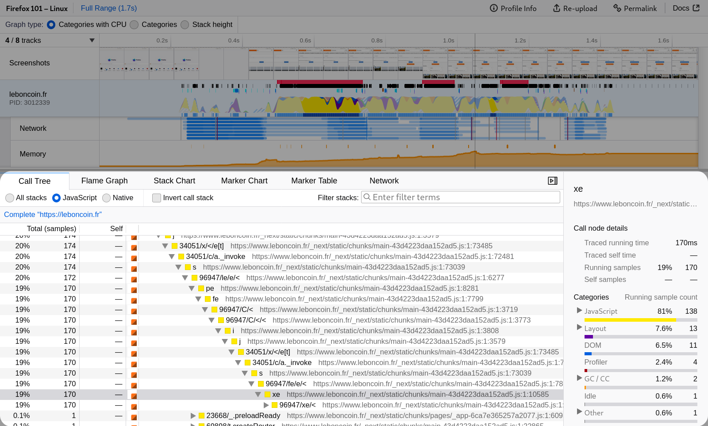
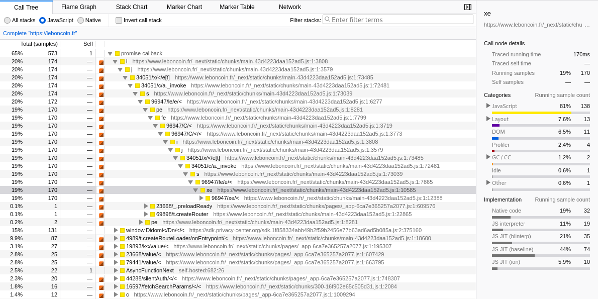
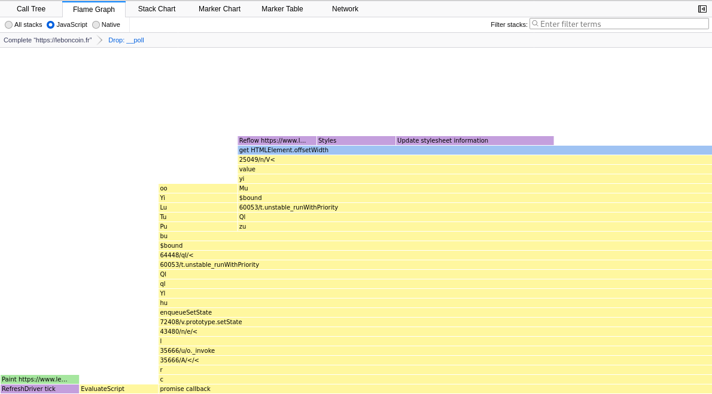
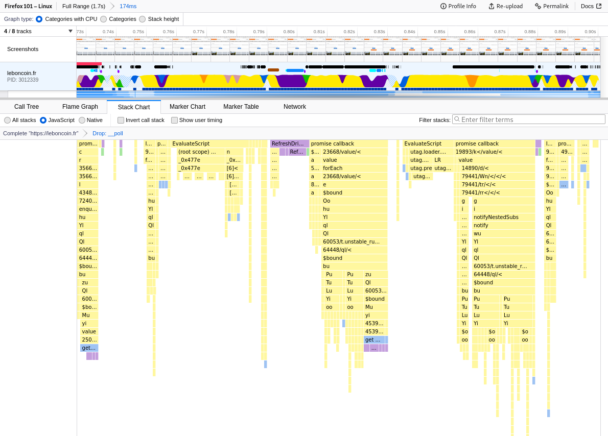
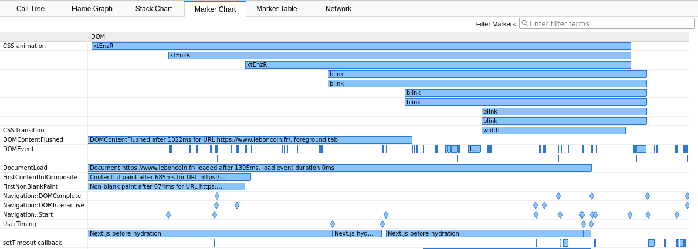
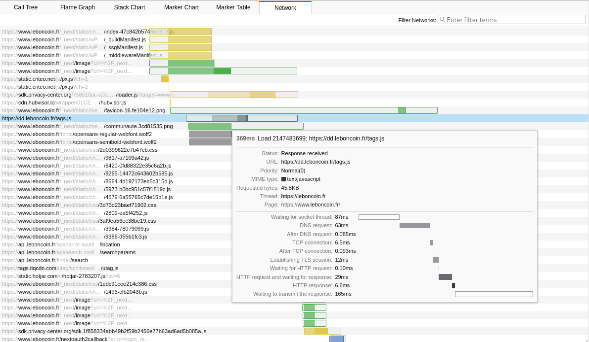

# UI 导览

通过一个突出显示各种功能的导览，更好地了解 Firefox Profiler 用户界面。所有截图均取自 [此配置文件](https://share.firefox.dev/3rRG46l)。

## 面板

时间线列出了多个线程，而面板则提供对时间线中当前选定线程的分析。
默认情况下，面板一次只使用一个线程。
但是，在单击线程时使用 `⌘`/`Ctrl` 键盘按键可以将多个线程合并在一起。

## 调用树

调用树面板是样本数据的合成视图。关于
[堆栈样本和调用树](guide-stack-samples-and-call-trees) 的页面很好地解释了
如何从样本数据中计算调用树结构。

简而言之，通过合并堆栈中的共同祖先，我们可以找出
程序中运行频率较高的部分。

[过滤指南](guide-filtering-call-trees) 提供了一些有关
如何使用此视图的有用信息：搜索、过滤到 JavaScript、
转换和反转（也称为自底向上树）。

最后，侧边栏提供了在选定函数内运行的代码的分类细分。

## 火焰图

火焰图为相同的调用树结构提供了更直观的视图：

- 较大的矩形意味着更多的运行时间。
- 顶部的矩形是贡献自时间的堆栈，即
  程序实际花费时间的代码。
- 顺序始终相同，这使得在不同范围选择之间以及不同配置文件之间进行比较更加方便。

一些用户更喜欢使用火焰图而不是调用树，因为它更加直观。

## 堆栈图表

堆栈图表面板也显示样本数据，但这并不是摘要。
相反，它是一个与时间线对齐的时间顺序视图：正如我们在上面的截图中所看到的，相同的类别可以在相同的时间戳看到。因此，这提供了与前几个面板不同的同一数据的视图。

不过请注意：在此面板中，我们试图重建函数调用的序列，
但由于样本数据本质上可能会遗漏短事件，该视图可能会显示一个长调用，而实际上它是一系列短调用。

## 标记图表

标记图表是分析会话期间发生的所有标记的时间顺序和可视化表示。[作为提醒](./guide-profiler-fundamentals)，
标记数据来自源代码插桩（C++、Rust、JavaScript、Java）。

通过悬停在标记上，可以检查其数据。例如对于
CSS 动画标记，会显示动画运行的元素。

右键单击标记会显示一个上下文菜单，允许您与这些信息进行更多交互，例如复制它们的数据。

Web 开发人员可以使用 [performance.mark](https://developer.mozilla.org/en-US/docs/Web/API/Performance/mark) 和
[performance.measure](https://developer.mozilla.org/en-US/docs/Web/API/Performance/measure) 添加自己的标记。Gecko 开发人员可以查看 [这份综合文档](https://firefox-source-docs.mozilla.org/tools/profiler/markers-guide.html) 以添加他们的新标记。

可以使用逗号分隔的搜索词列表过滤标记。每个术语
可以是用于匹配的字符串子串，`key:substring` 以更具体地匹配，
或者 `-key:substring` 来丢弃任何匹配项。(`-substring` 将不起作用；
负匹配需要 `key`。) 有效的 `key` 值包括：`name`、`cat`（用于
标记类别）、`type`（用于具有有效负载对象的标记），以及标记模式中声明的任何标记有效负载字段键。

示例：`DOM,cat:GC,-name:CSS` 将匹配其类别、名称、类型或任何字段中包含 DOM 的任何内容，
加上其类别中包含“GC”的任何内容，但省略名称中任何地方包含“CSS”的标记。

## 标记表

此面板为与标记图表相同的数据提供表格视图。它的优势在于通过搜索可以更快地同时显示多个标记的有效负载信息。

过滤方式与标记图表中的方式相同。

## 网络图表

此面板显示在捕获会话期间发生的所有网络请求。
特别是显示了请求期间发生的各个阶段，并且在悬停一行时它们会更加详细。

此面板也与时间线按时间顺序对齐，因此我们可以
将网络请求与其关联起来。

网络请求也在标记图表以及时间线中显示。
