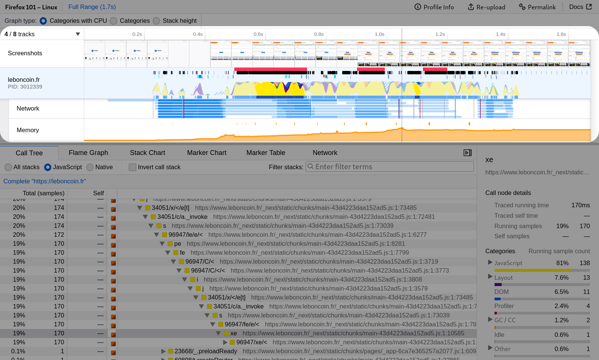
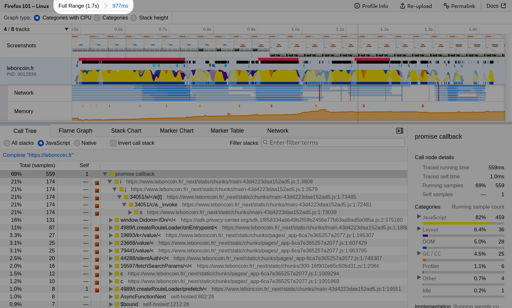
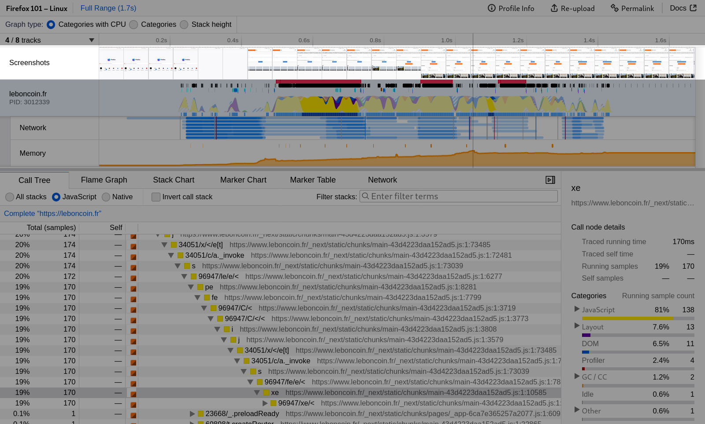
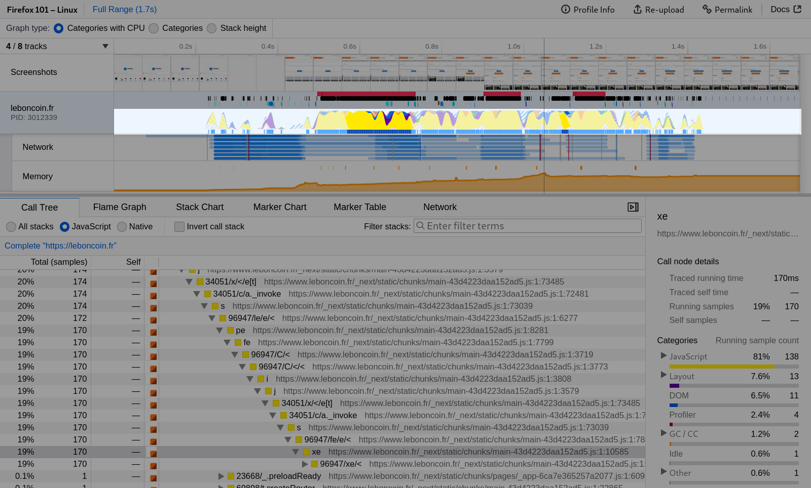
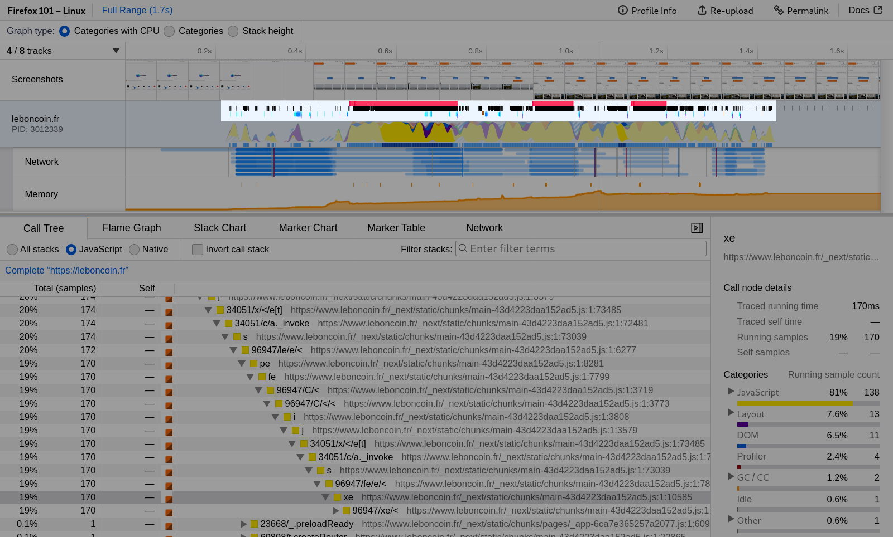
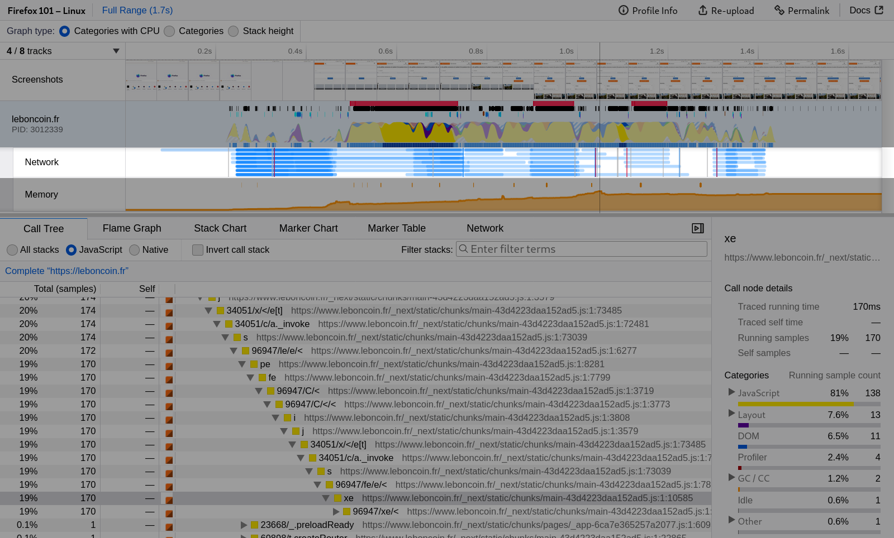
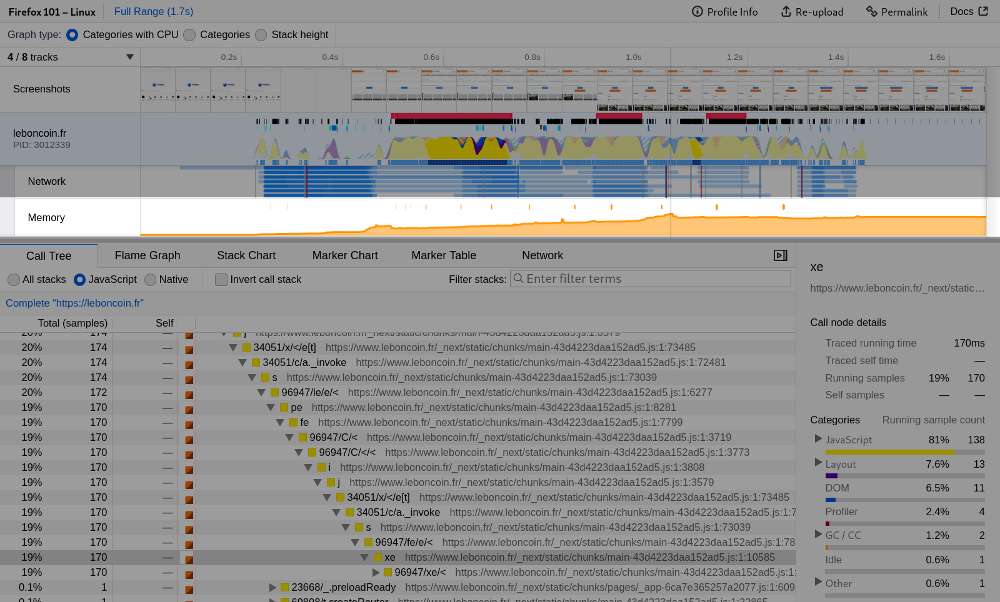
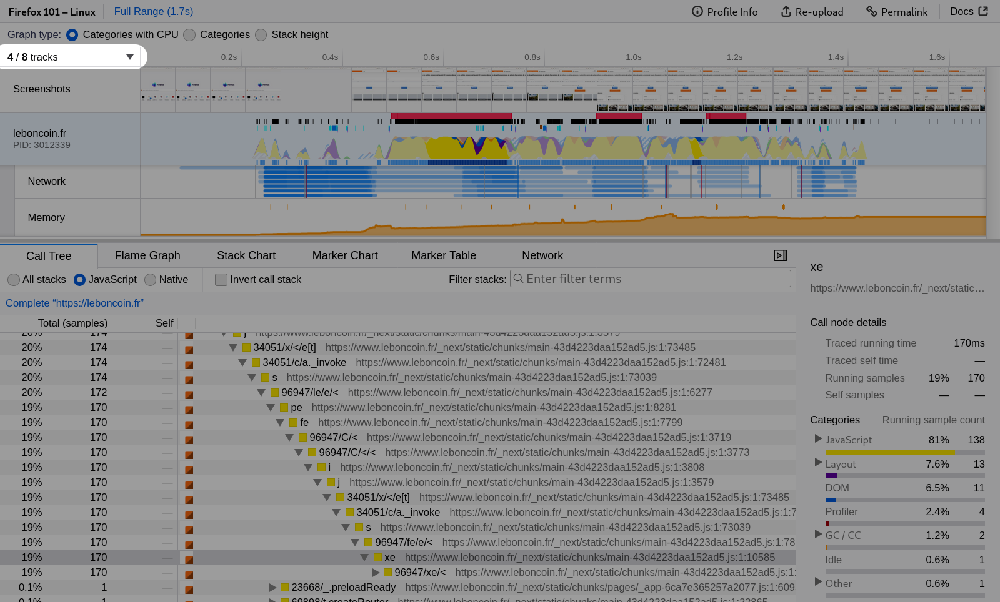

# UI 导览

通过一次突出显示各种功能的导览，更好地了解 Firefox Profiler 的用户界面。所有截图均来自 [此配置文件](https://share.firefox.dev/3rRG46l)。

## 时间线

Firefox Profiler 可视化多线程配置文件。每个线程在时间线中占据一行。单击线程名称可选择该线程，以便在时间线下方的选定面板中进行查看。可以通过右键单击线程名称来隐藏或显示线程。

## 创建范围选择

[一段突出显示时间线中范围选择的视频。](images/ui-tour-selection.webm ':include :type=video controls width=100%')

在时间线中单击并拖动可创建新的范围选择。该选择用于放大下方面板中的信息。例如，当在时间线上拖动时，调用树会动态重新计算。可以通过单击缩放按钮来提交这些范围选择。

## 已提交的范围选择

通过单击缩放按钮来提交范围选择是一种放大有用选择的有用方法。提交多个范围以专注于配置文件的特定部分可能很有帮助。

## 时间线的屏幕截图

屏幕截图轨道通过提供时间线内的视觉上下文，帮助用户在配置文件中导航。

## 时间线的活动图

时间线中的每个线程都包含一个活动图。X 轴代表时间，Y 轴代表 CPU 使用率。

单击活动图将选择一个样本并更新下方的面板（如果该面板使用当前选定的堆栈）。例如，在调用树中，它将展开树以查找此样本的堆栈。选定的堆栈在列表中将显示为较深的蓝色。这是另一种将堆栈与其随时间执行的时机相关联的有用方法。

[可以过滤掉堆栈和样本](./guide-filtering-call-trees.md) 通过各种操作。当发生这种情况时，活动图在该区域将变为灰色。如果线程在某个区域完全没有样本（例如线程尚未启动），则应有指示说明没有样本的原因。

## 时间线的标记

标记显示在时间线中，可用于将事件与活动图相关联。单击标记可将范围选择设置为该时间点。悬停在标记上会显示包含有关标记信息的工具提示。

也许最有用的标记之一是响应性标记——此处以红色显示。这是在 Firefox 内部的事件运行时间过长时收集的。单击其中一个将快速放大潜在的问题区域，并可能指示卡顿（jank）。

只有某些标记在时间线中被单独列出并着色。在 Marker Chart 面板中可以看到类似但更详细的视图。

## 时间线的网络活动

网络请求显示在时间线中，这对于关联浏览器和网页完成的工作与网络活动非常有用。例如，您可以发现某些 JavaScript 代码是在收到某些响应时执行的。

悬停在网络请求上会显示有关它的有趣信息，单击它将切换到更详细的网络面板。

## 时间线的内存使用变化

时间线还提供了进程内存使用变化的概览。请注意，这并不显示绝对内存使用量，而是显示在配置文件记录期间最低和最高内存使用量之间的差异。

## 轨道选择

通过位于轨道上方的按钮，可以隐藏在分析配置文件时造成干扰的轨道和线程，或者显示那些在加载配置文件时因我们认为其不太有趣而自动隐藏的轨道。

对每个轨道进行右键单击也可以执行相同的操作。
