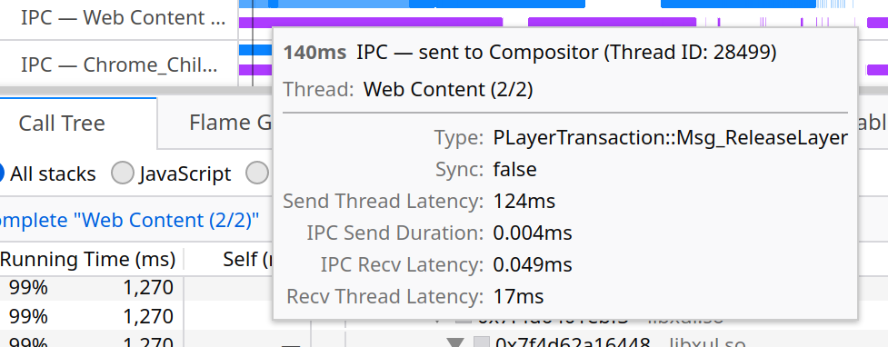
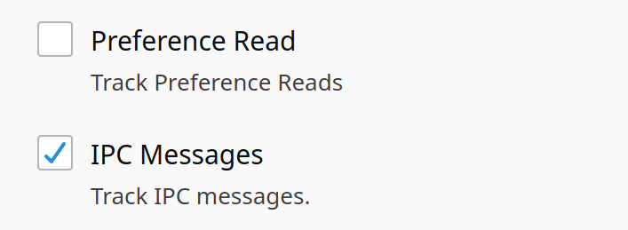
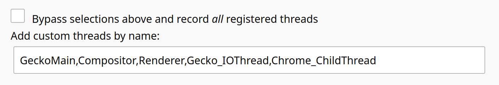

# IPC 消息

Firefox 分析器支持记录任何正在被分析的线程中的 IPC 消息。在分析期间，每条 IPC 消息都会记录以下 5 个事件：

1. 当源线程上调用 ``SendXXX`` 函数时
2. 当发送方的 IO 线程开始在 IPC 通道上发送字节时
3. 当发送方的 IO 线程完成在 IPC 通道上发送字节时
4. 当接收方的 IO 线程完成从 IPC 通道接收字节时
5. 当目标线程上调用 ``RecvXXX`` 函数时

## IPC 轨道

在收集包含 IPC 消息的分析数据后，时间线中将出现一个新的轨道，显示传出（蓝色）和传入（紫色）的 IPC 消息。将鼠标悬停在 IPC 消息的标记上可以查看其详细信息：

每条 IPC 消息都有几个与之关联的时间段，对应于上述连续 IPC 消息阶段之间的时间跨度：

- _发送线程延迟_：从调用 ``SendXXX`` 到在 IPC 通道上发送第一个字节之间的时间
- _IPC 发送持续时间_：在 IPC 通道上发送所有字节所花费的时间
- _IPC 接收延迟_：在 IPC 通道上发送最后一个字节与最后一个字节被_接收_之间的时间
- _接收线程延迟_：从从 IPC 通道接收最后一个字节到调用 ``RecvXXX`` 函数之间的时间

## 启用功能

在 ``about:profiling`` 中，向下滚动到 ``Features`` 部分并启用 ``IPC Messages`` 复选框。

### 分析 IO 线程

默认情况下，发送方和接收方的 IO 线程不包含在分析数据中。要包含这些线程，请将 ``Gecko_IOThread`` 和 ``Chrome_ChildThread`` 添加到要分析的线程列表中。

