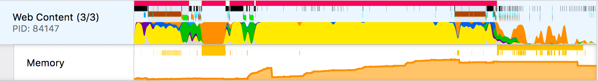
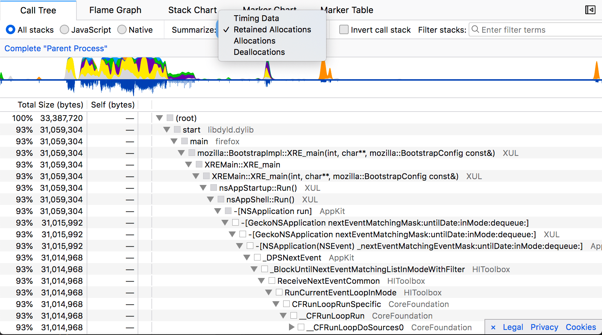
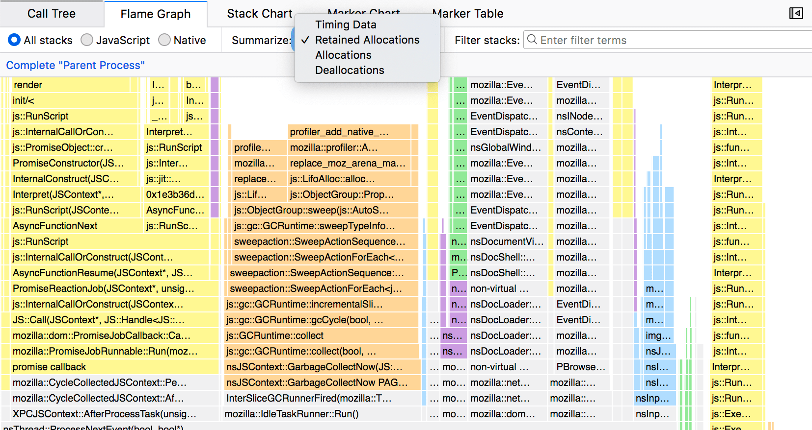
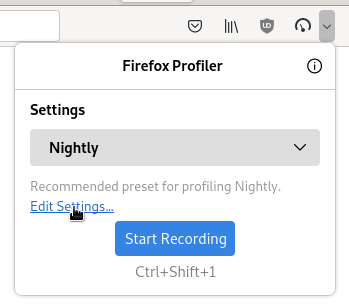
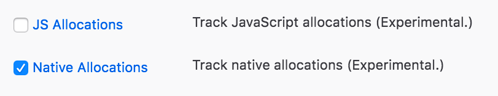
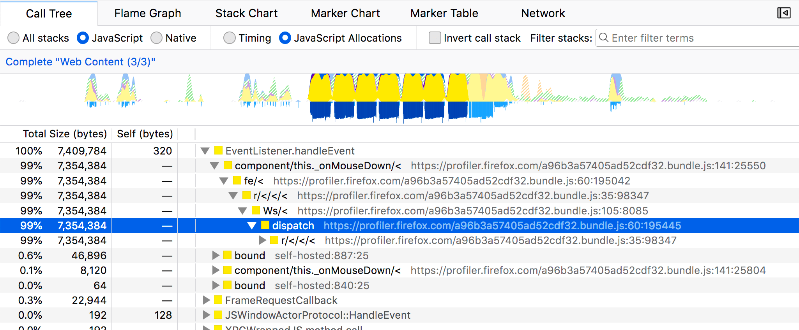

# 内存分配

Firefox 分析器支持不同类型的内存分析

1. 内存轨道 (Memory Track)
2. 原生分配 (Native Allocations)
3. JavaScript 分配 (JavaScript Allocations)
4. Valgrind DHAT 分析文件

## 内存轨道 (Memory Track)



内存轨道会绘制单个进程随时间变化的总体分配和释放数量。该功能仅在 Nightly 版本中可用。它通过跟踪每一次分配和释放操作，并偶尔采样这些操作的总和来实现。该轨道还会收集与垃圾回收 (garbage collection) 和循环回收 (cycle collection) 相关的标记 (markers)。将鼠标悬停在图表上即可查看所有数值。

图表可视化会显示在选定时间范围内的相对内存使用情况。需要注意的是，这并非绝对的内存使用量。当提交（commit）一个范围选择时，图表和数值会发生变化。

## 原生内存分配 (Native Memory Allocations)

分析器支持通过栈采样来分析原生代码（C++ 和 Rust）中的分配情况。这些功能需要 Nightly 版本。您可以打开此 [展示 DevTools 打开和关闭过程的示例](https://perfht.ml/2LKZsfY) 进行跟随操作。

原生分配功能通过收集原生代码（C++ 或 Rust）中内存分配的栈信息和大小来实现。它不会收集每一次分配，而是仅对其中一部分进行采样。采样偏向于较大的分配和较大的释放操作。较大的分配更有可能出现在分析文件中，并且更能代表实际的内存使用情况。请注意，由于这些分配仅是被采样的，因此并非所有分配都会被记录。这意味着内存轨道（顶部的橙色图表）报告的内存使用数值可能会有所不同。

请注意，此功能具有较大的开销，因此计时数据会比平时更加失真。如果分析文件包含原生分配数据，请不要过于关注这些数据。

### 各面板中的分配情况

分配情况可以在调用树 (call tree) 和火焰图 (flame graph) 中查看，但不能在栈图表 (stack chart) 中查看。





### 启用该功能

1. 打开 Nightly。
2. 点击 `Profiler Icon` 以打开 `Profiler Popup`。如果未显示，您可以先访问 https://profiler.firefox.com. 添加它。
3. 点击 `Edit Settings`。
4. 在“功能” (Features) 下，启用 `Native Allocations` 复选框。这将启用该功能。
5. 录制一个分析文件。





### 原生分配摘要策略

#### 摘要保留的分配 (Summarize Retained allocations)

在分析器中，分配是被采样的，但释放操作会与采样的分配进行匹配。这意味着分析器可以判断在给定时间范围内哪些分配被保留，哪些未被保留。在用户界面中，拖动交互式范围选择以更新视图中哪些分配被保留。这有助于识别潜在的内存泄漏。例如，在此 [DevTools 打开和关闭的分析文件](https://perfht.ml/2LKZsfY) 中，您可以创建范围选择并浏览分析文件的不同部分。理想情况下，在窗口关闭后，大部分分配应该被移除。

#### 摘要所有分配 (Summarize Allocations)

下拉菜单中的此选项显示所有被采样的分配，无论它们是否已被释放。

#### 摘要所有释放 (Summarize Deallocations)

此选项显示所有被采样的释放操作。请注意，此视图仅显示分析器跟踪的分配的释放操作。这些释放操作并非独立采样。

### 原生分配跟踪的限制

Gecko 内部的一些组件可能会实现自己的内存管理系统，从而绕过使用系统级函数（如 `malloc`），而这些函数正是通过此功能进行插桩 (instrumented) 的。例如，某些代码可能会创建一个大型缓冲区，并在该缓冲区内部管理其自身的内存。此功能会知道关于较大内存块分配的信息，但无法了解在该内存缓冲区内部如何创建较小的分配。如果发生这种情况，信息可能会缺失或具有误导性。

## JavaScript 分配 (JavaScript Allocations)

还有一个仅针对 JavaScript 的分配功能。这可能用处较小，因为它仅对 JS 对象的创建进行采样，并不跟踪垃圾回收或释放操作。事实上，原生分配功能是 JavaScript 分配功能的超集，并包含了 JavaScript 栈信息。您可以通过弹出菜单中的 `Features` 部分启用此功能。



## Valgrind 的“动态堆分析工具” DHAT

在 Firefox 外部工作时，您可以使用 [Valgrind 的 DHAT 工具](https://valgrind.org/docs/manual/dh-manual.html)。DHAT 拥有自己的查看器，但缺乏 Firefox 分析器的一些可视化和过滤功能。转换后的分析文件将缺少一些细节信息，如读取、写入和访问信息，但它包含分配的字节数。在 Linux 系统（甚至是 Linux Docker 镜像）上，您可以通过以下方式安装它：

```sh
sudo apt-get install valgrind
```

然后运行您的命令：

```
valgrind --tool=dhat ./my-program
```

DHAT 分析文件将输出在与您的程序相同的目录中：`dhat.out.<pid>`。将该文件拖入分析器即可查看。将有 4 个轨道包含内存信息。仅支持调用树和火焰图。

- **结束时的字节数 (Bytes at End)** - 程序结束时从未被释放的分配。
- **全局最大值时的字节数 (Bytes at Global Max)** - 当全局堆大小达到峰值时分配的字节数。
- **最大字节数 (Maximum Bytes)** - 在该调用站点同时分配的最大字节数。
- **总字节数 (Total Bytes)** - 在整个程序运行过程中分配的总字节数。
