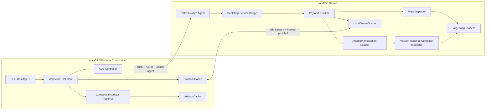

# 独立 Layout Inspector 的 Jetpack Compose 支持方案

> 状态：设计方案
>
> 目标仓库：`aps-ui-inspector-dist`
>
> 目标平台：macOS、Windows、Linux Host；Android 设备端 Agent
>
> 推荐路线：复用 AndroidX Compose Inspector，重写轻量 Host/Agent 适配层，逐步摆脱完整 Android Studio `tools/base` 构建环境

## 1. 背景

当前仓库尝试从 Android Studio `tools/base` 源码构建四类 Android 设备端产物：

- `lib_ui_inspector_agent.so`：JVMTI 注入入口，包含 `armeabi-v7a`、`arm64-v8a`、`x86_64` 三个 ABI。
- `lib_ui_inspector_service.jar`：加载到 Bootstrap ClassLoader 的桥接层。
- `lib_ui_inspector_payload.jar`：运行 Socket Server、协议分发和 Inspector 生命周期。
- `view-inspector.jar`：Android View 层级采集实现。

这些产物实际运行在 Android 设备中，与 Host 是 macOS、Windows 还是 Linux 无关。但原构建方案与 Android Studio Bazel 工作区强耦合，需要同步体积很大的 `studio-main` 工具源码和预编译依赖。

Compose 支持还有额外要求：Android View 或 UIAutomator 只能看到 Compose 暴露出的部分 Accessibility/Semantics 信息，无法完整获得 Composable 调用树、参数、Modifier、源码位置、重组次数和 State Read。完整能力来自 AndroidX 的 Compose Inspector。

本方案不重新实现 Compose 树解析，而是：

1. 复用开源的 AndroidX Compose Inspector。
2. 建立可独立构建的轻量 Agent 运行时。
3. 保留稳定、跨语言的 Host-Agent 协议。
4. 使用普通 Gradle、Android SDK、NDK 和 CMake 构建，避免完整 Android Studio Bazel 工作区。

## 2. 目标与非目标

### 2.1 产品目标

- 从 macOS、Windows、Linux 连接 Android 真机或模拟器。
- 在不依赖 Android Studio UI 的情况下获取 View 与 Compose 混合层级。
- 输出稳定、可版本化、适合桌面 UI、CLI 和 AI 使用的结构化数据。
- 支持多窗口、Dialog、Popup、Lazy 布局和 View/Compose 互操作。
- Compose 能力分级支持：
  - 层级与稳定节点 ID。
  - 屏幕 Bounds。
  - Semantics、TestTag、文本、ContentDescription 和动作。
  - 参数与 Modifier。
  - 源文件、行号和包信息。
  - 重组次数、跳过次数和 State Read。
- Agent 一次构建后可被所有 Host 操作系统使用。
- 对上游版本、Compose Inspector、最终产物和协议进行完整溯源。

### 2.2 工程目标

- Host 第一阶段发布为 Kotlin/JVM 可执行 JAR，避免为 Windows/Linux 重写业务逻辑。
- Agent 使用标准 Gradle Android Library、D8/R8、NDK 和 CMake 构建。
- Compose Inspector 根据目标 App 的 Compose 版本动态解析。
- 协议向后兼容；未知字段和未知能力可以安全忽略。
- 所有网络下载的 Inspector AAR/JAR 都记录来源并校验 SHA-256。

### 2.3 非目标

- MVP 不检查不可调试、无 `run-as` 权限且未 Root 的 Release App。
- MVP 不实现 Android Studio Layout Inspector 全部 UI 和 3D 渲染能力。
- 不复制 Android Studio Transport 的完整实现。
- Agent 不监听外网，只允许通过本机 ADB Forward 访问。
- 第一阶段不支持多个 Host 同时修改同一 App 的 Inspector 状态。

### 2.4 平台约束

- 目标 App 必须允许调试和 `run-as`，或者显式集成 Debug Inspector SDK。
- 独立注入路线最低支持 Android API 29，与当前上游 `MIN_SUPPORTED_API_LEVEL` 一致。
- 完整参数和源码信息依赖 Compose 编译器/Tooling 元数据。
- 目标 APK 不应删除 `META-INF/androidx.compose.*.version`。
- Compose Inspector 与 Compose Runtime 存在版本耦合，必须按 App 版本选择。

## 3. 可复用的开源实现

### 3.1 AndroidX Compose UI Inspection

上游：<https://github.com/androidx/androidx/tree/androidx-main/compose/ui/ui-inspection>

这是本方案的 Compose 核心。其 `ComposeLayoutInspector` 和 `LayoutInspectorTree` 能读取 `CompositionData`、Semantics 和 Tooling 数据，并支持：

- `GetComposablesCommand`
- `GetParametersCommand`
- `GetAllParametersCommand`
- `GetParameterDetailsCommand`
- `UpdateSettingsCommand`
- `GetRecompositionStateReadCommand`

本项目不应重新实现 `LayoutInspectorTree`。需要适配时优先建立边界适配器、维护有限兼容补丁或向上游贡献。

### 3.2 AOSP UI Inspector CLI

上游：<https://android.googlesource.com/platform/tools/base/+/f5c44342690c6324fe6fbea77ec3dbce0e31adda/ui-inspector/>

当前固定提交给出了 Host-Agent 解耦、JVMTI 注入、Socket 命名、文件哈希和动态加载 Compose Inspector 的参考设计。本方案保留它的架构和协议思想，但把构建边界收缩为独立 Gradle/NDK 工程。

### 3.3 Radiography

上游：<https://github.com/block/radiography>

Radiography 可在应用进程中扫描 View 与 Compose 树，暴露 `ScannableView.ComposeView`、Semantics 和部分 Modifier。适合作为：

- Cooperative Debug SDK 的第一版实现。
- AndroidX Inspector 尚未接入时的 MVP。
- View/Compose 树输出的交叉验证基准。

它不作为最终零侵入 Agent 的核心，因为 Compose API 仍为实验性且依赖 App 显式集成。

### 3.4 Roborazzi

上游：<https://github.com/takahirom/roborazzi>

Roborazzi 能在测试中输出 Compose Semantics 与 View 层级 JSON，并生成带编号标注的截图。适合作为 JSON 格式、AI 输入和 Golden Test 参考，不作为实时设备注入方案。

### 3.5 Flipper Compose Plugin

上游：<https://github.com/facebook/flipper/tree/main/android/plugins/jetpack-compose>

Flipper 仓库已归档，不作为运行时依赖；其应用内 SDK、桌面端插件和 Compose Tree 集成方式仅作为历史参考。

## 4. 总体架构



### 4.1 Host 组件

| 组件 | 职责 |
| --- | --- |
| CLI/Desktop Adapter | 参数解析、连接选择、JSON 输出和桌面 UI 集成 |
| Inspector Host Core | 会话生命周期、命令关联、事件分发和统一模型 |
| ADB Controller | 设备发现、ABI/API 查询、PID 查询、推送、`run-as`、注入和端口转发 |
| Artifact Resolver | 选择 Agent ABI，识别 Compose 版本并解析对应 Inspector |
| Protocol Codec | 帧协议、Protobuf 编解码、能力协商和输入限制 |
| Artifact Cache | 按来源、版本和 SHA-256 缓存 Agent 与 Compose Inspector |

### 4.2 Android Agent 组件

| 组件 | 运行层 | 职责 |
| --- | --- | --- |
| Native Agent | Native/JVMTI | 将 Service JAR 加入 Bootstrap ClassLoader 并调用初始化入口 |
| Service Bridge | Bootstrap ClassLoader | 找到 App ClassLoader，使用 `DexClassLoader` 加载 Payload |
| Payload Runtime | App 子 ClassLoader | 启动 Socket、处理协议、创建 Inspector 实例 |
| View Inspector | App 子 ClassLoader | 读取 View 树、属性、资源和 Bounds |
| Inspection Adapter | App 子 ClassLoader | 实现 AndroidX `Connection`、`InspectorEnvironment`、`ArtTooling` 等最小接口 |
| Compose Inspector | 动态 ClassLoader | 执行与目标 Compose 版本匹配的 AndroidX Inspector |

## 5. 两种运行模式

### 5.1 Cooperative Debug SDK 模式

目标 App 添加：

```kotlin
dependencies {
    debugImplementation("com.example.uiinspector:agent-debug:<version>")
    releaseImplementation("com.example.uiinspector:agent-noop:<version>")
}
```

SDK 在 App 内直接启动 Payload Runtime，因此不需要 Native Agent、Bootstrap Service、`attach-agent` 和 App 私有目录安装流程。

优点：实现快、构建轻、兼容性容易验证。

缺点：只能检查显式集成 SDK 的应用。

此模式作为协议、Host、统一模型和 Compose Adapter 的首个验证平台。

### 5.2 Standalone Injection 模式

Host 对任意可调试 App 执行：

1. 查询设备 API、ABI 和目标 PID。
2. 推送 Agent、Service、Payload、View Inspector 和 Compose Inspector。
3. 使用 `run-as <package>` 复制到 App 私有目录并设为只读。
4. 调用：

```text
adb shell cmd activity attach-agent <pid> \
  <app-data>/lib_ui_inspector_agent.so=\
  <service-jar>;<payload-jar>;<server-token>
```

5. 等待 `/proc/net/unix` 出现目标 Socket。
6. 创建 ADB Forward 并连接 Agent。

此模式不需要业务代码接入，但必须承担 JVMTI、ClassLoader、Android 版本和安全限制。

## 6. Compose Inspector 解析与加载

### 6.1 版本检测

Agent 通过反射判断 Compose 是否存在，然后读取：

```text
META-INF/androidx.compose.ui_ui.version
```

Host 通过 `GetLibraryVersions` 获得版本：

```json
{
  "androidx.compose.ui:ui": "1.8.2"
}
```

### 6.2 Maven Artifact 选择

遵循上游兼容逻辑：

- Compose `< 1.5.0`：解析 `androidx.compose.ui:ui:<version>`。
- Compose `>= 1.5.0`：优先解析 `androidx.compose.ui:ui-android:<version>`。

从 Google Maven 下载 AAR 后提取：

```text
inspector.jar
```

### 6.3 缓存结构

```text
~/.cache/aps-ui-inspector/
  compose-inspectors/
    <group>/<artifact>/<version>/
      source.aar
      inspector.jar
      artifact.properties
      SHA256SUMS
```

`artifact.properties` 至少记录：

```properties
repository=https://maven.google.com
group=androidx.compose.ui
artifact=ui-android
version=1.8.2
aar.sha256=<sha256>
inspector.sha256=<sha256>
retrieved.at=<UTC timestamp>
```

### 6.4 离线与覆盖

Host 支持：

```text
--compose-inspector <path>
--maven-repository <url>
--offline
```

离线模式只能使用已校验缓存；覆盖 JAR 也必须计算 SHA-256 并进入 Artifact Set Digest。

## 7. Host-Agent 协议

### 7.1 Transport

Agent 监听 Android Abstract Unix Domain Socket：

```text
localabstract:ui_inspector_<pid>_<artifact-set-digest>
```

Host 建立转发：

```text
adb -s <serial> forward tcp:<local-port> \
  localabstract:ui_inspector_<pid>_<artifact-set-digest>
```

Digest 覆盖 Native Agent、Service、Payload、View Inspector 和显式 Compose Inspector Override。Digest 只区分驻留 Agent 版本，不是认证令牌。

### 7.2 帧格式

```text
+----------------+----------------------+-------------------+
| 8 bytes        | 4 bytes              | N bytes           |
+----------------+----------------------+-------------------+
| "UIINSPCT"     | uint32 big-endian    | protobuf payload  |
+----------------+----------------------+-------------------+
```

实现必须增加：

- 默认 64 MiB 的最大消息长度和不可突破的硬上限。
- 负数、溢出和超长拒绝。
- Connect、Read、Write Timeout。
- 半包、EOF 和异常关闭处理。
- 并发写串行化。

### 7.3 顶层消息

建议保留命令 ID、Inspector ID 和透明 Payload：

```protobuf
message Command {
  uint32 command_id = 1;
  oneof specialized {
    HelloCommand hello = 2;
    InspectorMessageCommand inspector_message = 3;
    CreateInspectorCommand create_inspector = 4;
    GetLibraryVersionsCommand get_library_versions = 5;
    ShutdownCommand shutdown = 6;
  }
}

message InspectorMessageCommand {
  string inspector_id = 1;
  bytes payload = 2;
}

message AgentMessage {
  oneof specialized {
    Response response = 1;
    Event event = 2;
  }
}
```

Compose Inspector 原始 Protobuf 放在 `payload` 中，Host Transport 不修改其内容。

### 7.4 能力协商

首次连接发送 `HelloCommand`：

```protobuf
message HelloCommand {
  uint32 protocol_major = 1;
  uint32 protocol_minor = 2;
  repeated string requested_capabilities = 3;
  string host_build_id = 4;
}

message HelloResponse {
  uint32 protocol_major = 1;
  uint32 protocol_minor = 2;
  repeated string supported_capabilities = 3;
  string agent_build_id = 4;
  int32 device_api = 5;
}
```

能力建议：

- `view.tree`
- `view.properties`
- `view.resolution_stack`
- `compose.tree`
- `compose.parameters`
- `compose.source_location`
- `compose.recomposition_counts`
- `compose.state_reads`
- `screenshot.capture`

Major 不兼容时拒绝连接；Minor 差异通过能力协商处理。

## 8. 统一数据模型

Host 将 View 与 Compose 上游 Protobuf 转换成稳定产品模型，UI 不直接依赖上游消息：

```json
{
  "schemaVersion": 1,
  "device": {
    "serial": "emulator-5554",
    "api": 35,
    "abi": "x86_64"
  },
  "process": {
    "packageName": "com.example.app",
    "pid": 1234
  },
  "windows": [
    {
      "id": "main",
      "roots": [
        {
          "id": "compose:1001",
          "kind": "COMPOSE",
          "name": "LoginScreen",
          "bounds": [0, 0, 1080, 2400],
          "source": {
            "file": "LoginScreen.kt",
            "line": 42,
            "packageName": "com.example.ui"
          },
          "semantics": {
            "testTag": "login_screen"
          },
          "parameters": [],
          "modifiers": [],
          "recomposition": {
            "count": 3,
            "skips": 7
          },
          "children": []
        }
      ]
    }
  ]
}
```

模型要求：

- 节点 ID 在一次 App 进程生命周期内稳定。
- `kind` 区分 `VIEW`、`COMPOSE` 和系统/虚拟节点。
- Bounds 统一为屏幕物理像素 `[left, top, right, bottom]`。
- 未提供的信息必须标记不可用，不能生成猜测值。
- 参数区分原始值、格式化值、截断状态和敏感性。
- 默认不输出密码和可能包含个人信息的完整文本。

## 9. Android Agent 的独立构建

### 9.1 工程拆分

```text
agent/
  native-agent/             CMake + Android NDK
  service-bridge/           Android/JVM library -> DEX JAR
  payload-runtime/          Android library -> DEX JAR
  inspection-adapter/       androidx.inspection 接口适配
  view-inspector/           View 层级实现
  debug-sdk/                Cooperative 模式 AAR
  debug-sdk-noop/           Release no-op AAR
protocol/
  core-proto/
  view-proto/
host/
  core/
  adb/
  artifact-resolver/
  cli/
```

### 9.2 Native Agent

使用 Android NDK/CMake 生成：

```text
armeabi-v7a/lib_ui_inspector_agent.so
arm64-v8a/lib_ui_inspector_agent.so
x86_64/lib_ui_inspector_agent.so
```

Native Agent 只负责：

- 解析 attach options。
- `AddToBootstrapClassLoaderSearch()`。
- 定位 `InspectorService.initialize()`。
- JNI/JVMTI 错误转换和有限日志。

业务协议和 Compose 解析不放在 Native 层，以降低 ABI 和 Android 版本风险。

### 9.3 DEX JAR

Service、Payload 和 View Inspector 使用 Android Gradle Plugin 编译，再通过 D8 生成带 `classes.dex` 的 JAR。门禁必须检查：

```bash
unzip -l artifact.jar | grep classes.dex
```

### 9.4 可复现性

- 固定 Gradle、AGP、Kotlin、NDK、CMake、Protobuf 和 D8 版本。
- 归一化 ZIP 时间戳、文件顺序和权限。
- 发布 SHA-256、SBOM、`PROVENANCE.md` 和第三方许可证。
- CI 执行两次构建并比较最终哈希，验证可复现性。

## 10. 跨平台 Host

### 10.1 第一阶段：Kotlin/JVM

发布单一 Fat JAR：

```text
ui-inspector-cli.jar
bin/ui-inspector
bin/ui-inspector.bat
```

核心逻辑跨平台共用，只对 ADB 路径、文件权限和进程启动做平台抽象。macOS 可以完成主要开发和核心构建；Windows/Linux 不需要重新编译 Android Agent。

### 10.2 第二阶段：平台安装包

- macOS：DMG/App Bundle。
- Windows：ZIP/MSI。
- Linux：tar.gz/AppImage/deb。

各 OS Runner 只封装相同 Host JAR 和 Android Agent Bundle，不重新构建设备端 Agent。

## 11. 安全与隐私

### 11.1 访问边界

- 默认只检查 `debuggable=true` 且 `run-as` 成功的 App。
- Host 不提供监听外网的 TCP Server。
- ADB Forward 使用回环地址和随机可用端口。
- 会话结束后删除 Forward。
- Agent 空闲超时后关闭 Socket 和 Inspector。

### 11.2 输入与资源限制

- Protobuf 帧长度限制。
- 参数递归、集合大小、截图尺寸和刷新频率限制。
- Inspector JAR 只能来自允许仓库或显式本地文件。
- 下载校验 HTTPS、Maven 坐标和 SHA-256。
- 解压 AAR 时拒绝路径穿越、符号链接和异常压缩比。

### 11.3 隐私

- 默认隐藏密码和敏感 Semantics。
- 文本与参数输出使用 `--include-sensitive-data` 显式开启。
- 日志不得记录用户文本、完整参数值或敏感 App 私有路径。
- 包含敏感数据的导出文件必须明确标记。

## 12. 兼容性与降级

### 12.1 Compose 版本矩阵

CI 至少维护：

- 项目定义的最低 Compose 版本。
- 最新稳定版本。
- 一个中间长期使用版本。
- 使用 `ui` Artifact 的旧版本。
- 使用 `ui-android` Artifact 的新版本。

每个版本验证基本树、LazyColumn/SubcomposeLayout、Dialog/Popup、AndroidView 互操作、参数、源码位置和重组计数。

### 12.2 Android 矩阵

- API 29：最低版本。
- 一个中间版本。
- 当前稳定 Android 版本。
- 当前预览版作为非阻塞验证。
- ABI：`armeabi-v7a`、`arm64-v8a`、`x86_64`。

### 12.3 降级行为

- Compose Inspector 解析失败时仍返回 View 树。
- 参数不可用时仍返回节点、Bounds 和 Semantics。
- 源码位置不可用时标记 `unavailable`。
- 版本未知时允许 `--compose-inspector` 显式覆盖。

## 13. 测试方案

### 13.1 单元测试

- 帧协议：正常、半包、错误 Header、超长、EOF、并发写。
- Protobuf：未知字段、未知 Oneof、版本协商。
- Artifact Digest：长度前缀、文件顺序、Override 参与规则。
- Maven Resolver：缓存、离线、损坏 AAR、哈希和 Zip Slip。
- ADB 命令：路径转义、设备序列号和 Windows 路径。
- 数据模型：View/Compose 混合树、字符串表和参数截断。

### 13.2 Agent 测试

- Native attach options 解析。
- Service 找到正确 App ClassLoader。
- Payload 使用独立 DexClassLoader。
- 多次 attach 不创建不兼容的重复 Server。
- Socket 空闲退出和 App 重启恢复。
- Inspector 创建、命令、事件、异常和 Dispose 生命周期。

### 13.3 端到端测试 App

覆盖：

- XML View 页面。
- 纯 Compose 页面。
- View 内嵌 Compose。
- Compose 内嵌 AndroidView。
- 多 Window、Dialog、Popup。
- LazyColumn、动画和重组。
- 多个 Compose 版本 Build Variant。
- 敏感输入和无 Semantics 节点。

### 13.4 对照验证

同一页面分别使用本项目 Inspector、Android Studio Layout Inspector、Radiography 或 Compose Test Semantics，比较：

- 根节点和父子关系。
- 节点名称与 Bounds。
- 参数、Modifier 和 Semantics。
- 源码位置。
- 重组统计。

差异必须分类为产品降级、上游差异或缺陷，不能只比较节点数量后宣告兼容。

## 14. 诊断能力

提供：

```text
ui-inspector doctor --device <serial> --package <package>
```

检查：

- ADB 版本和设备状态。
- API、ABI、Debuggable 和 `run-as`。
- App PID 和前台状态。
- Agent 文件与 SHA-256。
- Compose 是否存在及检测到的版本。
- Compose Inspector 缓存。
- Socket、Forward 和协议握手。

日志使用 `session_id`、`command_id`、`inspector_id`、`device_serial` 和 `pid` 关联，默认不包含用户界面文本和参数值。

## 15. 许可证与来源治理

- AOSP、AndroidX 和 Radiography 相关源码主要使用 Apache License 2.0；实际引入时逐文件确认。
- 派生或复制源码时保留版权头、许可证文本和修改说明。
- 默认不重新分发 Google Maven 下载的 Inspector，优先运行时解析并缓存。
- 离线内置 Inspector 前必须完成目标版本及依赖的许可证和再分发审查。
- 发布包包含 `LICENSE`、`NOTICE`、SBOM/`3rdpartylicenses.txt`、`PROVENANCE.md` 和 SHA-256。

## 16. 分阶段实施计划

### Phase 0：协议与样例

- 固定当前 Core/View/Compose Protobuf 快照。
- 建立协议兼容测试和 JSON Golden。
- 建立 View/Compose 混合测试 App。

退出条件：Host 与 Fake Agent 完成握手、请求、响应、事件和异常测试。

### Phase 1：Cooperative Debug SDK MVP

- 创建普通 Gradle Debug Agent AAR。
- 集成 Radiography 或最小 Compose Semantics 采集。
- 实现 LocalServerSocket、跨平台 Host CLI 和统一 JSON。

退出条件：macOS、Windows、Linux 使用同一 Host JAR 获取测试 App 的 View/Compose 树。

### Phase 2：AndroidX Compose Inspector Adapter

- 实现 AndroidX Inspection 最小运行接口。
- 动态加载与 App Compose 版本匹配的 `inspector.jar`。
- 接入树、参数和源码位置。

退出条件：至少三组 Compose 版本与 Android Studio 对照结果达到验收要求。

### Phase 3：Standalone JVMTI Injection

- 使用 NDK/CMake 实现薄 Native Agent。
- 实现 Bootstrap Service 和 DEX Payload。
- 实现推送、`run-as`、attach、Socket 等待和 ADB Forward。

退出条件：不修改测试 App 即可在 API 29+ 三个 ABI 上获取 View/Compose 树。

### Phase 4：高级 Compose 能力

- 参数详情与延迟提取。
- Modifier 展示。
- 重组/跳过计数。
- State Read。
- 多窗口和动态 Composition。

退出条件：能力协商准确，不支持的版本能够稳定降级。

### Phase 5：发行与维护

- 可复现构建。
- SBOM、NOTICE 和 Provenance。
- Inspector 缓存与离线包策略。
- Windows/Linux/macOS 安装包。
- 上游 Compose 兼容自动测试。

退出条件：干净环境完成安装、连接、抓取和校验。

## 17. 验收标准

| 领域 | 必须满足 |
| --- | --- |
| 构建 | 不需要完整 Android Studio `tools/base` 工作区即可构建 Agent 与 Host |
| 跨平台 | 同一 Android Agent Bundle 可由 macOS、Windows、Linux Host 使用 |
| View | 返回层级、ID、类型、Bounds、资源和基础属性 |
| Compose MVP | 返回 Compose 层级、Bounds、Semantics 和 TestTag |
| Compose 完整版 | 返回参数、Modifier、源码位置和重组信息，或明确报告不可用 |
| 注入 | API 29+ 可调试 App 无业务代码修改即可工作 |
| 协议 | 有版本、能力协商、消息上限、超时和未知字段兼容 |
| 安全 | 只监听 ADB Forward；默认隐藏敏感数据；Artifact 可校验 |
| 溯源 | 所有 Agent、Inspector 和发行包具有来源、版本和 SHA-256 |
| 测试 | 单元、设备端、跨平台和 Android Studio 对照门禁通过 |

## 18. 风险与应对

| 风险 | 影响 | 应对 |
| --- | --- | --- |
| Compose 内部 API 变化 | Inspector 无法读取树 | 按 App 版本动态加载官方 Inspector，并维护版本矩阵 |
| AndroidX Inspection 接口变化 | Adapter 无法创建 Inspector | 独立 Adapter 模块并允许多版本实现 |
| JVMTI/ART 行为变化 | 注入失败或 App 崩溃 | Native 层保持最薄；API 矩阵；回退 Cooperative 模式 |
| R8 删除 Tooling 元数据 | 参数或源码位置缺失 | 检测并诊断；提供 keep/metadata 指引 |
| Inspector 下载失败 | 离线不可用 | 内容寻址缓存、镜像配置和显式 Override |
| 输出敏感数据 | 隐私风险 | 默认脱敏、显式开关、导出警告和日志隔离 |
| 上游许可证变化 | 无法合法分发 | 运行时下载优先；逐版本许可证扫描 |
| 协议无上限 | 内存耗尽 | 帧、递归、集合、截图和频率硬限制 |

## 19. 推荐决策

采用以下组合，而不是从零重写 Compose Inspector：

1. **Compose 树解析：**复用 AndroidX `ui-inspection`。
2. **协议与运行时：**基于 AOSP UI Inspector CLI 设计实现轻量兼容层。
3. **快速 MVP：**先以 Cooperative Debug SDK + Radiography/Compose Semantics 验证 Host 和数据模型。
4. **零侵入完整版：**再实现独立 Gradle/NDK 构建的 JVMTI Agent。
5. **跨平台：**Host 先发布通用 Kotlin/JVM JAR；OS Runner 仅负责安装包封装。
6. **Compose 版本兼容：**从 Google Maven 按版本解析 `inspector.jar`，不固定单一 Inspector。

该路线把“同步数十 GB Android Studio 构建树”的困难转换为可持续维护的小型 Gradle/NDK 模块，同时保留 AndroidX 官方 Compose Inspector 的完整数据能力。

## 20. 参考资料

- AOSP UI Inspector CLI：<https://android.googlesource.com/platform/tools/base/+/f5c44342690c6324fe6fbea77ec3dbce0e31adda/ui-inspector/>
- AndroidX Compose UI Inspection：<https://github.com/androidx/androidx/tree/androidx-main/compose/ui/ui-inspection>
- AndroidX `ComposeLayoutInspector`：<https://raw.githubusercontent.com/androidx/androidx/androidx-main/compose/ui/ui-inspection/src/main/java/androidx/compose/ui/inspection/ComposeLayoutInspector.kt>
- AndroidX `LayoutInspectorTree`：<https://raw.githubusercontent.com/androidx/androidx/androidx-main/compose/ui/ui-inspection/src/main/java/androidx/compose/ui/inspection/inspector/LayoutInspectorTree.kt>
- Radiography：<https://github.com/block/radiography>
- Roborazzi：<https://github.com/takahirom/roborazzi>
- Flipper Compose Plugin（已归档，仅供参考）：<https://github.com/facebook/flipper/tree/main/android/plugins/jetpack-compose>
