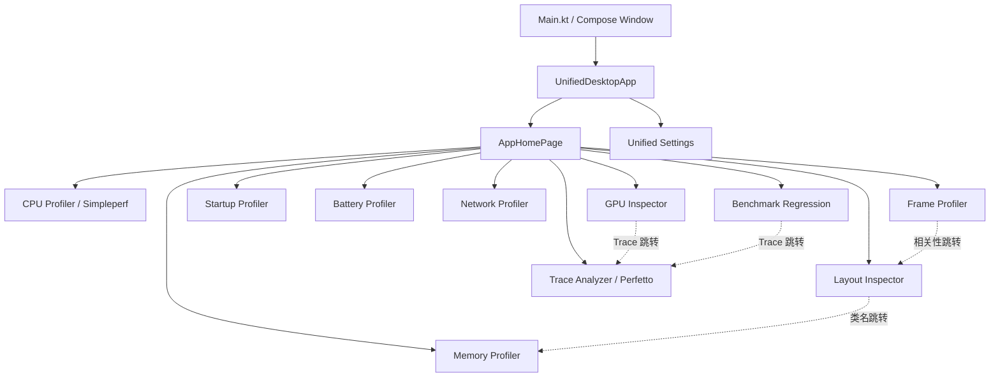

# 自研界面布局与代码位置

> 更新时间：2026-07-27  
> 范围：仅统计本仓库自行开发的界面。  
> 不包含：Firefox Profiler、Perfetto Web UI 等第三方浏览器前端，也不包含 Docsify 用户文档站。

## 1. 结论摘要

- 当前真正可运行的产品界面集中在 `desktop-viewer/`，技术栈为 Kotlin/JVM + Compose Desktop。
- Desktop 主窗口共有 11 个一级目的地：主页、Layout Inspector，以及 9 个性能分析工具。
- 主导航由 `AppDestination` 和 `UnifiedDesktopApp` 统一管理；各功能模块采用
  `Workspace（状态/控制器/文件选择器） -> Screen（纯 Compose 布局）` 的分层方式。
- 自研 Desktop 界面没有 Android XML layout。除 Android 示例 App 使用代码创建传统 View 外，
  所有主要产品布局都定义在 Kotlin `@Composable` 函数中。
- `android-studio-plugin/` 和 `web-ui-http-server/` 当前仍是规划占位，没有已实现的自研界面。

## 2. 总体导航



### 总入口代码

| 职责 | 代码位置 | 说明 |
| --- | --- | --- |
| 原生窗口入口 | `desktop-viewer/desktop-app/src/main/kotlin/dev/agentperf/desktop/Main.kt:15-36` | 创建 Compose `Window`，设置应用图标、标题、最小尺寸，并挂载统一 Shell。 |
| 一级路由枚举 | `desktop-viewer/desktop-app/src/main/kotlin/dev/agentperf/desktop/AppDestination.kt:8-20` | 定义主页及 10 个工具目的地。 |
| 导航状态 | `desktop-viewer/desktop-app/src/main/kotlin/dev/agentperf/desktop/AppDestination.kt:28-63` | `AppNavigator` 保存当前目的地，并承载跨工具关联参数。 |
| 页面路由 | `desktop-viewer/desktop-app/src/main/kotlin/dev/agentperf/desktop/UnifiedDesktopApp.kt:110-243` | 根据 `navigator.destination` 挂载各个 `Workspace`。 |
| 全局主题/语言 | `desktop-viewer/desktop-app/src/main/kotlin/dev/agentperf/desktop/UnifiedDesktopApp.kt:52-103` | 加载全局设置，解析中英文和明暗主题，向所有页面提供 Material 主题。 |

## 3. 一级界面索引

| 界面 | 一级入口 | 主布局文件 | 状态/控制文件 |
| --- | --- | --- | --- |
| 首页 | `AppDestination.HOME` | `desktop-app/.../AppHomePage.kt` | `UnifiedDesktopApp.kt` |
| Layout Inspector | `AppDestination.LAYOUT_INSPECTOR` | `layout-inspector/presentation/.../DesktopViewerApp.kt` | `InspectorStore`、`InspectorState` |
| CPU Profiler | `AppDestination.SIMPLEPERF` | `simpleperf-viewer/presentation/.../DeviceTargetPage.kt`、`FirefoxReportWorkspace.kt` | `SimpleperfWorkspace.kt`、`DeviceTargetController`、`ReportController` |
| Trace Analyzer | `AppDestination.PERFETTO` | `perfetto-viewer/perfetto-presentation/.../PerfettoCapturePage.kt`、`perfetto-app/.../PerfettoWorkspace.kt` | `PerfettoWorkspace.kt` |
| Memory Profiler | `AppDestination.MEMORY_PROFILER` | `memory-profiler/presentation/.../MemoryProfilerScreen.kt` | `MemoryProfilerWorkspace.kt`、`MemoryProfilerController` |
| Frame Profiler | `AppDestination.FRAME_PROFILER` | `frame-profiler/presentation/.../FrameProfilerScreen.kt` | `FrameProfilerWorkspace.kt`、`FrameProfilerController` |
| Startup Profiler | `AppDestination.STARTUP_PROFILER` | `startup-profiler/presentation/.../StartupProfilerScreen.kt` | `StartupProfilerWorkspace.kt`、`StartupProfilerController` |
| Battery Profiler | `AppDestination.BATTERY_PROFILER` | `battery-profiler/presentation/.../BatteryProfilerScreen.kt` | `BatteryProfilerWorkspace.kt`、`BatteryProfilerController` |
| Network Profiler | `AppDestination.NETWORK_PROFILER` | `network-profiler/presentation/.../NetworkProfilerScreen.kt` | `NetworkProfilerWorkspace.kt` |
| GPU Inspector | `AppDestination.GPU_INSPECTOR` | `gpu-inspector-integration/presentation/.../GpuIntegrationScreen.kt` | `GpuIntegrationWorkspace.kt` |
| Benchmark Regression | `AppDestination.BENCHMARK_REGRESSION` | `benchmark-regression/presentation/.../BenchmarkRegressionScreen.kt` | `BenchmarkRegressionWorkspace.kt` |
| 统一设置窗口 | 全局菜单、Layout Inspector/CPU Profiler 设置入口 | `desktop-app/.../UnifiedSettingsDialog.kt` | `ApplicationUiSettings.kt`、各功能设置 Store |

## 4. 首页

### 页面结构

`AppHomePage` 是所有工具的统一入口：

1. 顶部应用标题和说明。
2. 4 列卡片网格。
3. 每张卡片包含工具名、副标题、说明和进入按钮。
4. 页面整体支持纵向滚动。

### 代码位置

| 区域 | 代码位置 |
| --- | --- |
| 页面入口与全部工具卡片数据 | `desktop-viewer/desktop-app/src/main/kotlin/dev/agentperf/desktop/AppHomePage.kt:33-169` |
| 标题和 4 列网格布局 | `desktop-viewer/desktop-app/src/main/kotlin/dev/agentperf/desktop/AppHomePage.kt:171-213` |
| 单张功能卡片 | `desktop-viewer/desktop-app/src/main/kotlin/dev/agentperf/desktop/AppHomePage.kt:224-264` |
| 网格列数、卡片高度、标题字号 | `desktop-viewer/desktop-app/src/main/kotlin/dev/agentperf/desktop/AppHomePage.kt:29-31` |

## 5. 统一设置窗口

### 页面结构

统一设置使用独立的可缩放 `DialogWindow`：

- 顶部：标题和“完成”按钮。
- 左侧：设置导航树。
- 右侧：当前设置页内容。
- 当前一级设置页：
  - 通用：语言、主题。
  - Layout Inspector：视图、层级、存档上限、画布边框颜色。
  - Simpleperf：采样模板、采集配置、高级参数、火焰图、分析引擎、用户指南。

### 代码位置

| 区域 | 代码位置 |
| --- | --- |
| 设置页枚举 | `desktop-viewer/desktop-app/src/main/kotlin/dev/agentperf/desktop/UnifiedSettingsDialog.kt:39-43` |
| 对话框根布局 | `desktop-viewer/desktop-app/src/main/kotlin/dev/agentperf/desktop/UnifiedSettingsDialog.kt:45-161` |
| 顶部标题栏 | `desktop-viewer/desktop-app/src/main/kotlin/dev/agentperf/desktop/UnifiedSettingsDialog.kt:163-177` |
| 左侧导航树 | `desktop-viewer/desktop-app/src/main/kotlin/dev/agentperf/desktop/UnifiedSettingsDialog.kt:179-230` |
| 通用设置内容 | `desktop-viewer/desktop-app/src/main/kotlin/dev/agentperf/desktop/UnifiedSettingsDialog.kt:281-308` |
| Simpleperf 设置内容桥接 | `desktop-viewer/desktop-app/src/main/kotlin/dev/agentperf/desktop/UnifiedSettingsDialog.kt:310-354` |
| Simpleperf 子栏目定义 | `desktop-viewer/desktop-app/src/main/kotlin/dev/agentperf/desktop/UnifiedSettingsDialog.kt:390-398` |
| Layout Inspector 完整设置页 | `desktop-viewer/layout-inspector/presentation/src/main/kotlin/dev/agentperf/desktop/LayoutInspectorSettingsContent.kt:38-179` |
| 全局主题/语言持久化 | `desktop-viewer/desktop-app/src/main/kotlin/dev/agentperf/desktop/ApplicationUiSettings.kt:9-99` |
| Simpleperf 偏好持久化 | `desktop-viewer/desktop-app/src/main/kotlin/dev/agentperf/desktop/ApplicationUiSettings.kt:101-141` |

### 已定义但当前统一 Shell 不使用的旧界面

| 界面 | 代码位置 | 当前状态 |
| --- | --- | --- |
| 旧通用设置 `AlertDialog` | `desktop-viewer/desktop-app/src/main/kotlin/dev/agentperf/desktop/ApplicationSettingsDialog.kt:28-68` | 已被 `UnifiedSettingsDialog` 取代，当前路由未调用。 |
| Layout Inspector 独立设置弹窗 | `desktop-viewer/layout-inspector/presentation/src/main/kotlin/dev/agentperf/desktop/ThemeSettingsDialog.kt:47-125` | 独立运行 `DesktopViewerApp` 时的回退入口；统一 Shell 中会跳转统一设置页。 |
| Coming Soon 页面 | `desktop-viewer/desktop-app/src/main/kotlin/dev/agentperf/desktop/ComingSoonPage.kt:19-49` | 仅保留定义，当前所有工具均接入真实 Workspace，路由未调用。 |

## 6. Layout Inspector

### 页面结构

Layout Inspector 是典型的“顶部工具栏 + 三栏检查器 + 底部问题面板”：

```text
┌ Header：主页 / 采集目标 / 设备 / Window / 自动扫描 / 刷新 / 面板开关 / 设置 ┐
├ 可选 Correlation Banner ──────────────────────────────────────────────┤
├ Hierarchy ┆ Canvas / Screenshot ┆ Properties ┤
├───────────┴─────────────────────┴────────────┤
└ Findings / Timeline / AI Analysis ────────────────────────────────────┘
```

### 代码位置

| 区域 | 代码位置 | 说明 |
| --- | --- | --- |
| 页面入口与主要 UI 状态 | `desktop-viewer/layout-inspector/presentation/src/main/kotlin/dev/agentperf/desktop/DesktopViewerApp.kt:141-193` | 保存 `InspectorStore`、设备、采集、存档、AI、隐藏层级、搜索等状态。 |
| Native 菜单与快捷动作 | `desktop-viewer/layout-inspector/presentation/src/main/kotlin/dev/agentperf/desktop/DesktopViewerApp.kt:520-597` | 面板显隐、设置、导入导出和显示选项。 |
| 根布局 | `desktop-viewer/layout-inspector/presentation/src/main/kotlin/dev/agentperf/desktop/DesktopViewerApp.kt:603-793` | Header、可调宽三栏、可调高 Findings。 |
| 跨工具关联提示 | `desktop-viewer/layout-inspector/presentation/src/main/kotlin/dev/agentperf/desktop/DesktopViewerApp.kt:881-900` | 展示从 Frame Profiler 进入时的相关性说明。 |
| 顶部工具栏 | `desktop-viewer/layout-inspector/presentation/src/main/kotlin/dev/agentperf/desktop/DesktopViewerApp.kt:918-1027` | 采集目标、设备、窗口、扫描、刷新、面板和设置入口。 |
| Hierarchy 左栏 | `desktop-viewer/layout-inspector/presentation/src/main/kotlin/dev/agentperf/desktop/DesktopViewerApp.kt:1431-1627` | 树、选择、折叠、搜索高亮、临时隐藏层级。 |
| Canvas 中栏 | `desktop-viewer/layout-inspector/presentation/src/main/kotlin/dev/agentperf/desktop/DesktopViewerApp.kt:1680-2241` | 截图、Bounds、hover/click 命中、缩放、平移、命中顺序和隐藏层级状态。 |
| Properties 右栏 | `desktop-viewer/layout-inspector/presentation/src/main/kotlin/dev/agentperf/desktop/DesktopViewerApp.kt:2250-2402` | 节点详情分组、展开折叠，并支持按类名跳转 Memory Profiler。 |
| Findings 底栏 | `desktop-viewer/layout-inspector/presentation/src/main/kotlin/dev/agentperf/desktop/DesktopViewerApp.kt:2404-2485` | 严重级别汇总、AI 分析入口、问题列表。 |
| Timeline 条 | `desktop-viewer/layout-inspector/presentation/src/main/kotlin/dev/agentperf/desktop/DesktopViewerApp.kt:2487-2513` | 离线/连续快照时间帧选择。 |
| Hierarchy 搜索栏 | `desktop-viewer/layout-inspector/presentation/src/main/kotlin/dev/agentperf/desktop/DesktopViewerApp.kt:2652-2800` | 查询、上下一个结果、文本高亮。 |

### 弹窗和系统文件选择器

| 界面 | 代码位置 |
| --- | --- |
| 导入/导出成功或失败弹窗 | `desktop-viewer/layout-inspector/presentation/src/main/kotlin/dev/agentperf/desktop/DesktopViewerApp.kt:818-875`、`:1177-1194` |
| 存档导入/截图导入/存档导出文件选择器 | `desktop-viewer/layout-inspector/presentation/src/main/kotlin/dev/agentperf/desktop/CaptureArchiveFileChooser.kt` |

## 7. CPU Profiler（Simpleperf）

### 页面结构

CPU Profiler 由同一个页面根据报告加载状态切换内容：

1. 顶部 Workspace Toolbar：主页、设备、应用、进程、线程、能力信息、设置/采集动作。
2. 中部：
   - 未加载报告时为空白采集工作区。
   - 已加载报告时显示报告工作区。
3. 底部 Footer：采集状态和操作。
4. 设置可以进入统一设置，也保留模块内 `CaptureSettingsDialog` 回退实现。

### 入口与状态

| 职责 | 代码位置 |
| --- | --- |
| Workspace 入口、Controller 和 StateFlow 收集 | `desktop-viewer/simpleperf-viewer/app-desktop/src/main/kotlin/com/androidperformancestudio/desktop/SimpleperfWorkspace.kt:50-146` |
| 菜单、动作绑定和页面挂载 | `desktop-viewer/simpleperf-viewer/app-desktop/src/main/kotlin/com/androidperformancestudio/desktop/SimpleperfWorkspace.kt:147-194` |
| 页面主题和本地化外壳 | `desktop-viewer/simpleperf-viewer/presentation/src/main/kotlin/com/androidperformancestudio/presentation/HomeScreen.kt:19-77` |

### 设备与采集页

| 区域 | 代码位置 |
| --- | --- |
| 页面根布局与报告区切换 | `desktop-viewer/simpleperf-viewer/presentation/src/main/kotlin/com/androidperformancestudio/presentation/DeviceTargetPage.kt:60-125` |
| 顶部工具栏 | `desktop-viewer/simpleperf-viewer/presentation/src/main/kotlin/com/androidperformancestudio/presentation/DeviceTargetPage.kt:127-161` |
| 设备/应用/进程/线程选择器 | `desktop-viewer/simpleperf-viewer/presentation/src/main/kotlin/com/androidperformancestudio/presentation/DeviceTargetPage.kt:356-542` |
| 能力信息弹层 | `desktop-viewer/simpleperf-viewer/presentation/src/main/kotlin/com/androidperformancestudio/presentation/DeviceTargetPage.kt:585-711` |
| Footer 和采集状态 | `desktop-viewer/simpleperf-viewer/presentation/src/main/kotlin/com/androidperformancestudio/presentation/DeviceTargetPage.kt:719-848` |
| 采集设置 Dialog | `desktop-viewer/simpleperf-viewer/presentation/src/main/kotlin/com/androidperformancestudio/presentation/CaptureConfigurationWorkspace.kt:158-260` |
| 设置内容各分区 | `desktop-viewer/simpleperf-viewer/presentation/src/main/kotlin/com/androidperformancestudio/presentation/CaptureConfigurationWorkspace.kt:261-706` |

### 报告页

报告页采用“Timeline + Tabs/Toolbar + 主内容 + 可选详情栏”布局；窄窗口时详情栏从右侧改为底部。

| 区域 | 代码位置 |
| --- | --- |
| 报告加载状态入口 | `desktop-viewer/simpleperf-viewer/presentation/src/main/kotlin/com/androidperformancestudio/presentation/ReportPage.kt:66-131` |
| Timeline、Tabs、工具栏、内容/详情布局 | `desktop-viewer/simpleperf-viewer/presentation/src/main/kotlin/com/androidperformancestudio/presentation/FirefoxReportWorkspace.kt:41-100` |
| 宽/窄窗口响应式详情布局 | `desktop-viewer/simpleperf-viewer/presentation/src/main/kotlin/com/androidperformancestudio/presentation/FirefoxReportWorkspace.kt:146-179` |
| 报告 Tab 栏 | `desktop-viewer/simpleperf-viewer/presentation/src/main/kotlin/com/androidperformancestudio/presentation/FirefoxReportTabs.kt:33-97` |
| Tab 到面板的映射 | `desktop-viewer/simpleperf-viewer/presentation/src/main/kotlin/com/androidperformancestudio/presentation/ReportPage.kt:149-175` |
| Overview | `desktop-viewer/simpleperf-viewer/presentation/src/main/kotlin/com/androidperformancestudio/presentation/OverviewPanel.kt`、`ReportPage.kt:177-252` |
| Top Functions | `desktop-viewer/simpleperf-viewer/presentation/src/main/kotlin/com/androidperformancestudio/presentation/TopFunctionsPanel.kt`、`ReportPage.kt:268-353` |
| Call Tree | `desktop-viewer/simpleperf-viewer/presentation/src/main/kotlin/com/androidperformancestudio/presentation/CallTreePanel.kt`、`ReportPage.kt:355-650` |
| Flame Graph | `desktop-viewer/simpleperf-viewer/presentation/src/main/kotlin/com/androidperformancestudio/presentation/FlameGraphPanel.kt` |
| Stack Chart | `desktop-viewer/simpleperf-viewer/presentation/src/main/kotlin/com/androidperformancestudio/presentation/StackChartPanel.kt` |
| Marker Chart | `desktop-viewer/simpleperf-viewer/presentation/src/main/kotlin/com/androidperformancestudio/presentation/MarkerChartPanel.kt` |
| Marker Table | `desktop-viewer/simpleperf-viewer/presentation/src/main/kotlin/com/androidperformancestudio/presentation/MarkerTablePanel.kt` |

## 8. Trace Analyzer（自研 Perfetto 工作区）

> 本节只记录仓库自研的 Compose 采集、会话和诊断界面，不展开第三方 Perfetto 浏览器前端。

### 页面结构

```text
Toolbar：主页 / adb 路径 / 设备 / 刷新
├ Capture 区：左侧模板列表 + 右侧采集配置
├ Recent Sessions：最近会话列表
└ Trace Diagnostics（打开 Trace 后出现）
   ├ 左侧诊断 SQL 列表
   └ 右侧结果/错误
```

### 代码位置

| 区域 | 代码位置 |
| --- | --- |
| Workspace 状态与依赖 | `desktop-viewer/perfetto-viewer/perfetto-app/src/main/kotlin/com/androidperformancestudio/perfetto/app/PerfettoWorkspace.kt:79-152` |
| 文件菜单 | `desktop-viewer/perfetto-viewer/perfetto-app/src/main/kotlin/com/androidperformancestudio/perfetto/app/PerfettoWorkspace.kt:154-216` |
| 页面根布局 | `desktop-viewer/perfetto-viewer/perfetto-app/src/main/kotlin/com/androidperformancestudio/perfetto/app/PerfettoWorkspace.kt:218-326` |
| 顶部工具栏 | `desktop-viewer/perfetto-viewer/perfetto-app/src/main/kotlin/com/androidperformancestudio/perfetto/app/PerfettoWorkspace.kt:336-443` |
| 最近会话面板 | `desktop-viewer/perfetto-viewer/perfetto-app/src/main/kotlin/com/androidperformancestudio/perfetto/app/PerfettoWorkspace.kt:475-551` |
| Trace 诊断双栏面板 | `desktop-viewer/perfetto-viewer/perfetto-app/src/main/kotlin/com/androidperformancestudio/perfetto/app/PerfettoWorkspace.kt:621-743` |
| 采集页根布局 | `desktop-viewer/perfetto-viewer/perfetto-presentation/src/main/kotlin/com/androidperformancestudio/perfetto/presentation/PerfettoCapturePage.kt:37-83` |
| 左侧采集模板 | `desktop-viewer/perfetto-viewer/perfetto-presentation/src/main/kotlin/com/androidperformancestudio/perfetto/presentation/PerfettoCapturePage.kt:85-164` |
| 右侧采集配置 | `desktop-viewer/perfetto-viewer/perfetto-presentation/src/main/kotlin/com/androidperformancestudio/perfetto/presentation/PerfettoCapturePage.kt:166-309` |
| 打开/保存 Trace 文件选择器 | `desktop-viewer/perfetto-viewer/perfetto-app/src/main/kotlin/com/androidperformancestudio/perfetto/app/PerfettoWorkspace.kt:755-767` |

## 9. Memory Profiler

### 页面结构

- Workspace 顶栏：主页、刷新设备、导出原始/标准 HPROF、导出 CSV。
- 页面内工具栏：设备、进程、Dump Heap、Import HPROF。
- 内容区为纵向滚动：
  1. 错误和警告。
  2. 内存概览指标。
  3. 类直方图。
  4. 泄漏嫌疑。
  5. Heap Diff。
  6. Bitmap 分析。

### 代码位置

| 区域 | 代码位置 |
| --- | --- |
| Workspace、顶栏和动作绑定 | `desktop-viewer/memory-profiler/memory-app/src/main/kotlin/com/androidperformancestudio/memory/app/MemoryProfilerWorkspace.kt:32-105` |
| 页面根布局 | `desktop-viewer/memory-profiler/presentation/src/main/kotlin/com/androidperformancestudio/memory/presentation/MemoryProfilerScreen.kt:59-90` |
| 页面内设备/进程工具栏 | `desktop-viewer/memory-profiler/presentation/src/main/kotlin/com/androidperformancestudio/memory/presentation/MemoryProfilerScreen.kt:92-221` |
| 错误和警告 | `desktop-viewer/memory-profiler/presentation/src/main/kotlin/com/androidperformancestudio/memory/presentation/MemoryProfilerScreen.kt:228-320` |
| 概览指标 | `desktop-viewer/memory-profiler/presentation/src/main/kotlin/com/androidperformancestudio/memory/presentation/MemoryProfilerScreen.kt:321-362` |
| 类直方图 | `desktop-viewer/memory-profiler/presentation/src/main/kotlin/com/androidperformancestudio/memory/presentation/MemoryProfilerScreen.kt:363-475` |
| 泄漏、Diff、Bitmap | `desktop-viewer/memory-profiler/presentation/src/main/kotlin/com/androidperformancestudio/memory/presentation/MemoryProfilerScreen.kt:476-580` |
| HPROF 打开对话框 | `desktop-viewer/memory-profiler/memory-app/src/main/kotlin/com/androidperformancestudio/memory/app/MemoryProfilerWorkspace.kt:107-130` |
| 导出文件选择器 | `desktop-viewer/memory-profiler/memory-app/src/main/kotlin/com/androidperformancestudio/memory/app/MemoryProfilerWorkspace.kt:132-140` |

## 10. Frame Profiler

### 页面结构

- 顶栏：主页、设备、进程、刷新、开始/停止采集、导入 FrameStats、导出 CSV/JSON。
- 空状态：提示在线采集或导入。
- 分析状态：
  1. 总帧数、卡顿率、P50、P95、最差帧指标卡。
  2. 可点击帧时间线。
  3. 左下单帧详情。
  4. 右下卡顿簇列表。
  5. 单帧详情可关联跳转 Layout Inspector。

### 代码位置

| 区域 | 代码位置 |
| --- | --- |
| Workspace 和顶栏 | `desktop-viewer/frame-profiler/frame-app/src/main/kotlin/com/androidperformancestudio/frame/app/FrameProfilerWorkspace.kt:35-159` |
| 导入 FrameStats 对话框 | `desktop-viewer/frame-profiler/frame-app/src/main/kotlin/com/androidperformancestudio/frame/app/FrameProfilerWorkspace.kt:161-195` |
| 页面状态切换 | `desktop-viewer/frame-profiler/presentation/src/main/kotlin/com/androidperformancestudio/frame/presentation/FrameProfilerScreen.kt:48-76` |
| 空状态 | `desktop-viewer/frame-profiler/presentation/src/main/kotlin/com/androidperformancestudio/frame/presentation/FrameProfilerScreen.kt:78-113` |
| 分析根布局 | `desktop-viewer/frame-profiler/presentation/src/main/kotlin/com/androidperformancestudio/frame/presentation/FrameProfilerScreen.kt:115-158` |
| 指标卡 | `desktop-viewer/frame-profiler/presentation/src/main/kotlin/com/androidperformancestudio/frame/presentation/FrameProfilerScreen.kt:160-191` |
| 帧时间线 | `desktop-viewer/frame-profiler/presentation/src/main/kotlin/com/androidperformancestudio/frame/presentation/FrameProfilerScreen.kt:193-240` |
| 单帧详情和 Layout Inspector 入口 | `desktop-viewer/frame-profiler/presentation/src/main/kotlin/com/androidperformancestudio/frame/presentation/FrameProfilerScreen.kt:242-296` |
| 卡顿簇列表 | `desktop-viewer/frame-profiler/presentation/src/main/kotlin/com/androidperformancestudio/frame/presentation/FrameProfilerScreen.kt:309-350` |

## 11. Startup Profiler

### 页面结构

- 主工具栏：主页、设备、应用/Activity、刷新、开始/停止实验、导出 CSV/JSON。
- 次工具栏：启动类型、编译模式、预热次数、测量次数、超时。
- 实验中显示进度条。
- 结果页：
  1. TotalTime、首帧、完全绘制和稳定性指标。
  2. Baseline 对比。
  3. 多轮结果表。
  4. 选中轮次详情。
  5. 平台 Timeline、Agent 阶段、里程碑和原始 `am start -W` 证据。

### 代码位置

| 区域 | 代码位置 |
| --- | --- |
| Workspace、两级工具栏、进度条 | `desktop-viewer/startup-profiler/startup-app/src/main/kotlin/com/androidperformancestudio/startup/app/StartupProfilerWorkspace.kt:45-190` |
| 页面状态切换和空状态 | `desktop-viewer/startup-profiler/presentation/src/main/kotlin/com/androidperformancestudio/startup/presentation/StartupProfilerScreen.kt:46-84` |
| 结果根布局 | `desktop-viewer/startup-profiler/presentation/src/main/kotlin/com/androidperformancestudio/startup/presentation/StartupProfilerScreen.kt:86-119` |
| 指标与稳定性 | `desktop-viewer/startup-profiler/presentation/src/main/kotlin/com/androidperformancestudio/startup/presentation/StartupProfilerScreen.kt:121-157` |
| Baseline 对比 | `desktop-viewer/startup-profiler/presentation/src/main/kotlin/com/androidperformancestudio/startup/presentation/StartupProfilerScreen.kt:159-186` |
| 多轮结果表 | `desktop-viewer/startup-profiler/presentation/src/main/kotlin/com/androidperformancestudio/startup/presentation/StartupProfilerScreen.kt:188-224` |
| 轮次详情和 Timeline | `desktop-viewer/startup-profiler/presentation/src/main/kotlin/com/androidperformancestudio/startup/presentation/StartupProfilerScreen.kt:225-299` |
| 导出文件选择器 | `desktop-viewer/startup-profiler/startup-app/src/main/kotlin/com/androidperformancestudio/startup/app/StartupProfilerWorkspace.kt:209-217` |

## 12. Battery Profiler

### 页面结构

- 主工具栏：主页、设备、应用/UID、刷新、运行/停止实验。
- 采集配置工具栏：模式、时长、轮询周期、轮数、是否自动启动应用。
- 导出/高级工具栏：JSON、CSV、原始证据、Battery Historian、重置统计。
- 结果页：
  1. Wakelock、Alarm、Network、能耗指标。
  2. 能力/归因信息。
  3. Baseline 对比。
  4. 实验轮次表。
  5. Wakelock、Alarm、Job、Sensor、Network 和能耗证据详情。

### 代码位置

| 区域 | 代码位置 |
| --- | --- |
| Workspace 状态与主工具栏 | `desktop-viewer/battery-profiler/battery-app/src/main/kotlin/com/androidperformancestudio/battery/app/BatteryProfilerWorkspace.kt:51-131` |
| 采集配置工具栏 | `desktop-viewer/battery-profiler/battery-app/src/main/kotlin/com/androidperformancestudio/battery/app/BatteryProfilerWorkspace.kt:132-193` |
| 导出/高级工具栏和进度 | `desktop-viewer/battery-profiler/battery-app/src/main/kotlin/com/androidperformancestudio/battery/app/BatteryProfilerWorkspace.kt:194-260` |
| 重置统计确认弹窗 | `desktop-viewer/battery-profiler/battery-app/src/main/kotlin/com/androidperformancestudio/battery/app/BatteryProfilerWorkspace.kt:262-279` |
| Battery Historian 隐私确认弹窗 | `desktop-viewer/battery-profiler/battery-app/src/main/kotlin/com/androidperformancestudio/battery/app/BatteryProfilerWorkspace.kt:280-299` |
| 页面状态切换和空状态 | `desktop-viewer/battery-profiler/presentation/src/main/kotlin/com/androidperformancestudio/battery/presentation/BatteryProfilerScreen.kt:45-84` |
| 结果根布局 | `desktop-viewer/battery-profiler/presentation/src/main/kotlin/com/androidperformancestudio/battery/presentation/BatteryProfilerScreen.kt:86-139` |
| 指标与 Baseline | `desktop-viewer/battery-profiler/presentation/src/main/kotlin/com/androidperformancestudio/battery/presentation/BatteryProfilerScreen.kt:141-179` |
| 轮次表和资源详情 | `desktop-viewer/battery-profiler/presentation/src/main/kotlin/com/androidperformancestudio/battery/presentation/BatteryProfilerScreen.kt:181-258` |

## 13. Network Profiler

### 页面结构

- 顶栏：主页、导入 HAR、设备序列号、包名、在线采集、JSON/HAR/CSV/原始包导出。
- 顶部摘要：请求数、失败数、P50、P95、丢弃事件。
- 内容双栏：
  - 左侧请求卡片列表。
  - 右侧选中请求详情、Exchange、阶段耗时和失败证据。

### 代码位置

| 区域 | 代码位置 |
| --- | --- |
| Workspace 状态、采集和工具栏 | `desktop-viewer/network-profiler/network-app/src/main/kotlin/com/androidperformancestudio/network/app/NetworkProfilerWorkspace.kt:46-182` |
| 页面状态模型 | `desktop-viewer/network-profiler/presentation/src/main/kotlin/com/androidperformancestudio/network/presentation/NetworkProfilerScreen.kt:16-30` |
| 摘要和请求详情双栏 | `desktop-viewer/network-profiler/presentation/src/main/kotlin/com/androidperformancestudio/network/presentation/NetworkProfilerScreen.kt:32-69` |
| 请求卡片 | `desktop-viewer/network-profiler/presentation/src/main/kotlin/com/androidperformancestudio/network/presentation/NetworkProfilerScreen.kt:71-88` |
| HAR 打开和导出文件选择器 | `desktop-viewer/network-profiler/network-app/src/main/kotlin/com/androidperformancestudio/network/app/NetworkProfilerWorkspace.kt:184-193` |

## 14. GPU Inspector 集成页

### 页面结构

- 顶栏：主页、重新探测、配置 AGI、启动 AGI、导入产物。
- AGI 能力卡：可执行文件、版本、启动模式和警告。
- 最近 GPU 产物列表：类型、文件、大小、Hash、警告、校验和打开操作。

### 代码位置

| 区域 | 代码位置 |
| --- | --- |
| Workspace 状态、工具栏和动作 | `desktop-viewer/gpu-inspector-integration/gpu-integration-app/src/main/kotlin/com/androidperformancestudio/gpu/app/GpuIntegrationWorkspace.kt:34-173` |
| 页面状态模型 | `desktop-viewer/gpu-inspector-integration/presentation/src/main/kotlin/com/androidperformancestudio/gpu/presentation/GpuIntegrationScreen.kt:24-34` |
| AGI 能力卡和产物列表 | `desktop-viewer/gpu-inspector-integration/presentation/src/main/kotlin/com/androidperformancestudio/gpu/presentation/GpuIntegrationScreen.kt:36-109` |
| AGI/产物文件选择器 | `desktop-viewer/gpu-inspector-integration/gpu-integration-app/src/main/kotlin/com/androidperformancestudio/gpu/app/GpuIntegrationWorkspace.kt:175-185` |

## 15. Benchmark Regression

### 页面结构

- 顶栏：主页、导入当前结果、导入基线、导出报告、在 Perfetto 打开 Trace。
- 摘要卡：当前文件、基线文件、回归数、阈值。
- 指标比较列表：分类、Case、指标、基线值、当前值、绝对/相对变化、置信度和原因。

### 代码位置

| 区域 | 代码位置 |
| --- | --- |
| Workspace 状态、导入对比和工具栏 | `desktop-viewer/benchmark-regression/benchmark-app/src/main/kotlin/com/androidperformancestudio/benchmark/app/BenchmarkRegressionWorkspace.kt:33-94` |
| 页面状态模型 | `desktop-viewer/benchmark-regression/presentation/src/main/kotlin/com/androidperformancestudio/benchmark/presentation/BenchmarkRegressionScreen.kt:22-29` |
| 摘要和比较列表 | `desktop-viewer/benchmark-regression/presentation/src/main/kotlin/com/androidperformancestudio/benchmark/presentation/BenchmarkRegressionScreen.kt:31-56` |
| 摘要卡 | `desktop-viewer/benchmark-regression/presentation/src/main/kotlin/com/androidperformancestudio/benchmark/presentation/BenchmarkRegressionScreen.kt:58-66` |
| JSON 打开/导出文件选择器 | `desktop-viewer/benchmark-regression/benchmark-app/src/main/kotlin/com/androidperformancestudio/benchmark/app/BenchmarkRegressionWorkspace.kt:96-105` |

## 16. 自研 Android 示例界面

Layout Inspector 附带一个用于联调的 Android View 示例 App。它不是正式产品页，但属于仓库自研界面。

| 界面 | 代码位置 | 布局方式 |
| --- | --- | --- |
| 示例 Activity | `desktop-viewer/layout-inspector/samples/android-view-app/src/main/kotlin/dev/agentperf/sample/MainActivity.kt:11-29` | 在 `setContentView` 中用 Kotlin 创建纵向 `LinearLayout` 和 3 个 `TextView`。 |
| TextView 样式 | `desktop-viewer/layout-inspector/samples/android-view-app/src/main/kotlin/dev/agentperf/sample/MainActivity.kt:31-42` | 统一文字颜色、字号和底部间距。 |

## 17. 尚无自研界面的规划模块

| 模块 | 当前状态 | 证据 |
| --- | --- | --- |
| Android Studio 插件 | 只有规划文档，没有 Gradle 插件工程、`plugin.xml`、Action、ToolWindow 或设置页实现。 | `android-studio-plugin/README.md:3-7` |
| Web UI + App 内 HTTP Server | 只有规划文档，没有该方案对应的自研 Web 前端或 Android Server 工程。 | `web-ui-http-server/README.md:3-7` |

Android Studio 插件未来计划的 Tool Window 区域记录在
`docs/requirements/layout-complexity-inspector-three-solutions-plan.md:103-145`，但这些内容不能当作现有界面代码位置。

## 18. 维护时如何快速定位界面

1. 先从 `UnifiedDesktopApp.kt:110-243` 找到一级路由对应的 `*Workspace`。
2. 在 `*Workspace` 中查找传入的 `*Screen`，这里通常包含控制器、状态收集、工具栏和文件选择器。
3. 在 `presentation` 模块的 `*Screen.kt` 中查找具体 Compose 布局。
4. 复杂页面继续按 `Pane`、`Panel`、`Toolbar`、`Details`、`Timeline`、`Dialog` 等函数名定位。
5. 新增一级工具时，应同步更新：
   - `AppDestination.kt`
   - `UnifiedDesktopApp.kt`
   - `AppHomePage.kt`
   - 本文档
