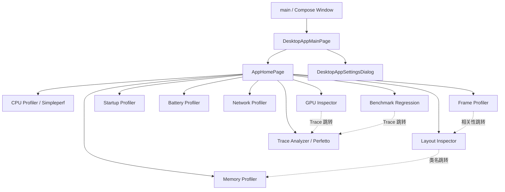

# 自研界面布局与代码映射

> 更新时间：2026-07-30
>
> 范围：仅统计本仓库自行开发的界面。
>
> 定位规则：不记录易失效的行号，统一使用“代码文件 + 函数或类型符号”定位。
>
> 不包含：Firefox Profiler、Perfetto Web UI 等第三方浏览器前端，也不包含 Docsify 用户文档站。

## 1. 结论摘要

- 当前真正可运行的产品界面集中在 `desktop-viewer/`，技术栈为 Kotlin/JVM + Compose Desktop。
- Desktop 主窗口共有 11 个一级目的地：主页、Layout Inspector，以及 9 个性能分析工具。
- 主导航由 `AppDestination`、`AppNavigator` 和 `DesktopAppMainPage` 统一管理。
- 各工具入口已统一使用 `*MainPage` 命名；具有独立展示层的模块通常采用
  `MainPage（状态、控制器、菜单、文件选择器） -> Screen（Compose 内容布局）` 的分层方式。
- 自研 Desktop 界面没有 Android XML layout。除 Android 示例 App 使用代码创建传统 View 外，
  所有主要产品布局都定义在 Kotlin `@Composable` 函数中。
- `android-studio-plugin/` 和 `web-ui-http-server/` 当前仍是规划占位，没有已实现的自研界面。

## 2. 总体导航



### 总入口代码

| 职责 | 代码文件 | 对应函数或类型 | 说明 |
| --- | --- | --- | --- |
| 原生窗口入口 | `desktop-viewer/desktop-app/src/main/kotlin/dev/agentperf/desktop/Main.kt` | `main` | 创建 Compose `Window`，设置应用图标、标题、最小尺寸，并挂载统一 Shell。 |
| 原生设置菜单 | `desktop-viewer/desktop-app/src/main/kotlin/dev/agentperf/desktop/ApplicationSettingsMenuInstaller.kt` | `ApplicationSettingsMenuInstaller.install` | 将系统菜单中的设置动作转换为 `SettingsRequest`。 |
| 一级路由枚举 | `desktop-viewer/desktop-app/src/main/kotlin/dev/agentperf/desktop/AppDestination.kt` | `AppDestination`、`shouldMaximizeWindow` | 定义主页及 10 个工具目的地和窗口最大化策略。 |
| 导航状态 | `desktop-viewer/desktop-app/src/main/kotlin/dev/agentperf/desktop/AppDestination.kt` | `AppNavigator`、`open`、`openLayoutInspector`、`openPerfettoTrace` | 保存当前目的地，并承载跨工具关联参数。 |
| 页面路由、全局主题和语言 | `desktop-viewer/desktop-app/src/main/kotlin/dev/agentperf/desktop/DesktopAppMainPage.kt` | `DesktopAppMainPage` | 加载全局设置、应用主题和语言，并根据当前目的地挂载各个 `*MainPage`。 |

## 3. 一级界面索引

| 界面 | 一级入口 | 主布局函数 | 状态或控制入口 |
| --- | --- | --- | --- |
| 首页 | `AppDestination.HOME` | `AppHomePage` | `DesktopAppMainPage`、`AppNavigator` |
| Layout Inspector | `AppDestination.LAYOUT_INSPECTOR` | `LayoutInspectorMainPage` | `InspectorStore`、`InspectorState` |
| CPU Profiler | `AppDestination.SIMPLEPERF` | `DeviceTargetPage`、`FirefoxReportWorkspace` | `SimpleperfMainPage`、`DeviceTargetController`、`ReportController` |
| Trace Analyzer | `AppDestination.PERFETTO` | `PerfettoCapturePage`、`TraceDiagnosticsWorkspacePanel` | `PerfettoMainPage` |
| Memory Profiler | `AppDestination.MEMORY_PROFILER` | `MemoryProfilerScreen` | `MemoryProfilerMainPage`、`MemoryProfilerController` |
| Frame Profiler | `AppDestination.FRAME_PROFILER` | `FrameProfilerScreen` | `FrameProfilerMainPage`、`FrameProfilerController` |
| Startup Profiler | `AppDestination.STARTUP_PROFILER` | `StartupProfilerScreen` | `StartupProfilerMainPage`、`StartupProfilerController` |
| Battery Profiler | `AppDestination.BATTERY_PROFILER` | `BatteryProfilerScreen` | `BatteryProfilerMainPage`、`BatteryProfilerController` |
| Network Profiler | `AppDestination.NETWORK_PROFILER` | `NetworkProfilerScreen` | `NetworkProfilerMainPage` |
| GPU Inspector | `AppDestination.GPU_INSPECTOR` | `GpuIntegrationScreen` | `GpuIntegrationMainPage` |
| Benchmark Regression | `AppDestination.BENCHMARK_REGRESSION` | `BenchmarkRegressionScreen` | `BenchmarkRegressionMainPage` |
| 统一设置窗口 | 全局菜单、Layout Inspector/CPU Profiler 设置入口 | `DesktopAppSettingsDialog` | `ApplicationUiSettingsStore`、`SimpleperfPreferencesStore` |

## 4. 首页

`AppHomePage` 是所有工具的统一入口，包含标题说明、4 列卡片网格和纵向滚动区域。

| 区域 | 代码文件 | 对应函数或符号 |
| --- | --- | --- |
| 页面入口、标题、网格和工具卡片数据 | `desktop-viewer/desktop-app/src/main/kotlin/dev/agentperf/desktop/AppHomePage.kt` | `AppHomePage` |
| 单张功能卡片 | `desktop-viewer/desktop-app/src/main/kotlin/dev/agentperf/desktop/AppHomePage.kt` | `FeatureEntryCard`、`HomeFeatureEntry` |
| 网格列数、卡片高度和标题字号 | `desktop-viewer/desktop-app/src/main/kotlin/dev/agentperf/desktop/AppHomePage.kt` | `HOME_GRID_COLUMN_COUNT`、`HOME_CARD_HEIGHT_DP`、`HOME_ITEM_TITLE_FONT_SIZE_SP` |

## 5. 统一设置窗口

统一设置使用独立的可缩放 `DialogWindow`，左侧为设置导航树，右侧为通用、Layout Inspector 或 Simpleperf 设置内容，底部提供完成动作。

| 区域 | 代码文件 | 对应函数或类型 |
| --- | --- | --- |
| 设置页枚举 | `desktop-viewer/desktop-app/src/main/kotlin/dev/agentperf/desktop/DesktopAppSettingsDialog.kt` | `SettingsPage` |
| 对话框根布局 | `desktop-viewer/desktop-app/src/main/kotlin/dev/agentperf/desktop/DesktopAppSettingsDialog.kt` | `DesktopAppSettingsDialog` |
| 底部完成栏 | `desktop-viewer/desktop-app/src/main/kotlin/dev/agentperf/desktop/DesktopAppSettingsDialog.kt` | `SettingsFooter` |
| 左侧导航树和导航项 | `desktop-viewer/desktop-app/src/main/kotlin/dev/agentperf/desktop/DesktopAppSettingsDialog.kt` | `SettingsSidebar`、`SettingsSidebarRow` |
| 通用设置 | `desktop-viewer/desktop-app/src/main/kotlin/dev/agentperf/desktop/DesktopAppSettingsDialog.kt` | `GeneralSettingsContent`、`SettingsChoice` |
| Android SDK 路径设置 | `desktop-viewer/desktop-app/src/main/kotlin/dev/agentperf/desktop/DesktopAppSettingsDialog.kt` | `AndroidSdkPathSetting`、`chooseAndroidSdkDirectory` |
| Simpleperf 设置桥接 | `desktop-viewer/desktop-app/src/main/kotlin/dev/agentperf/desktop/DesktopAppSettingsDialog.kt` | `CompleteSimpleperfSettingsContent`、`CaptureSettingsSection.settingsLabel` |
| Layout Inspector 完整设置页 | `desktop-viewer/layout-inspector/presentation/src/main/kotlin/dev/agentperf/desktop/LayoutInspectorSettingsContent.kt` | `LayoutInspectorSettingsContent`、`SettingsSection`、`SettingsToggleRow`、`CanvasHitTestOrderSetting`、`CanvasColorField` |
| 全局主题、语言和 SDK 路径持久化 | `desktop-viewer/desktop-app/src/main/kotlin/dev/agentperf/desktop/ApplicationUiSettings.kt` | `ApplicationUiSettings`、`ApplicationUiSettingsStore.load`、`ApplicationUiSettingsStore.save` |
| Simpleperf 偏好持久化 | `desktop-viewer/desktop-app/src/main/kotlin/dev/agentperf/desktop/ApplicationUiSettings.kt` | `SimpleperfPreferencesStore.load`、`SimpleperfPreferencesStore.save` |

### 已定义的兼容或回退界面

| 界面 | 代码文件 | 对应函数或类型 | 当前状态 |
| --- | --- | --- | --- |
| 旧通用设置 `AlertDialog` | `desktop-viewer/desktop-app/src/main/kotlin/dev/agentperf/desktop/ApplicationSettingsDialog.kt` | `ApplicationSettingsDialog`、`ApplicationSettingsDialogStyle` | 保留定义，统一 Shell 当前不调用。 |
| Layout Inspector 独立设置弹窗 | `desktop-viewer/layout-inspector/presentation/src/main/kotlin/dev/agentperf/desktop/ThemeSettingsDialog.kt` | `SettingsDialog`、`SettingsDialogStyle` | 未提供统一设置回调时使用的模块内回退入口。 |

## 6. Layout Inspector

```text
┌ Header：主页 / 采集目标 / 设备 / Window / 自动扫描 / 刷新 / 面板开关 / 设置 ┐
├ 可选 Correlation Banner ──────────────────────────────────────────────┤
├ Hierarchy ┆ Canvas / Screenshot ┆ Properties ┤
├───────────┴─────────────────────┴────────────┤
└ Findings / Timeline / AI Analysis ────────────────────────────────────┘
```

| 区域 | 代码文件 | 对应函数或类型 | 说明 |
| --- | --- | --- | --- |
| 页面入口、状态和根布局 | `desktop-viewer/layout-inspector/presentation/src/main/kotlin/dev/agentperf/desktop/LayoutInspectorMainPage.kt` | `LayoutInspectorMainPage`、`CaptureTargetMode`、`InspectorCorrelationHint` | 保存设备、采集、存档、AI、隐藏层级和搜索状态，并组合全部面板。 |
| Native 菜单与快捷动作 | `desktop-viewer/layout-inspector/presentation/src/main/kotlin/dev/agentperf/desktop/NativeViewerMenuBar.kt` | `NativeViewerMenuBar`、`NativeViewerMenuModel`、`toRecentArchiveMenuItems`、`viewerActionNativeShortcut` | 面板显隐、设置、导入导出、最近打开和显示选项。 |
| 跨工具关联提示 | `desktop-viewer/layout-inspector/presentation/src/main/kotlin/dev/agentperf/desktop/LayoutInspectorMainPage.kt` | `CorrelationBanner` | 展示从 Frame Profiler 进入时的相关性说明。 |
| 顶部工具栏 | `desktop-viewer/layout-inspector/presentation/src/main/kotlin/dev/agentperf/desktop/LayoutInspectorMainPage.kt` | `Header`、`HomeButton`、`CaptureTargetSelector`、`DeviceSelector`、`WindowSelector`、`AutoScanSwitch`、`ManualRefreshButton`、`PanelToggleButton` | 采集目标、设备、窗口、扫描、刷新、面板和设置入口。 |
| Hierarchy 左栏 | `desktop-viewer/layout-inspector/presentation/src/main/kotlin/dev/agentperf/desktop/LayoutInspectorMainPage.kt` | `HierarchyPane`、`HierarchyDisclosure` | 树、选择、折叠、搜索高亮和临时隐藏层级。 |
| Canvas 中栏 | `desktop-viewer/layout-inspector/presentation/src/main/kotlin/dev/agentperf/desktop/LayoutInspectorMainPage.kt` | `PreviewPane`、`PreviewZoomControls`、`LayerVisibilityButton`、`HitTestOrderToggle`、`HiddenLayerSummary`、`CanvasModeToggle` | 截图、Bounds、命中测试、缩放、平移和隐藏层级状态。 |
| Properties 右栏 | `desktop-viewer/layout-inspector/presentation/src/main/kotlin/dev/agentperf/desktop/LayoutInspectorMainPage.kt` | `DetailsPane`、`DetailSection`、`DetailRow` | 节点详情分组、展开折叠，并支持按类名跳转 Memory Profiler。 |
| Findings 底栏 | `desktop-viewer/layout-inspector/presentation/src/main/kotlin/dev/agentperf/desktop/LayoutInspectorMainPage.kt` | `FindingsPane`、`FindingRow` | 严重级别汇总、AI 分析入口和问题列表。 |
| Timeline 条 | `desktop-viewer/layout-inspector/presentation/src/main/kotlin/dev/agentperf/desktop/LayoutInspectorMainPage.kt`、`desktop-viewer/layout-inspector/presentation/src/main/kotlin/dev/agentperf/desktop/TimelineScrollNavigation.kt` | `TimelineStrip`、`TimelineScrollButton`、`TimelineScrollNavigation` | 离线或连续快照时间帧选择；溢出时显示左右边缘按钮并按页滚动。 |
| Hierarchy 搜索栏 | `desktop-viewer/layout-inspector/presentation/src/main/kotlin/dev/agentperf/desktop/LayoutInspectorMainPage.kt` | `HierarchySearchBar`、`SearchNavButton`、`HierarchySearchHighlightText` | 查询、上下一个结果和文本高亮。 |
| 导出结果弹窗 | `desktop-viewer/layout-inspector/presentation/src/main/kotlin/dev/agentperf/desktop/LayoutInspectorMainPage.kt` | `ExportResultDialog` | 展示导出成功或失败结果。 |
| 最近打开持久化 | `desktop-viewer/layout-inspector/presentation/src/main/kotlin/dev/agentperf/desktop/RecentCaptureArchiveStore.kt` | `RecentCaptureArchiveStore.load`、`RecentCaptureArchiveStore.record`、`RecentCaptureArchiveStore.clear` | 保存最近成功打开的布局归档，支持去重、数量上限和清除菜单。 |
| 存档和截图文件选择器 | `desktop-viewer/layout-inspector/presentation/src/main/kotlin/dev/agentperf/desktop/CaptureArchiveFileChooser.kt` | `CaptureArchiveFileChooser`、`SwingCaptureArchiveFileChooser`、`normalizeCaptureArchiveExportPath` | 选择存档导入、截图导入和存档导出路径。 |

## 7. CPU Profiler（Simpleperf）

CPU Profiler 由同一个设备页根据报告加载状态切换采集工作区和报告工作区；报告区采用“Timeline + Tabs/Toolbar + 主内容 + 可选详情栏”布局。

### 入口与状态

| 职责 | 代码文件 | 对应函数或类型 |
| --- | --- | --- |
| MainPage、Controller、StateFlow 收集和页面挂载 | `desktop-viewer/simpleperf-viewer/app-desktop/src/main/kotlin/com/androidperformancestudio/desktop/SimpleperfMainPage.kt` | `SimpleperfMainPage` |
| 模块菜单和动作绑定 | `desktop-viewer/simpleperf-viewer/app-desktop/src/main/kotlin/com/androidperformancestudio/desktop/SimpleperfMainPage.kt` | `SimpleperfMenu`、`DeviceTargetController.deviceActions` |
| 原生文件菜单 | `desktop-viewer/simpleperf-viewer/app-desktop/src/main/kotlin/com/androidperformancestudio/desktop/SimpleperfFileMenu.kt` | `SimpleperfFileMenuBar`、`simpleperfFileMenuModel` |
| 页面主题和本地化外壳 | `desktop-viewer/simpleperf-viewer/presentation/src/main/kotlin/com/androidperformancestudio/presentation/HomeScreen.kt` | `HomeScreen` |

### 设备与采集页

| 区域 | 代码文件 | 对应函数 |
| --- | --- | --- |
| 页面根布局和报告区切换 | `desktop-viewer/simpleperf-viewer/presentation/src/main/kotlin/com/androidperformancestudio/presentation/DeviceTargetPage.kt` | `DeviceTargetPage` |
| 顶部工具栏和采集动作 | `desktop-viewer/simpleperf-viewer/presentation/src/main/kotlin/com/androidperformancestudio/presentation/DeviceTargetPage.kt` | `WorkspaceToolbar`、`ToolbarContent`、`ToolbarCaptureActions` |
| 设备、应用、进程和线程选择器 | `desktop-viewer/simpleperf-viewer/presentation/src/main/kotlin/com/androidperformancestudio/presentation/DeviceTargetPage.kt` | `DeviceSelector`、`AppSelector`、`ProcessSelector`、`ThreadSelector`、`SelectorControl`、`SelectorMenuItem` |
| 能力信息弹层 | `desktop-viewer/simpleperf-viewer/presentation/src/main/kotlin/com/androidperformancestudio/presentation/DeviceTargetPage.kt` | `CapabilityPopupButton`、`CapabilityPopup`、`CapabilityPopupFact`、`CapabilityStatusBadge` |
| Footer 和采集状态 | `desktop-viewer/simpleperf-viewer/presentation/src/main/kotlin/com/androidperformancestudio/presentation/DeviceTargetPage.kt` | `WorkspaceFooter`、`CaptureStatus`、`CaptureActions` |
| 采集设置 Dialog | `desktop-viewer/simpleperf-viewer/presentation/src/main/kotlin/com/androidperformancestudio/presentation/CaptureConfigurationWorkspace.kt` | `CaptureSettingsDialog`、`SettingsNavigation`、`SettingsPanel` |
| 设置内容分区 | `desktop-viewer/simpleperf-viewer/presentation/src/main/kotlin/com/androidperformancestudio/presentation/CaptureConfigurationWorkspace.kt` | `SimpleperfSettingsContent`、`SimpleperfSettingsSectionContent`、`UserGuideSettingsPanel`、`FlameGraphSettingsPanel`、`SimpleperfEngineSettingsPanel`、`SamplingTemplatePanel`、`CaptureConfigurationPanel`、`AdvancedCaptureParameters` |

### 报告页

| 区域 | 代码文件 | 对应函数 |
| --- | --- | --- |
| 报告加载状态入口 | `desktop-viewer/simpleperf-viewer/presentation/src/main/kotlin/com/androidperformancestudio/presentation/ReportPage.kt` | `ReportPage`、`ReportWorkspace`、`ReportResultPane`、`ReportStatus` |
| Timeline、Tabs、工具栏、内容和详情布局 | `desktop-viewer/simpleperf-viewer/presentation/src/main/kotlin/com/androidperformancestudio/presentation/FirefoxReportWorkspace.kt` | `FirefoxReportWorkspace` |
| 宽窄窗口响应式详情布局 | `desktop-viewer/simpleperf-viewer/presentation/src/main/kotlin/com/androidperformancestudio/presentation/FirefoxReportWorkspace.kt` | `FirefoxReportContentAndDetails`、`TimelineResizeHandle` |
| 报告 Tab 栏 | `desktop-viewer/simpleperf-viewer/presentation/src/main/kotlin/com/androidperformancestudio/presentation/FirefoxReportTabs.kt` | `FirefoxReportTabs`、`ReportTab.displayName` |
| Tab 到面板的映射 | `desktop-viewer/simpleperf-viewer/presentation/src/main/kotlin/com/androidperformancestudio/presentation/ReportPage.kt` | `ReportSelectedPanel` |
| Overview | `desktop-viewer/simpleperf-viewer/presentation/src/main/kotlin/com/androidperformancestudio/presentation/OverviewPanel.kt`、`desktop-viewer/simpleperf-viewer/presentation/src/main/kotlin/com/androidperformancestudio/presentation/ReportPage.kt` | `OverviewPanel`、`OverviewReport` |
| Top Functions | `desktop-viewer/simpleperf-viewer/presentation/src/main/kotlin/com/androidperformancestudio/presentation/TopFunctionsPanel.kt`、`desktop-viewer/simpleperf-viewer/presentation/src/main/kotlin/com/androidperformancestudio/presentation/ReportPage.kt` | `TopFunctionsPanel`、`TopFunctionsReport` |
| Call Tree | `desktop-viewer/simpleperf-viewer/presentation/src/main/kotlin/com/androidperformancestudio/presentation/CallTreePanel.kt`、`desktop-viewer/simpleperf-viewer/presentation/src/main/kotlin/com/androidperformancestudio/presentation/ReportPage.kt` | `CallTreePanel`、`CallTreeReport` |
| Flame Graph | `desktop-viewer/simpleperf-viewer/presentation/src/main/kotlin/com/androidperformancestudio/presentation/FlameGraphPanel.kt` | `FlameGraphPanel`、`FirefoxFlameGraphViewport` |
| Stack Chart | `desktop-viewer/simpleperf-viewer/presentation/src/main/kotlin/com/androidperformancestudio/presentation/StackChartPanel.kt` | `StackChartPanel` |
| Marker Chart | `desktop-viewer/simpleperf-viewer/presentation/src/main/kotlin/com/androidperformancestudio/presentation/MarkerChartPanel.kt` | `MarkerChartPanel`、`MarkerPanelMessage` |
| Marker Table | `desktop-viewer/simpleperf-viewer/presentation/src/main/kotlin/com/androidperformancestudio/presentation/MarkerTablePanel.kt` | `MarkerTablePanel`、`MarkerTableHeader`、`MarkerTableRow` |

## 8. Trace Analyzer（自研 Perfetto 工作区）

> 本节只记录仓库自研的 Compose 采集、会话和诊断界面，不展开第三方 Perfetto 浏览器前端。

```text
Toolbar：主页 / adb 路径 / 设备 / 刷新
├ Capture 区：左侧模板列表 + 右侧采集配置
├ Recent Sessions：最近会话列表
└ Trace Diagnostics（打开 Trace 后出现）
   ├ 左侧诊断 SQL 列表
   └ 右侧结果/错误
```

| 区域 | 代码文件 | 对应函数 |
| --- | --- | --- |
| MainPage 状态、依赖和根布局 | `desktop-viewer/perfetto-viewer/perfetto-app/src/main/kotlin/com/androidperformancestudio/perfetto/app/PerfettoMainPage.kt` | `PerfettoMainPage` |
| 原生文件菜单 | `desktop-viewer/perfetto-viewer/perfetto-app/src/main/kotlin/com/androidperformancestudio/perfetto/app/PerfettoFileMenu.kt` | `PerfettoFileMenuBar` |
| 顶部工具栏和设备选择 | `desktop-viewer/perfetto-viewer/perfetto-app/src/main/kotlin/com/androidperformancestudio/perfetto/app/PerfettoMainPage.kt` | `PerfettoToolbar`、`DeviceSelector`、`PerfettoHomeButton` |
| 初始 Trace 关联提示 | `desktop-viewer/perfetto-viewer/perfetto-app/src/main/kotlin/com/androidperformancestudio/perfetto/app/PerfettoMainPage.kt` | `InitialTraceNotice` |
| 最近会话面板 | `desktop-viewer/perfetto-viewer/perfetto-app/src/main/kotlin/com/androidperformancestudio/perfetto/app/PerfettoMainPage.kt` | `RecentSessionsPanel`、`RecentSessionRow` |
| Trace 诊断双栏面板 | `desktop-viewer/perfetto-viewer/perfetto-app/src/main/kotlin/com/androidperformancestudio/perfetto/app/PerfettoMainPage.kt` | `TraceDiagnosticsWorkspacePanel`、`TraceDiagnosticNavigation`、`TraceDiagnosticContent` |
| 采集页根布局 | `desktop-viewer/perfetto-viewer/perfetto-presentation/src/main/kotlin/com/androidperformancestudio/perfetto/presentation/PerfettoCapturePage.kt` | `PerfettoCapturePage` |
| 左侧采集模板 | `desktop-viewer/perfetto-viewer/perfetto-presentation/src/main/kotlin/com/androidperformancestudio/perfetto/presentation/PerfettoCapturePage.kt` | `PerfettoTemplatePanel`、`PerfettoTemplateOption` |
| 右侧采集配置和状态 | `desktop-viewer/perfetto-viewer/perfetto-presentation/src/main/kotlin/com/androidperformancestudio/perfetto/presentation/PerfettoCapturePage.kt` | `PerfettoConfigurationPanel`、`CaptureStatus`、`createCaptureConfig`、`isCaptureStartAllowed` |
| 打开和保存 Trace 文件选择器 | `desktop-viewer/perfetto-viewer/perfetto-app/src/main/kotlin/com/androidperformancestudio/perfetto/app/PerfettoMainPage.kt` | `chooseTraceFile`、`chooseSaveFile` |

## 9. Memory Profiler

| 区域 | 代码文件 | 对应函数 |
| --- | --- | --- |
| MainPage、顶栏和动作绑定 | `desktop-viewer/memory-profiler/memory-app/src/main/kotlin/com/androidperformancestudio/memory/app/MemoryProfilerMainPage.kt` | `MemoryProfilerMainPage` |
| 页面根布局和状态切换 | `desktop-viewer/memory-profiler/presentation/src/main/kotlin/com/androidperformancestudio/memory/presentation/MemoryProfilerScreen.kt` | `MemoryProfilerScreen` |
| 页面内设备和进程工具栏 | `desktop-viewer/memory-profiler/presentation/src/main/kotlin/com/androidperformancestudio/memory/presentation/MemoryProfilerScreen.kt` | `MemoryToolbar`、`DeviceSelector`、`ProcessSelector` |
| 错误和警告 | `desktop-viewer/memory-profiler/presentation/src/main/kotlin/com/androidperformancestudio/memory/presentation/MemoryProfilerScreen.kt` | `ErrorAndWarnings`、`MessageCard` |
| 概览指标 | `desktop-viewer/memory-profiler/presentation/src/main/kotlin/com/androidperformancestudio/memory/presentation/MemoryProfilerScreen.kt` | `Overview`、`MetricCard` |
| 类直方图 | `desktop-viewer/memory-profiler/presentation/src/main/kotlin/com/androidperformancestudio/memory/presentation/MemoryProfilerScreen.kt` | `Histogram`、`HistogramHeader`、`SortHeader`、`HistogramRow` |
| 泄漏、Diff 和 Bitmap | `desktop-viewer/memory-profiler/presentation/src/main/kotlin/com/androidperformancestudio/memory/presentation/MemoryProfilerScreen.kt` | `LeakSuspectsPhaseTwo`、`HeapDiffSection`、`BitmapSection` |
| HPROF 打开对话框 | `desktop-viewer/memory-profiler/memory-app/src/main/kotlin/com/androidperformancestudio/memory/app/MemoryProfilerMainPage.kt` | `HprofOpenFileDialog` |
| 导出文件选择器 | `desktop-viewer/memory-profiler/memory-app/src/main/kotlin/com/androidperformancestudio/memory/app/MemoryProfilerMainPage.kt` | `chooseSaveFile` |

## 10. Frame Profiler

| 区域 | 代码文件 | 对应函数 |
| --- | --- | --- |
| MainPage、顶栏和动作绑定 | `desktop-viewer/frame-profiler/frame-app/src/main/kotlin/com/androidperformancestudio/frame/app/FrameProfilerMainPage.kt` | `FrameProfilerMainPage` |
| 导入 FrameStats 对话框 | `desktop-viewer/frame-profiler/frame-app/src/main/kotlin/com/androidperformancestudio/frame/app/FrameProfilerMainPage.kt` | `FrameStatsOpenFileDialog` |
| 导出文件选择器 | `desktop-viewer/frame-profiler/frame-app/src/main/kotlin/com/androidperformancestudio/frame/app/FrameProfilerMainPage.kt` | `chooseSaveFile` |
| 页面状态切换 | `desktop-viewer/frame-profiler/presentation/src/main/kotlin/com/androidperformancestudio/frame/presentation/FrameProfilerScreen.kt` | `FrameProfilerScreen` |
| 空状态 | `desktop-viewer/frame-profiler/presentation/src/main/kotlin/com/androidperformancestudio/frame/presentation/FrameProfilerScreen.kt` | `EmptyState` |
| 分析根布局 | `desktop-viewer/frame-profiler/presentation/src/main/kotlin/com/androidperformancestudio/frame/presentation/FrameProfilerScreen.kt` | `AnalysisContent` |
| 指标卡 | `desktop-viewer/frame-profiler/presentation/src/main/kotlin/com/androidperformancestudio/frame/presentation/FrameProfilerScreen.kt` | `SummaryCards`、`MetricCard` |
| 帧时间线 | `desktop-viewer/frame-profiler/presentation/src/main/kotlin/com/androidperformancestudio/frame/presentation/FrameProfilerScreen.kt` | `FrameTimeline` |
| 单帧详情和 Layout Inspector 入口 | `desktop-viewer/frame-profiler/presentation/src/main/kotlin/com/androidperformancestudio/frame/presentation/FrameProfilerScreen.kt` | `FrameDetail`、`DetailRow` |
| 卡顿簇列表 | `desktop-viewer/frame-profiler/presentation/src/main/kotlin/com/androidperformancestudio/frame/presentation/FrameProfilerScreen.kt` | `ClusterList` |

## 11. Startup Profiler

| 区域 | 代码文件 | 对应函数 |
| --- | --- | --- |
| MainPage、两级工具栏和进度条 | `desktop-viewer/startup-profiler/startup-app/src/main/kotlin/com/androidperformancestudio/startup/app/StartupProfilerMainPage.kt` | `StartupProfilerMainPage` |
| 导出文件选择器 | `desktop-viewer/startup-profiler/startup-app/src/main/kotlin/com/androidperformancestudio/startup/app/StartupProfilerMainPage.kt` | `chooseSaveFile` |
| 页面状态切换和空状态 | `desktop-viewer/startup-profiler/presentation/src/main/kotlin/com/androidperformancestudio/startup/presentation/StartupProfilerScreen.kt` | `StartupProfilerScreen`、`EmptyPane` |
| 结果根布局 | `desktop-viewer/startup-profiler/presentation/src/main/kotlin/com/androidperformancestudio/startup/presentation/StartupProfilerScreen.kt` | `ResultsPane` |
| 指标和稳定性 | `desktop-viewer/startup-profiler/presentation/src/main/kotlin/com/androidperformancestudio/startup/presentation/StartupProfilerScreen.kt` | `MetricCard`、`StabilityCard` |
| Baseline 对比 | `desktop-viewer/startup-profiler/presentation/src/main/kotlin/com/androidperformancestudio/startup/presentation/StartupProfilerScreen.kt` | `BaselineComparison` |
| 多轮结果表 | `desktop-viewer/startup-profiler/presentation/src/main/kotlin/com/androidperformancestudio/startup/presentation/StartupProfilerScreen.kt` | `RunRowHeader`、`RunRow`、`TableCell` |
| 轮次详情和 Timeline | `desktop-viewer/startup-profiler/presentation/src/main/kotlin/com/androidperformancestudio/startup/presentation/StartupProfilerScreen.kt` | `RunDetail`、`TimelineBar`、`ConfidenceBadge`、`MessagePane` |

## 12. Battery Profiler

| 区域 | 代码文件 | 对应函数 |
| --- | --- | --- |
| MainPage、状态、工具栏、进度和确认弹窗 | `desktop-viewer/battery-profiler/battery-app/src/main/kotlin/com/androidperformancestudio/battery/app/BatteryProfilerMainPage.kt` | `BatteryProfilerMainPage` |
| 采集模式文案 | `desktop-viewer/battery-profiler/battery-app/src/main/kotlin/com/androidperformancestudio/battery/app/BatteryProfilerMainPage.kt` | `BatteryCaptureMode.label` |
| 导出文件选择器 | `desktop-viewer/battery-profiler/battery-app/src/main/kotlin/com/androidperformancestudio/battery/app/BatteryProfilerMainPage.kt` | `chooseSaveFile` |
| 页面状态切换和空状态 | `desktop-viewer/battery-profiler/presentation/src/main/kotlin/com/androidperformancestudio/battery/presentation/BatteryProfilerScreen.kt` | `BatteryProfilerScreen`、`EmptyPane` |
| 结果根布局 | `desktop-viewer/battery-profiler/presentation/src/main/kotlin/com/androidperformancestudio/battery/presentation/BatteryProfilerScreen.kt` | `ResultsPane` |
| 指标和 Baseline | `desktop-viewer/battery-profiler/presentation/src/main/kotlin/com/androidperformancestudio/battery/presentation/BatteryProfilerScreen.kt` | `MetricCard`、`BaselineComparison` |
| 轮次表和资源详情 | `desktop-viewer/battery-profiler/presentation/src/main/kotlin/com/androidperformancestudio/battery/presentation/BatteryProfilerScreen.kt` | `RunRow`、`RunDetail`、`ResourceSection`、`Cell` |

## 13. Network Profiler

| 区域 | 代码文件 | 对应函数或类型 |
| --- | --- | --- |
| MainPage、采集、工具栏和动作 | `desktop-viewer/network-profiler/network-app/src/main/kotlin/com/androidperformancestudio/network/app/NetworkProfilerMainPage.kt` | `NetworkProfilerMainPage` |
| 页面状态和动作模型 | `desktop-viewer/network-profiler/presentation/src/main/kotlin/com/androidperformancestudio/network/presentation/NetworkProfilerScreen.kt` | `NetworkProfilerState`、`NetworkProfilerActions` |
| 摘要和请求详情双栏 | `desktop-viewer/network-profiler/presentation/src/main/kotlin/com/androidperformancestudio/network/presentation/NetworkProfilerScreen.kt` | `NetworkProfilerScreen`、`Summary` |
| 请求卡片 | `desktop-viewer/network-profiler/presentation/src/main/kotlin/com/androidperformancestudio/network/presentation/NetworkProfilerScreen.kt` | `CallCard` |
| HAR 打开和导出文件选择器 | `desktop-viewer/network-profiler/network-app/src/main/kotlin/com/androidperformancestudio/network/app/NetworkProfilerMainPage.kt` | `chooseHar`、`chooseSave` |

## 14. GPU Inspector 集成页

| 区域 | 代码文件 | 对应函数或类型 |
| --- | --- | --- |
| MainPage、状态、工具栏和动作 | `desktop-viewer/gpu-inspector-integration/gpu-integration-app/src/main/kotlin/com/androidperformancestudio/gpu/app/GpuIntegrationMainPage.kt` | `GpuIntegrationMainPage` |
| 页面状态和动作模型 | `desktop-viewer/gpu-inspector-integration/presentation/src/main/kotlin/com/androidperformancestudio/gpu/presentation/GpuIntegrationScreen.kt` | `GpuIntegrationState`、`GpuIntegrationActions` |
| AGI 能力卡和产物列表 | `desktop-viewer/gpu-inspector-integration/presentation/src/main/kotlin/com/androidperformancestudio/gpu/presentation/GpuIntegrationScreen.kt` | `GpuIntegrationScreen` |
| AGI 和产物文件选择器 | `desktop-viewer/gpu-inspector-integration/gpu-integration-app/src/main/kotlin/com/androidperformancestudio/gpu/app/GpuIntegrationMainPage.kt` | `chooseExecutable`、`chooseArtifact` |

## 15. Benchmark Regression

| 区域 | 代码文件 | 对应函数或类型 |
| --- | --- | --- |
| MainPage、导入对比、工具栏和动作 | `desktop-viewer/benchmark-regression/benchmark-app/src/main/kotlin/com/androidperformancestudio/benchmark/app/BenchmarkRegressionMainPage.kt` | `BenchmarkRegressionMainPage`、局部函数 `import` |
| 页面状态模型 | `desktop-viewer/benchmark-regression/presentation/src/main/kotlin/com/androidperformancestudio/benchmark/presentation/BenchmarkRegressionScreen.kt` | `BenchmarkRegressionState` |
| 摘要和比较列表 | `desktop-viewer/benchmark-regression/presentation/src/main/kotlin/com/androidperformancestudio/benchmark/presentation/BenchmarkRegressionScreen.kt` | `BenchmarkRegressionScreen` |
| 摘要卡 | `desktop-viewer/benchmark-regression/presentation/src/main/kotlin/com/androidperformancestudio/benchmark/presentation/BenchmarkRegressionScreen.kt` | `SummaryCard` |
| JSON 打开和导出文件选择器 | `desktop-viewer/benchmark-regression/benchmark-app/src/main/kotlin/com/androidperformancestudio/benchmark/app/BenchmarkRegressionMainPage.kt` | `chooseJson`、`chooseSave` |

## 16. 自研 Android 示例界面

Layout Inspector 附带一个用于联调的 Android View 示例 App。它不是正式产品页，但属于仓库自研界面。

| 界面 | 代码文件 | 对应函数或类型 | 布局方式 |
| --- | --- | --- | --- |
| 示例 Activity | `desktop-viewer/layout-inspector/samples/android-view-app/src/main/kotlin/dev/agentperf/sample/MainActivity.kt` | `MainActivity`、`onCreate` | 在 `setContentView` 中用 Kotlin 创建纵向 `LinearLayout` 和 3 个 `TextView`。 |
| TextView 样式 | `desktop-viewer/layout-inspector/samples/android-view-app/src/main/kotlin/dev/agentperf/sample/MainActivity.kt` | `label` | 统一文字颜色、字号和底部间距。 |

## 17. 尚无自研界面的规划模块

| 模块 | 当前状态 | 证据位置 |
| --- | --- | --- |
| Android Studio 插件 | 只有规划文档，没有 Gradle 插件工程、`plugin.xml`、Action、ToolWindow 或设置页实现。 | `android-studio-plugin/README.md` 的“方案 A：Android Studio 插件”说明 |
| Web UI + App 内 HTTP Server | 只有规划文档，没有该方案对应的自研 Web 前端或 Android Server 工程。 | `web-ui-http-server/README.md` 的“方案 C：Web UI + App 内 HTTP Server”说明 |

Android Studio 插件未来计划的 Tool Window 区域记录在
`docs/requirements/layout-complexity-inspector-three-solutions-plan.md` 的“三、方案 A：Android Studio 插件”章节，
但这些规划内容不能当作现有界面代码位置。

## 18. 维护时如何快速定位界面

1. 先从 `DesktopAppMainPage` 的 `when (navigator.destination)` 找到一级路由对应的 `*MainPage`。
2. 在 `*MainPage` 中查找传入的 `*Screen`，这里通常包含控制器、状态收集、工具栏和文件选择器。
3. 在 `presentation` 模块的 `*Screen.kt` 中按本文记录的函数名查找具体 Compose 布局。
4. 复杂页面继续按 `Pane`、`Panel`、`Toolbar`、`Details`、`Timeline`、`Dialog` 等函数名定位。
5. 重命名布局文件或函数时，应同步更新：
   - `AppDestination.kt`
   - `DesktopAppMainPage.kt`
   - `AppHomePage.kt`
   - 本文档
